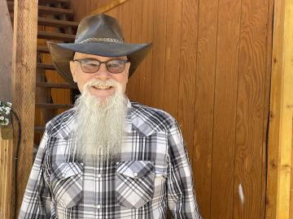

#### Nevyžádaná kniha na poště

_Andrew McChesney_

Rob Schetky, důstojník amerického námořnictva ve výslužbě, po většinu svého života s Biblí a jejím významem zápasil.

Kdysi byl agnostik, nyní Rob hledal Boží vůli, ale problém představovala sobota. Dost mu vadilo, když lidé v neděli nechodili do kostela a věnovali se každodenním činnostem. Ptal se: „Proč hrajete v neděli golf?“ Ale uvnitř ho zajímalo: _„Kde v Bibli Bůh změnil sobotu?“_

Rob přestal chodit do kostela. Hledal novou církev ve Fairbanksu v americkém státě Aljaška, když mu na poštu přišla nevyžádaná kniha. „To je zajímavý název,“ pomyslel si, když si knihu prohlížel. „Zajímalo by mě, co je to Velký spor.“

Když odcházel z pošty, míjel hromádku knih Velkého sporu, které jiní lidé u přepážky odhodili. Byla to hromadná zásilka.

Doma se Rob do knihy ponořil. Bylo to vzrušující, když četl, jak lidé, nikoli Bůh, změnili sobotu jako den uctívání. Pomyslel si: _„Páni! Někdo vypráví dějiny církve velmi logickým způsobem“_.

Kontaktoval svého přítele a řekl mu: „Našel jsem skvělé dějiny křesťanství. Jmenuje se to Velký spor.“ Následně mu přítel zavolal zpět. „Od té knihy dej ruce pryč,“ řekl. „Je to od Církve adventistů sedmého dne a to jsou sektáři.“

Rob byl překvapený. Nevšiml si jména autorky knihy, Ellen Whiteové, a nevěděl, že spoluzakládala Církev adventistů. „Ne, nejsou sekta,“ řekl. „Oni jen věří v Boží slovo.“

Po rozhovoru chtěl Rob zjistit, jestli adventisté ve Fairbanksu mají pobožnosti. Když se podíval na internet, našel sbor, který se nacházel jen 10 minut jízdy autem. V sobotu si vzal Bibli a Velký spor a vydal se do sboru. Knihu četl necelý měsíc.

První, kdo ho ve sboru přivítal, byla učitelka sobotní školy Helen. Vyjádřila překvapení, když se dozvěděla, že přišel díky knihy _Velký spor_. „Právě jste vyvrátil mé obavy,“ řekla.

Obávala se, že kvůli malé velikosti textu, se kniha nedá číst. Rob však už přečetl tři čtvrtiny knihy - a přišel do sboru, aby se dozvěděl víc.

Dnes, o sedm let později, je Robovi 70 let a je sborovým diakonem. Stále denně čte Bibli a spisy Ellen Whiteové. „Když jsem našel Církev adventistů sedmého dne, našel jsem domov a pravdu,“ řekl.

_Připojte se v roce 2024 ke světové církvi adventistů při masové propagaci a distribuci knihy Velký spor. Můžete navštívit anglicky psané stránky greatcontroversyproject.com, kde najdete další podrobnosti._

  
Rob
