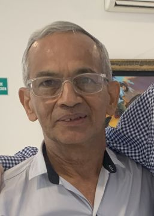

#### „Nikoho jsme neposlali“

_Andrew McChesney_

Čtyři roky navštěvoval Donaldo Velasquez každý pátek kolumbijské vězení, kde kázal o Ježíši. Jednou v pátek však nemohl přijít. Pracoval jako tesař a jeden klient nutně potřeboval jeho pomoc. Donaldo navíc potřeboval peníze.

Pouze čtyři adventisté sedmého dne - Donaldo, dva další členové církve a jejich pastor - měli povolení navštívit věznici v Acacias a Donaldo je požádal o pomoc. „Ne, nemám vůbec čas,“ řekl Ranses. Pedro také řekl, že nemůže přijít. A pastor se omluvil s tím, že je mimo město.

Donaldo se rozplakal a modlil se. Když se ho manželka Jesusita zeptala, co se děje, vysvětlil, že nechce vynechat setkání s vězni, ale potřebuje pracovat. „Běž, dělej svou práci,“ řekla Jesusita. „Bůh se postará.“

Když Donaldo navštívil věznici příště, přišlo si jeho kázání poslechnout 38 vězňů. Doprovázel ho další člen církve, Pedro.

„Kde je ten muž, který tu byl minule?“ zeptal se jeden vězeň.

„Nikoho jsme neposlali,“ odpověděl Donaldo.

„Ano, poslali,“ řekl další vězeň. „Nějaký muž nám kázal.“

„Ne, nikoho jsme neposlali,“ řekl Donaldo a naznačil, že kázající možná patřil k jiné denominaci.

„Ne, ne,“ řekli vězni. „Známe každého, kdo má povolení k návštěvě. Tenhle člověk nás nikdy předtím nenavštívil a nebyl z jiné církve.“

Donaldo se zeptal na kázání toho muže v naději, že získá vodítko k jeho totožnosti. Vězni řekli, že mluvil o sobotě jako sedmém dni.

Udivený Donaldo se zeptal: „Jak vypadal?“

Vězni ho popsali jako vysokého, dobře oblečeného muže v bílé košili. Říkali, že znal Bibli tak dobře, že byl pravděpodobně učitelem.

Pedro se dotkl Donaldovy paže. „Musel přijít anděl a kázat jim,“ řekl. „To je jediné vysvětlení.“

Donalda to však nepřesvědčilo. Šel za vězeňským dozorcem, který registroval návštěvy. Dozorce, Donaldův přítel, se podíval do záznamů v počítači a zavrtěl hlavou. „Ten den nikdo nepřišel,“ řekl.

Ohromený Donaldo zvolal: „Teď už nepochybuji o tom, že Pánův anděl přišel vyučovat Bibli místo mě!“

Vrátil se k vězňům a oznámil jim, že museli vidět anděla.

Uplynulo šest let a téměř všech 38 vězňů odevzdalo svá srdce Ježíši při křtu. Donaldo řekl, že na ten den nikdy nezapomene.

„I když je to neuvěřitelný příběh, věřím, že Bůh poslal svého nebeského posla,“ řekl.

_Děkujeme vám za vaše dary třinácté soboty, které v minulém čtvrtletí pomohly dvěma misijním projektům v Kolumbii._

  
Donaldo
