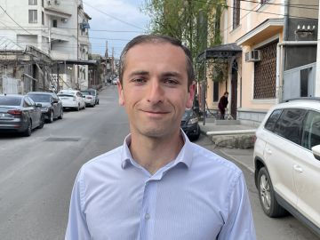

#### Boží dokonalé načasování v Tbilisi

_Andrew McChesney_

Zurab z Gruzie, bývalé sovětské republiky, se považoval za křesťana, ale jeho vztah s Bohem spočíval pouze v zapalování svíček v katedrále. Doma měl Bibli, ale bral ji do ruky jen proto, aby ji oprášil.

Pak ho začalo trápit svědomí a pomyslel si: _Pokud jsem křesťan, proč nečtu Bibli?"_ Naplnila ho touha číst Bibli.

Vzal Bibli a přečetl ji od začátku do konce. Poprvé se dozvěděl o sobotě, jako sedmém dni. Překvapen vyhledal na internetu další informace. Zhlédl asi 100 kázání na YouTube a zaujal ho kazatel, který vysvětloval Bibli srozumitelným způsobem. Kazatel se označil za adventistu sedmého dne a řekl, že církev tvoří miliony členů, kteří dodržují sobotu, jako sedmý den.

Zurab o adventistech nikdy neslyšel a zalekl se představy, že by se jedním z nich stal. Mnoho Gruzínců si myslí, že adventisté patří k sektě. Hledal na internetu jinou církev, která by uctívala sedmý den a praktikovala další biblické pravdy, o nichž se dozvěděl, ale marně.

Jednoho sobotního rána se tedy objevil v adventistickém sboru v gruzínském hlavním městě Tbilisi. Stál venku, a nemohl se rozhodnout, zda chce vůbec dovnitř. V tom se náhle otevřely dveře a někdo ho pozval dovnitř.

Zurab byl vřele přivítán.

„Jste ve sboru Církve adventistů poprvé?“ zeptal se ho někdo.

„Ano, jsem u adventistů poprvé,“ odpověděl.

„Skvělé!“ řekl někdo další. „Přijďte také na náš evangelizační program.“

Ukázalo se, že sbor plánuje evangelizační setkání právě na ten večer. Zurab se dopoledne zúčastnil bohoslužby a večer evangelizačního setkání. Poté se vracel každý večer po následující dva týdny. Pak se nechal pokřtít.

Dnes, o rok později, má 36letý Zurab nový vztah s Bohem. Každý den čte Bibli a sdílí ji se svou ženou a dvěma chlapci, kteří s ním také chodí v sobotu do sboru. Zurab žasne nad tím, jak se vše sešlo - jeho touha číst Bibli, objevení soboty a online kazatele, a příchod do adventistického sboru ve stejný den, kdy se konalo první evangelizační setkání.

Do církve nešel kvůli misijní iniciativě. Ale díky misijnímu duchu členů církve se cítil vítaný a jako doma. „Všechno se tak dobře sešlo,“ řekl.

_Část letošních darů třinácté soboty putovala do zdravotního střediska v Gruzii. Modlete se prosím, aby Bůh přitahoval lidi do centra, stejně jako přivedl Zuraba do sboru, aby se o něm dozvěděli více. Podívejte se na krátké video se Zurabem na adrese: bit.ly/Zurab-Georgia._

  
Zurab
