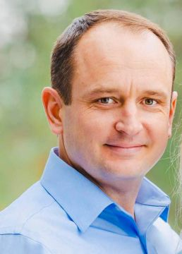

#### Sen v Dallasu

_Andrew McChesney_

Samuel prohlásil, že o studium Bible nemá zájem. „Ale na dotazníku o studiu Bible jsi vyznačil, že máš zájem,“ řekl volající, biblický pracovník z prvního sboru církve adventistů sedmého dne v Dallasu, který leží v americkém státě Texas. On a další bibličtí pracovníci procházeli dotazníky, které církev rozdávala. „No, já nemám zájem,“ řekl Samuel.

Volající odložil dotazník o studiu Bible stranou.

O týden později Samuelovi zavolal jiný biblický pracovník.

„Nemám zájem,“ řekl Samuel.

Další týden zavolal biblický pracovník znovu.

„Kolik by to studium Bible stálo?“ zeptal se Samuel.

„Nic.“

Na prvním biblickém studiu Samuel řekl, že se svou ženou hledají církev. Jejich syn je pozval do svého sboru, ale pohoršilo je kázání o papeži a sobotě. „Už nikdy nevkročím do sboru adventistů sedmého dne,“ řekl Samuel.

Pracovník se tiše pomodlil a pokračoval ve studiu Bible.

Po několika týdnech biblický pracovník pozval Samuela na evangelizační setkání v dallaské První církvi adventistů sedmého dne. Zajímalo ho, co Samuel řekne. Samuel souhlasil, že příjde.

Na prvním setkání se Samuel s velkým zájmem rozhlížel po sboru. Budova měla jedinečnou architekturu se zaoblenou modlitebnou, zaobleným stropem a lavicemi zakřivenými kolem pódia. Samuel vyhledal biblického pracovníka. „Potřebuji s vámi mluvit,“ řekl. Biblický pracovník pomáhal s přípravou na setkání a požádal Samuela, zda by mohl počkat. Samuel souhlasil a posadil se. Pozorně naslouchal evangelistovu kázání o Danielovi 2. Poté vyhledal biblického pracovníka a vyhrkl: „Chci se nechat pokřtít!“ Samuel se na něj podíval a řekl mu: „Já chci být pokřtěn!“ Biblický pracovník byl v šoku a zvolal: „Cože?“

Samuel řekl, že před 18 lety měl sen: „V tom snu mě Ježíš zavedl do sboru a řekl: 'To je moje církev,'“. „Když jsem dnes večer vešel do tohoto sboru, okamžitě jsem ho poznal. Konečně jsem našel sbor ze svého snu. Chci se nechat pokřtít.“

Biblický pracovník zavedl Samuela k evangelistovi, který byl také překvapen, když se dozvěděl o jeho snu. Příběh byl o to pozoruhodnější, že sbir před 13 lety vyhořel a byla postavena nová budova. Samuel viděl ve snu nový sboru pět let před jeho stavbou.

“Everything is possible when we cooperate with God in His mission,” said the evangelist, Slavik Ostapenko, now pastor of the Spokane Slavic Seventh-day Adventist Church in Washington State.

„Všechno je možné, když spolupracujeme s Bohem na jeho poslání,“ řekl evangelista Slavik Ostapenko, nyní pastor slovanského sboru církve adventistů sedmého dne ve Spokane ve státě Washington.

  
Slavik Ostapenko