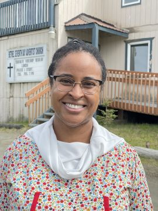

#### Kingston nachází naději

_Andrew McChesney_

Biblická pracovnice pozvala do sboru adventistů sedmého dne v Bethelu na Aljašce několik lidí, aby se podělili o své životní příběhy s návštěvníkem z adventistické misie. Část darů třinácté soboty ve čtvrtém čtvrtletí roku 2024 půjde na opravu a rozšíření sboru, aby se v něm mohlo usídlit centrum vlivu pro službu v Bethelu. Do města s 6300 obyvateli jsem přiletěl, abych shromáždil misijní příběhy k propagaci projektu.

V určený čas se však ve sboru nikdo neobjevil. Biblická pracovnice Joy Anderson mávla směrem k velké pizze, kterou vyzvedla cestou do sboru ze své kanceláře, kde pracuje jako právnička.

„Poslužte si,“ řekla Joy, která pochází z Alabamy a sbor vede společně s dalším biblickým pracovnikem. „Doufala jsem, že pizza podnítí lidi, aby přišli.“

Když byla snězena asi polovina pizzy, vešel dovnitř Kingston. Vyjádřil překvapení, že je jediným přítomným. Pak si vzal kousek pizzy, posadil se a promluvil o tom, proč chodí na bohoslužby do sboru adventistů.

Devětapadesátiletý hlídač řekl, že léta bojoval s alkoholem a drogami v Hooper Bay, městečku v deltě Yukon-Kuskokwim s 1400 obyvateli, které se nachází 90 minut letu malým letadlem od Bethelu. „Chtěl jsem se dostat z toho mizerného života, který jsem vedl,“ řekl. „Řekl jsem si: 'Pokud se z této lekce nepoučím, pokud se nepoučím ze svých chyb, lidé si budou myslet, že jsem hloupý. “

Pak se Kingston přestěhoval do Bethelu a následoval tak cestu mnoha obyvatel delty Yukon-Kuskokwim, kteří opustili malá města v naději na lepší život v Bethelu, největší obci na západě Aljašky. Obyvatelstvo delty Yukon-Kuskokwim tvoří asi 85 % původních obyvatel Aljašky, kteří jsou především Yup'ikové, Cup'ikové a Athabaskové.

Jednoho dne Steve, adventista a domorodý obyvatel z delty Yukon-Kuskokwim, pozval Kingstona do bethelského sboru. „Zeptal se mě, jestli mě něco trápí, nebo jsem na dně,“ řekl Kingston. „Byl jsem zvědavý, kam to chodí, a tak jsem začal do sboru docházet.“

Kingston našel sílu ve chvílích strávených s ostatními návštěvníky sboru, kteří překonali jejich závislost na alkoholu a drogách. „Pomohli mi držet se od těchto věcí dál,“ řekl. „Toto prostředí mi pomohlo.“ Řekl, že je šťastný, ale stále hledá odpovědi. „Ta Dobrá Osoba nahoře všechno vidí,“ řekl. „Všichni nějak najdeme své odpovědi.“

_Prosím, modlete se za Kingstona, který navštěvuje sbor téměř každou sobotu, ale ještě se nerozhodl pro křest. Děkujeme vám za dary třinácté soboty, které v tomto čtvrtletí podpoří misijní pomoc ve sboru Církve adventistů sedmého dne v obci Bethel. Jména obyvatel Bethelu byla změněna z důvodu ochrany jejich soukromí. Na fotografii je Joy Anderson._

  
Joy Anderson
