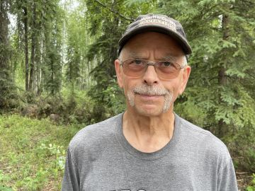

#### Klíč k aljašské vesnici

_Andrew McChesney_

Misijní pilot Jim Kincaid zjistil, že létat od odlehlé vesnice k jiné odlehlé vesnici v americkém státě Aljaška je těžká práce. Vzlet a přistání v buši byla ta snadnější část. Větší výzvou bylo dostat se k srdcím aljašských domorodců, kteří byli vnímaví k poselství evangelia.

Když Jim přistál se svým malým letadlem v osadě asi 150 mil severně od Fairbanksu, vypadalo to na problém. Létal s knižními evangelisty od vesnice k vesnici, aby prodávali Bible a další křesťanskou literaturu. Když zaparkoval, kolem letadla se vyrojila terénní vozidla. Obyvatelé byli velmi nepřívětiví.

„Kdo jste?“ zeptal se jeden z nich.

„Co tady děláte?“ řekl jiný.

V tu chvíli si Jim vzpomněl na jedno jméno. Jeden muž z vesnice se totiž zúčastnil jednoho nebo dvou evangelizačních shromáždění, která Jim někdy předtím vedl ve Fairbanksu. Jim se obrátil ke strážcům vesnice.

„Je ve městě Robert Frank?“ zeptal se.

Jejich výrazy se okamžitě změnily. Naštvané pohledy vystřídala zvědavost a pak pohostinnost.

„Aha, vy znáte Roberta Franka?“ řekl jeden z nich.

„Vezmeme vás za ním!“ řekl další.

Jim byl odveden na návštěvu k Robertovi. Bylo to, jako by měl klíč od celé vesnice.

Když Jim dorazil, Robert právě jedl jídlo a bohužel pilota hned nepoznal. Jim mu musel připomenout, odkud a proč se znají. Pak si ale Robert vzpomněl a byl velmi srdečný. Nabídl Jimovi kus čerstvého medvědího masa.

A tak se stalo, že Jim a knižní evangelisté získali vstup do nové vesnice, která by jim jinak zůstala uzavřena. Vše, co k tomu stačilo, bylo znát něčí jméno.

Ježíš také zná jména lidí. Ježíš řekl, že on, Dobrý Pastýř, „své ovce volá jménem a vyvádí je“ _(Jan 10,3)_.

Jestliže Ježíš zná jména, mohlo by být pro jeho následovníky také dobré následovat jeho příkladu?

„Znát někoho ve vesnici, i kdyby to mělo být jen to, že znáte jméno jednoho člověka ve vesnici, vám může vybudovat důvěru celé vesnice,“ řekl Jim. „Je to jako v každé kultuře. Když si zapamatujete něčí jméno, má to dlouhodobý dopad.“

_Část darů třinácté soboty tohoto čtvrtletí pomůže otevřít centrum vlivu pro aljašské domorodce v Bethelu na Aljašce. Děkujeme vám, že tuto sobotu plánujete štědré dary._

  
Jim
