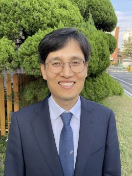

#### Otevření Bambusové opony

_Andrew McChesney_

Když jsem klečel před jihokorejským studentem, zeptal jsem se ho, jestli má nějaké prosby o modlitby, než jsem mu umyl nohy během Památky večeře Páně v Moskevském mezinárodním sboru Církve adventistů sedmého dne v Rusku.

„Modlete se za Severní Koreu,“ řekl student, který studoval na moskevské univerzitě. „Je třeba, aby se evangelium dostalo na Sever, aby se Ježíš mohl vrátit.“

Díky této prosbě o modlitbu v roce 2006 jsem se dozvěděl o zvláštním břemenu, které adventisté sedmého dne z Jižní Koreje nesou za své bratry a sestry na Severu. Ježíš řekl: „A toto evangelium o království bude kázáno po celém světě na svědectví všem národům a pak přijde konec“ (Matouš 24,14). Jihokorejští adventisté považují Sever za poslední hranici v poslání církve hlásat evangelium světu a mnozí dnes v modlitbách hledají způsoby, jak "Bambusovou oponu" otevřít.

Dílo Církve adventistů začalo na severu v roce 1904 a poté se rozšířilo na jih. Dnes má církev 285 000 členů žijících mezi 52 miliony lidmi na jihu. Není však známo, že by na Severu, který má 26 milionů obyvatel, žil nějaký adventista. Přesto pramínek informací naznačuje, že Bůh má na severu svůj lid, řekl Beom Seok Oh, ředitel Severní asijsko-pacifické divize, který dohlíží na rozšíření církve do Severní Koreje. Během cesty do Jižní Koreje mi vyprávěl o jedné severokorejské ženě, která každé sobotní ráno pila odvar ze sójové omáčky, aby onemocněla horečkou a byla tak omluvena z povinné sobotní práce. Když ji uvěznili, propašovala do vězení Bibli, zakopala ji do země a tajně ji vyhrabávala, aby si v ní mohla číst. Později se jí podařilo proklouznout přes hranice do Jižní Koreje, kde mohla svobodně uctívat Boha. Církevní vedoucí se připravují na to, kdy se otevře severní hranice. Až se tak stane, hodlají do země vyslat misionáře.

Mezitím se jihokorejští adventisté starají o severokorejské zběhy. Jeden z diakonů a jeho žena pravidelně navštěvují nového přeběhlíka, pomáhají mu uklízet byt, připravovat jídlo a podávat státní dokumenty. Po šesti měsících se přeběhlík přihlásil k víře v Boha, řekl Čang-Seop Lee, pastor sboru diakona a jeho ženy.

Jiný přeběhlík nemohl spát, protože myslel na svou ženu a děti na Severu. Pastor Lee se s ním modlil a přeběhlík poté přiznal, že věří v Boha a že na Severu četl Bibli. Tato událost pastora znovu povzbudila v jeho odhodlání pomáhat přeběhlíkům. „Věřím, že můžeme rozšířit naši působnost na Severu tím, že začneme u lidí, se kterými se můžeme setkat dnes,“ řekl.

_Modlete se za Severní Koreu. Děkujeme, že 29. března plánujete štědré dary třinácté soboty na další šíření evangelia v severní asijsko-pacifické divizi._

  
Čang-Seop Lee
