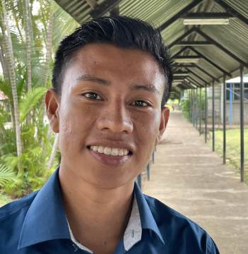

#### Sibú z Bible

_Andrew McChesney_

Melvin si nebyl jistý, zda byl člověk stvořen z prachu, nebo z kukuřice. V Bibli se dočetl, že „Hospodin Bůh utvořil člověka z prachu země a vdechl mu do chřípí dech života; a člověk se stal živou bytostí“ (Genesis 2:7). Ale Cabécarové, největší domorodá skupina v Kostarice, která má asi 17 000 obyvatel, ho učili, že Sibú, což v jejich rodném jazyce znamená „Bůh“, stvořil člověka z kukuřice.

Když Melvin vyrůstal, vždy si myslel, že Sibú z tradice a Sibú z Bible jsou stejné božstvo. Když však studoval Bibli s jedním z adventistů sedmého dne, uvědomil si, že vlastnosti Sibú v Bibli se od těch v tradici velmi liší. Rozhodl se přijmout Sibú z Bible a nechal se pokřtít spolu se svými rodiči a dvěma sourozenci.

O rok později utrpěla jeho matka ve věku 40 let mrtvici a zemřela.

Melvin, kterému zrovna bylo 22 let, věřil, že smrt je nevědomý spánek. Cabécarská tradice však učila, že jeho matka zůstává naživu a hrozí jí, že se navždy ztratí v temnotě, pokud se její rodina nebude podílet na čtyřdenních rituálech, které ji zavedou na onen svět. V rámci tradičních pohřebních rituálů museli porazit dvě prasata a tři kuřata a nakrmit jimi truchlící. Odmítnout to by bylo považováno za velmi sobecké. Cabécarská tradice odsuzovala sobecké lidi jako ohavnost. Navzdory obrovskému tlaku prarodičů a dalších příbuzných, aby se přizpůsobili tradici, se Melvin a jeho rodina rozhodli řídit Biblí. Adventistický pastor jim pomohl najít místo mimo území Cabécaru, kde mohli matku pohřbít.

Tehdy se Melvin rozhodl stát se pastorem. Od svého křtu cítil, že ho Bůh volá ke službě evangeliu, ale odolával. Po matčině smrti se rozhodl zasvětit zbytek života sdílení Sibú z Bible. Chtěl odvést svůj lid od Sibú, který stvořil člověka z kukuřice, k Sibú, který utvořil člověka z prachu. Chtěl, aby se radovali z poznání, že k získání věčného života na onom světě nejsou zapotřebí zvířecí oběti, protože biblický Sibú dal svůj vlastní život jako oběť za záchranu všech..

Dnes je Melvin Madriz 24letým studentem pastorace na Středoamerické adventistické univerzitě v Kostarice. Po ukončení studia se stane prvním pastorem Církve adventistů v Cabécaru. V současné době se k adventistům v Cabécaru hlásí jen asi 30 lidí.

„Věřím v Sibú, ale pouze v Sibú z Bible, ne v Sibú z tradice,“ řekl Melvin.

_Modlete se za to, aby byl Bůh Bible zvěstován Cabécarům a všem domorodým lidem na celém světě. Děkujeme vám za vaše misijní dary, které pomáhají sdílet evangelium s nedosaženými a nedostatečně oslovenými skupinami lidí._

  
Melvin Madriz
