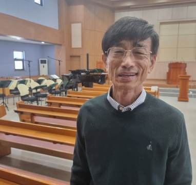

#### Vděčný diakon

_Andrew McChesney_

Jong-Moon Yoon je známý jako vděčný diakon. První slovo, které vyjde z jeho úst bez ohledu na okolnosti, je „děkuji“. Když ho někdo požádá o pomoc, řekne „děkuji“. Když čelí konfliktu, řekne: „Děkuji.“ Když ho obklopují těžkosti a dokonce i ztráty, říká: „Děkuji.“

Diakon v jihokorejském sboru Církve adventistů sedmého dne si vzal k srdci slova apoštola Pavla, který v 1. Tesalonickým 5,18 řekl: "Za všech okolností děkujte, neboť to je vůle Boží v Kristu Ježíši pro vás.“. A lidé si toho všimli.

Jong-Moon je dlouholetým majitelem kavárny na pláži v Jeongdongjinu, která je jedním z nejoblíbenějších míst pro pozorování východů slunce v Jižní Koreji, zejména na Nový rok. Mezi jeho zákazníky patřila i Nanum. Jako teenagerka se občas zastavila v kavárně, aby si vychutnala východ slunce u jednoduché snídaně v podobě čaje a opečeného sendviče se smaženým vejcem, salátem a sýrem. Když byla starší, vdala se a narodila se jí dcera Azsa. Obě se staly pravidelnými zákaznicemi snídaně a matka žasla nad Jong-Mooninou vděčností. Když si objednala jídlo, Jong-Moon řekl: „Děkuji.“ Když zaplatila za snídani, řekl: „Děkuji.“ Když mu poděkovala za jídlo, řekl: „Děkuji.“

Při jedné návštěvě s ním navázala rozhovor a dozvěděla se, že do kostela chodí v sobotu. Nikdy předtím neslyšela o tom, že by lidé chodili v sobotu na bohoslužby. „Mohla bych s vámi jít příští sobotu do kostela?“ zeptala se.

Následující sobotu Nanum se svou pětiletou dcerou doprovázela Jong-Moona do jeho sboru, který se nachází asi 30 minut jízdy od jeho kavárny. Členové sboru matku s dcerou srdečně přivítali a dychtivě se ji ptali, jak se o sboru dozvěděla. Odpověděla, že přišla kvůli vděčnému diakonovi.

Po bohoslužbě Nanum řekla Jong-Moonovi, že by chtěla přijít znovu. „Pokud je tohle církev, kterou navštěvujete, budu vás následovat,“ řekla.

I když Nanum v kavárně nikdy nezaslechla Ježíšovo jméno, skrze Jong-Moonova vděčného ducha Ježíše viděla. Evangelium není zvěstováno jen slovem, ale také zprostředkováno životem člověka. Díky Jong-Moonovu příkladu začala mladá matka s dcerou pravidelně navštěvovat sbor. Nyní se modlí, aby se k nim v sobotu ráno připojil i její manžel.

_Část darů třinácté soboty v tomto čtvrtletí pomůže šířit evangelium v Jižní Koreji. Děkujeme vám, že 29. března plánujete štědré dary._

  
Jong-Moon Yoon
