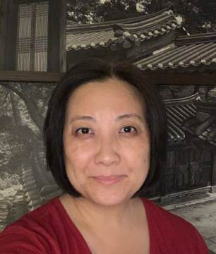

#### „Nemůžeš projít kolem“

_Andrew McChesney_

Americká misionářka Joanne (Park) Kim šla do svého pronajatého bytu v mongolském Ulánbátaru. Bylo to uprostřed zimy a teplota během odpoledne klesla k -40 stupňům Celsia.

Na chodníku uviděla ležet opilého muže. Za poslední rok ji v Mongolsku několik opilých mužů napadlo, a tak se nechtěla zastavovat. Co kdyby ji také napadl? Začala kolem něj procházet, ale v tom se zastavila. Jako by ji nějaký tichý hlas říkal: „Nemůžeš jen tak projít kolem“.

Joanne bojovala s myšlenkou, že mu pomůže. „Pane,“ řekla, “on váží skoro dvakrát tolik co já. Jak mu já můžu pomoci?“

Rozhlédla se kolem sebe. Ulice byla prázdná. V dohledu nebyli žádní další lidé.

Joanne se znovu podívala na toho cizího muže. „Když kolem jen projdu, on zemře,“ pomyslela si. „Jeho tělo za pár hodin zmrzne.“

Všude kolem viděla obytné domy. Každá budova měla v prvním patře malou místnost pro hlídače, takže u vchodu bylo poměrně teplo. Nejbližší budova byla vzdálená asi tři sta metrů. „Dobře, Pane,“ řekla Joanne. „Přesunu toho chlapa k té budově.“ Vložila své paže pod jeho, pomodlila se o sílu a zatáhla. Nějakým způsobem ho k budově dotáhla. Položila ho ke vchodu, ustoupila a podívala se na něj. Srdce jí naplnil nový pocit. Pocítila soucit a lítost.

Toto setkání znamenalo zlom v Joannině misijní práci. Už k útočníkům nechovala žádné zlé pocity. Místo toho ji zaplavil pocit soucitu a lítosti. Konečně dokázala milovat jako Ježíš.

Joanne pomáhala zakládat první adventistický sbor v Ulánbátaru jako průkopnická misionářka podpůrné misijní organizace v letech 1992-1998. V roce 2017 se vrátila a nyní působí jako ředitelka pro vzdělávání a rozvoj Církve adventistů v Mongolsku.

I nyní ji čas od času napadají opilci, ale její láska k Bohu a jeho lidem je neochvějná. „Satan se nevzdává,“ řekla. „Věděl, že mě může zlomit. Ale Bůh mě obdařil mongolským jazykem a změnou srdce. Bůh miluje i ty opilé muže, kteří mě neustále napadali, takže je musím milovat a pomáhat jim, jak nejlépe dovedu.“

_Na misijní práci v Mongolsku se můžete podílet také prostřednictvím darů třinácté soboty tohoto čtvrtletí, jejíž část pomůže otevřít v mongolském Ulánbátaru rekreační středisko, kde mohou děti duchovně, duševně, společensky i fyzicky růst._

  
Joanne Kim
