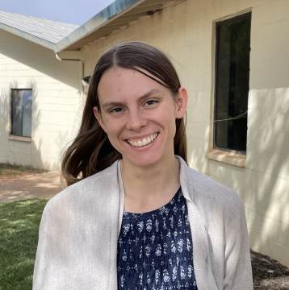

#### Hlas ve tmě

_Andrew McChesney_

Grace Babcock uprostřed noci náhle probudil rozzlobený hlas. „Ty to nevíš,“ řekl hlas. „Nerozumíš tomu.“

Grace nebyla vystrašená. Jestli něco byla, tak byla rozlobená, že ji někdo vzbudil v jejím jednopokojovém bytě v Holbrookově indiánské škole, kde pracovala jako učitelka. Poslouchala...

„Bůh tě používá jako loutku,“ řekl hlas. „Jsou věci, o kterých nevíš. Slepě následuješ Boha a Bůh je přitom tyran“.

Grace zápasila s důvěrou Bohu. Nedávná smrt holbrookského studenta při nehodě autobusu ji těžce zasáhla. Měla na Boha mnoho otázek, ale nechtěla s ním o nich mluvit.

Nyní hlas obviňoval Boha, a to se jí také nelíbilo.

„Jdi pryč,“ řekla. „Nechci s tebou mluvit.“

Hlas zmlkl.

Obvinění proti Bohu však v místnosti těžce viselo. Grace nechtěla s Bohem mluvit, ale považovala za fér, aby mu byla dána příležitost na obvinění odpovědět. A tak se Boha zeptala na každé konkrétní obvinění, které slyšela. Ticho. Usnula.

Druhý den se Grace vydala do přírody na místo, kde často ráda přemýšlela. Seděla na hnědé skále a znovu přednesla Bohu svá obvinění. Ticho. Když se setmělo, vrátila se domů.

Další den se vrátila na místo v přírodě. Opět ticho. Když však šla domů, ucítila hlas, který jí říkal: „Nepotřebuješ znát odpovědi na otázky, které si kladeš. Potřebuješ mít víru a důvěru.“

„To je pravda,“ řekla. „Nepotřebuji znát odpovědi. Ale potřebuji vědět, že jsi dobrý. Právě teď ale nevím, zda jsi dobrý.“

Doma Grace otevřela materiály ke studiu Bible v sobotní škole a začala číst. Při čtení ucítila hlas, který jí řekl: „Podívej se nahoru.“

Když se podívala nahoru, uviděla na lednici obrázek z omalovánky. Obrázek jí daroval žák páté třídy a byl na něm vyobrazen Ježíšův kříž a slova z Janova evangelia 3,16. „To jsi udělal pro nás, Ježíši,“ řekla Grace. „Protože jsi to udělal, jsi dobrý. Jsi opravdu dobrý. Mohu Ti důvěřovat, i když neznám odpovědi na všechny své otázky.“

_Tento misijní příběh nabízí pohled na předchozí projekt třinácté soboty. Grace Babcock učí žáky americké adventistické indiánské základní školy v Holbrook, která obdržela část darů ze sbírky třinácté soboty v roce 2021. Děkujeme, že 29. března podpoříte šíření evangelia prostřednictvím darů třinácté soboty v tomto čtvrtletí._

  
Grace Babcock
