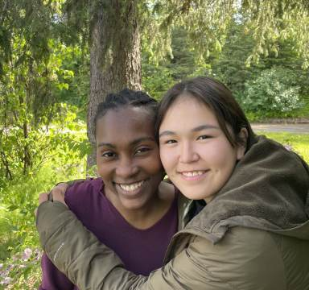

#### Vytrvalý volající: Část 1.

_Andrew McChesney_

Připojit se na Zoomu prostě nešlo.

„Nefunguje to!“ vykřikla Matrona.

Přes telefon Colette slyšela, jak Matrona na počítači dokola zadává heslo pro Zoom.

Ten týden se pokoušely spojit přes Zoom už mnohokrát. Matrona patřila k mnoha dětem původních obyvatel Aljašky žijících v dětských domovech a pěstounských rodinách na Aljašce a toužila se s Colette seznámit.

Znovu zkusila zadat heslo. „Nefunguje to!“, znovu vykřikla.

„To je v pořádku,“ řekla Colette.

„Není to v pořádku! Chci to zkusit znovu,“ řekla Matrona.

Když to stále nefungovalo, Colette navrhla, aby si místo toho promluvily po telefonu.

Colette Reahl, dětská lékařka adventistů sedmého dne v Anchorage, se s Matronou také chtěla seznámit. Matrona, dívka původních obyvatel Aljašky, žila v dětském domově ve Fairbanksu, vzdáleném 360 mil od Colette a měla nárok na adopci .

Matrona neochotně souhlasila s telefonickým rozhovorem. První otázka, kterou položila, zněla: „Jaká jsou u vás domácí pravidla?“.

„O tom si můžeme více promluvit, až přijedeš do našeho domu,“ řekla Colette. „Ale u nás doma je dost důležitá úcta.“

Matrona se Colette vyptávala dalších 30 minut. Na konci rozhovoru řekla: „Víš, že moje pěstounská mamka mě bude adoptovat, že?“

To Colette, rodačka z Floridy, která žila se svým manželem osm let na Aljašce, nevěděla. Pomyslela si: _Matrona je tak zajímavá a má tak obrovskou osobnost. Tohle bude dobrodružství!_

Ze své strany Matrona věděla, že Colette ji chce adoptovat, ale nechtěla zažít zklamání. Proto bylo pro Matronu složitější, aby se s Colette zblížila.

Colette se zeptala, jak často může volat, a Matrona navrhla, že jednou týdně v úterý. Ale když Colette zavolala, Matrona nebyla k zastižení nebo to nezvedala. Změnily čas na čtvrtky a pak na soboty.

Colette cítila, že je Matrona naštvaná, ale nechápala proč. Rozhodla se, že bude volat každý týden, ať už Matrona bude chtít mluvit, nebo ne. Když volala dál s bezpodmínečnou láskou, Matronino srdce začalo tát.

_Tento misijní příběh nabízí pohled na předchozí projekt Třinácté soboty. Pediatrička Colette Reahl je také spoluvedoucí ve sboru Církve adventistů sedmého dne v Bethel na Aljašce, který obdržel část darů třinácté soboty v roce 2024. Děkujeme vám, že 29. března pomůžete šířit evangelium prostřednictvím darů třinácté soboty i v tomto čtvrtletí._

_Více o Colette a Matroně se dozvíte příští týden._

