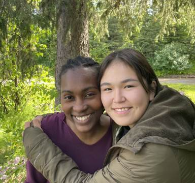

#### Vytrvalá matka: Část 3.

_Andrew McChesney_

Dětská lékařka Colette Reahl doufala, že se jí podaří přivést třináctiletou Aljašskou indiánku domů ještě před sobotou. Matroně sice řekla, že je adventistka sedmého dne, ale zdálo se jí jako dobrý nápad zabydlet se doma v Anchorage dříve, než spolu stráví první sobotu.

Aljašské adopční úřady však měly jinou představu. Řekly Colette, že si může dívku vzít v sobotu.

Den před velkým stěhováním zavolala Colette Matroně do jejího dětského domova v Anchorage. „V sobotu obvykle chodím do sboru. Nechtěla bys jít se mnou?“ zeptala se.

„Ne,“ řekla Matrona.

Když Matrona druhý den ráno dorazila, oznámila, že se chce dívat na televizi.

„V soboty se u nás doma díváme na pořady s křesťanskou tematikou nebo na videa o přírodě,“ odpověděla Colette.

Matrona byla překvapená. Zeptala se, jestli by se místo toho mohla dívat na animovaný televizní pořad o divokých zvířatech.

Colette a Matrona spolu strávily dva měsíce kvalitního času v Anchorage, než se přestěhovaly do Bethelu, kde Colette získala novou práci v nemocnici. Během této doby si vytvořily návyky a budovaly svůj vztah. Měly ranní a večerní pobožnosti a Matrona duchovně rostla.

Dnes je Matroně 15 let a ráda žije v Bethelu, kde chodí do domácí školy, navštěvuje hodiny klavíru, má mnoho přátel a aktivně se zapojuje do života sboru Církve adventistů sedmého dne v Bethel.

„Bůh to prostě všechno zařídil,“ řekla Colette, která kromě toho, že pracuje jako dětská lékařka, slouží jako biblická pracovnice a spoluvedoucí sboru.

„Ta drzá Matrona, se kterou jsem se poprvé setkala po telefonu, je úplně jiná než Matrona, která je teď,“ řekla. „Je vedoucí dětí ve sboru i v komunitě. Vidím, že Bůh v jejím životě působí a jak zraje její víra.“

Matrona vyjádřila vděčnost za vytrvalé telefonáty Colette a nyní i za její vytrvalou lásku jako matky. „Kdyby se nesnažila a nepokoušela se ke mně dostat, nevěděla bych, kdo je Bůh,“ řekla.

Řekla, že Bůh si Colette použil, aby změnil její život. „To, jak mě našla, nebyla náhoda,“ řekla. „Cítím, že Bůh ji ke mně dovedl a mě Bůh zase dovedl k ní. Bůh mě přivedl na dobré místo a dal mi pokoj.“

_Tento misijní příběh nabízí pohled do sboru Církve adventistů sedmého dne v Bethel na Aljašce, který obdržel část darů třinácté soboty v roce 2024.  Děkujeme vám, že pomůžete šířit evangelium prostřednictvím sbírky třinácté soboty, která se uskuteční 29. března._

