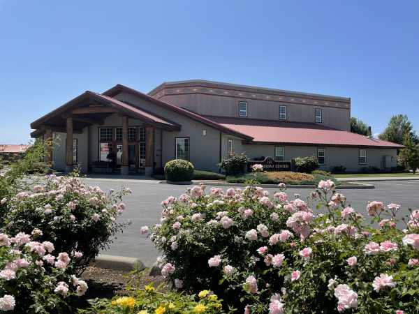

#### Proměněná mysl

_Andrew McChesney_

Mitch, surový člen gangu, se dostal do rvačky s několika dalšími domorodými Američany ve státě Washington. Utrpěl vážné zranění hlavy a lékaři mu řekli, že už nikdy nebude moci pracovat.

Pak ho jeho mladší bratr Stephan pozval do komunity církve adventistů All Nations Center ve Wapato ve státě Washington. Stephan chodil každou sobotu na bohoslužby do sboru se svou matkou a sestrou.

Mitch nechtěl jít a do sboru se v sobotu vydal s nechutí. Ale pak tam šel znovu a znovu. Ponořil se do Bible, poháněn nadějí, že mu může uzdravit mysl. Držel se Římanům 12,2, kde se píše: „A nepřizpůsobujte se tomuto věku, nýbrž proměňujte se obnovou své mysli, abyste mohli rozpoznat, co je vůle Boží, co je dobré, Bohu milé a dokonalé.“. Přijal za své verš Filipským 4,8: „Konečně, bratří, přemýšlejte o všem, co je pravdivé, čestné, spravedlivé, čisté, cokoli je hodné lásky, co má dobrou pověst, co se považuje za ctnost a co sklízí pochvalu.“

Vedoucí sboru Jeff Weijohn ho povzbuzoval slovy: „Boží slovo slibuje, že pokud ho budeš studovat, změní tvou mysl.“

Mitch začal vidět, jak se biblické sliby naplňují. Lékaři, kteří mu řekli, že už nikdy nebude moci pracovat, byli překvapeni, když viděli, že si našel práci a udržel si ji.

Po studiu Bible dal Mitch své srdce Ježíši a připojil se k Církvi adventistů sedmého dne. Poté se stal biblickým pracovníkem a začal učit Bibli ostatní. On a jeho žena otevřeli svůj dům mladým lidem, kteří potřebovali místo k pobytu. Kdokoli byl vítán, pokud dodržoval domácí pravidla. Jedním z pravidel bylo, že všichni chodili v sobotu do sboru.

Životy jejich hostů se také začaly měnit.

Jeden mladý člověk v sobotu radostně řekl Jeffovi: „Víš co? Když jsi nám vyprávěl o Bibli, vůbec jsme tě nechtěli poslouchat. Ale teď Bibli chceme studovat.“

Jeff řekl, že změna v Mitchově životě byla revoluční.

„Když přijal Boha do svého života, lidé ho už nepoznávali,“ řekl. „Z člověka, který byl velmi tvrdý a měl poškozený mozek, se stal člověk schopný sloužit. Mnoho mladých lidí jím bylo dotčeno. Bůh skrze nás působí navzdory nám samotným.“

_Program pomoci domorodým Američanům ve Wapato a okolním regionu státu Washington byl zahájen v roce 1990 s pomocí darů třinácté soboty. Vrcholem tohoto programu je komunita církve adventistů All Nations Center (na obrázku), která byla otevřena v roce 2001._

 
