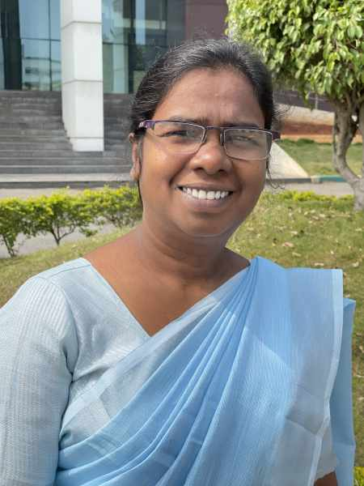

#### Podivný a tichý svět

_Andrew McChesney_

Nikdo ve městě nikdy nekonvertoval ke křesťanství a obyvatelé města hořeli hněvem, když se otec Kokily a další čtyři rodiny rozhodly dodržovat sobotu. Kokile bylo devět let a její život se navždy změnil.

Matka Kokily zemřela, když byla Kokila ještě miminko, a tak žila se svým otcem, čtyřmi staršími sestrami a starším bratrem v jižní Asii.

Když začal Otec, chudý farmář, dodržovat sobotu , dostal zákaz pracovat na poli. Jemu a ostatním, kteří dodržovali sobotu, bylo také zakázáno nakupovat jídlo v obchodech.

Kromě toho představitelé města oznámili, že každý, kdo promluví s těmi, kteří dodržují sobotu, bude muset zaplatit vysokou pokutu.

V důsledku toho sousedé odmítali mluvit s Kokilou a její rodinou. Kokila také nemluvila se svými sousedy. Nikdo nechtěl platit pokutu. Kokila měla mnoho přátel, ale všechny ztratila. Pro dívku to byl podivný a tichý svět.

Když se otec odmítl vzdát se své víry, sousedé se uchýlili k násilí. Rozzuřeně vtrhli do Kokilina domu, sebraly nábytek, oblečení a nádobí a vyhodily je na ulici. Také zbili jejího otce a bratra.

Jeden soused se však v této temné době ukázal jako jasné světlo. Také nebyl křesťan, ale nepatřil ke stejnému hlavnímu světovému náboženství jako ostatní obyvatelé města. Pomohl Kokilině rodině koupit rýži. Promluvil s Kokilou a ochotně zaplatil pokutu za porušení městských pravidel.

Sedm let žila Kokila v hrozných podmínkách. Tři rodiny, které přijaly sobotu ve stejnou dobu jako Kokilin otec, změnily názor a opustily církev. Pouze dvě z pěti rodin, včetně Kokiliny rodiny, zůstaly věrné Bohu.

Kokila si nikdy nestěžovala, ale hodně plakala. Otec viděl její slzy a rozhodl se ji poslat do adventistické internátní školy. Pro dívku to bylo jako kousek nebe na zemi.

„Učitelé byli velmi milí a laskaví,“ vzpomíná Kokila, které je dnes 39 let a pracuje jako sekretářka v internátní škole E. D. Thomas Memorial Higher Secondary School v Thanjavuru v Indii. „Učitelé se mnou mluvili! Děti se mnou mluvily! Bylo tak hezké mít zase přátele.“

_Děkujeme za vaše misijní dary, které podporují školy Církve adventistů sedmého dne po celém světě. E. D. Thomas Memorial Higher Secondary School obdržela část darů třinácté soboty v roce 2020._

