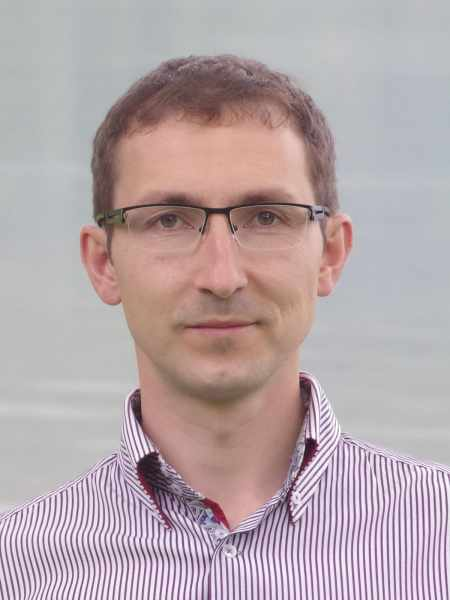

#### Zvláštní mise: Nemocnice

_Andrew McChesney_

Dmitrij Bagal, ruský misionář žijící v Německu, shledal nemocnici jako nečekané misijní pole, když se tam léčil s rakovinou, která se nakonec ukázala být třemi benigními nádory. Viděl tam lidi ze všech společenských vrstev – zejména osoby sekulární a postkřesťanské a lidi z nekřesťanských světových náboženství – kteří se potýkali s těžkými otázkami o Bohu.

Jeden pacient podstoupil šest cyklů chemoterapie a operaci v mnichovské nemocnici. Když se však po šesti týdnech rakovina vrátila, lékař neviděl smysl v jejím opětovném odstranění. Muž nebyl schopen jasně uvažovat a stěží poznal svou ženu. Její jedinou touhou bylo zůstat s manželem během jeho posledních dnů na paliativní péči. V pravý okamžik Dmitrij dal ženě brožuru o Bohu a utrpení a s manželským párem se pomodlil. Modlitba ženu dojala k slzám.

Později toho dne Dmitrij dal ženě výtisky knih Velký spor a Touhu věků, s tím, že tyto knihy poskytly velkou útěchu jemu i mnoha dalším. Žena knihy chtěla, ale ne zadarmo. Dala mu 14 euro, všechny drobné, které měla v peněžence. Dmitrij věří, že se ti dva znovu setkají, pokud ne na této zemi, tak na nové zemi.

Dmitrij se také setkal s mladým mužem hospitalizovaným s neznámou nemocí. Muž, který pocházel z Íránu, vzdal studium v Británii a odletěl do Německa na léčbu. Lékaři však nedokázali diagnostikovat jeho nemoc. Nemohl chodit, takže Dmitrij ho téměř každý den vozil po areálu nemocnice na invalidním vozíku. I když nebyl vychován jako křesťan, dovolil Dmitrijovi, aby se za něj modlil k Ježíši. Dmitrij se modlil den za dnem a mladý muž se začal uzdravovat. Brzy mohl s pomocí stát a chodit. Oba spolu hovořili německy, ale protože mladý muž studoval v Británii, Dmitrij mu dal anglickou kopii knihy Velký spor. O několik měsíců později se Dmitrij za něj stále modlil a držel se slov: „Pamatujte však, že neznáte a nemůžete změřit výsledek věrného úsilí“ (Ellen G. White, Colporteur Ministry, str. 114).

Během dvou týdnů v nemocnici Dmitrij rozdal 20 výtisků knihy Velký spor a dalších knih, rozdával vizitky s QR kódy pro stažení knihy a zásobil asi 10 veřejných knihoven v nemocnici knihami.

„Bylo zaseto mnoho semen a modlím se, aby přinesla ovoce,“ řekl. „Pracujeme pod Božím vedením a výsledky necháváme na Něm.“

