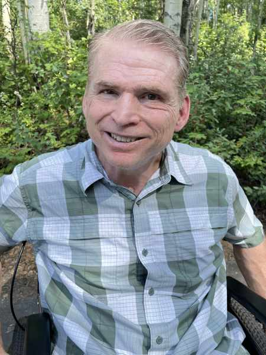

#### Všechno napomáhá

_Andrew McChesney_

Carl Casey, pilot vrtulníku a učitel přírodovědy na Aljašce, utrpěl ve věku 51 let mozkovou mrtvici. Nemohl pochopit proč. Dlouho předtím, než se stal adventistou sedmého dne, přestal jíst nečisté maso, protože zjistil, že to Bible zakazuje a k tomu si přečetl vědecké důkazy, které to potvrzovaly.

Mrtvice otřásla Carlovým životem ve Fairbanksu. Nemohl chodit ani pracovat.

Pak si přečetl v listu Římanům 8:28: „Víme, že všecko napomáhá k dobrému těm, kdo milují Boha, kdo jsou povoláni podle jeho rozhodnutí.“ Tento verš četl mnohokrát, ale nyní nabyl nový význam. Uvědomil si, že se tam neříká „všechno je dobré pro ty, kdo milují Boha“, ale „všechno napomáhá k dobrému těm, kdo milují Boha“.

Carl se přestal ptát proč. Místo toho požádal Boha, aby jeho mrtvici použil k záchraně duší na Aljašce. Chtěl být schopen zopakovat slova Josefa a říci: „Zamýšleli jste proti mně zlé věci; Bůh to však zamýšlel k dobrému, aby se stalo, co dnes vidíte – aby byl zachráněn život mnoha lidí.“ (Genesis 50:20).

Carl začal hledat příležitosti, aby mohl svědčit o Bohu na Aljašce, která je náročným misijním polem s obtížnou historií, dlouhými chladnými zimami a omezenou dopravní sítí a další infrastrukturou na rozsáhlém území. Mezi 733 000 obyvateli žije pouze kolem 3 000 adventistů. Carl si rychle uvědomil, že jeho invalidní vozík ho staví do jedinečné pozice. Lidé si ho nemohli nevšimnout. Když upoutal jejich pozornost, hovořil s nadšením o své lásce k Bohu.

Lidé reagovali překvapeně. „Jste na invalidním vozíku a zajímáte se o Boha?“ ptali se.

„To si pište!“ odpověděl Carl. Poté velebil Boží velkou lásku. Citoval Římanům 3:23, kde se píše, že všichni zhřešili a nedosahují Boží slávy, a Jan 3:16, kde se píše, že všichni, kdo věří v Ježíše, mají věčný život. Povzbuzoval lidi, aby denně četli Bibli a přibližovali se k Bohu, protože věřil, že jakmile vznikne osobní vztah, vše ostatní se dá do pořádku, včetně přijetí doktrín, jako je sobota, a učení, jako je "levitská strava".

Carl ochotně přiznává, že zdravá strava jeho mrtvici nezabránila. „Moje mrtvice nebyla způsobena nezdravým stravováním, ale jednoduše výsledkem života v hříšném světě,“ řekl. „Mám štěstí, že jsem naživu. Většina lidí po takové mrtvici umírá.“ Stále doporučuje a dodržuje levitskou stravu jako cestu k delšímu a zdravějšímu životu.

Téměř deset let po mrtvici může říci, že se životy změnili právě díky ní.

„Díky této mrtvici uvidím lidi v nebi,“ řekl Carl. „Budou tam lidé, kteří by tam jinak nebyli. Takže všechno napomáhá k dobrému těm, kdo milují Boha.“

