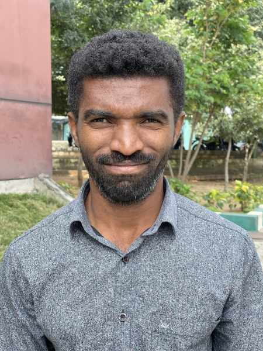

#### Poznání vševědoucího Boha

_Andrew McChesney_

Když Iqbal cestoval více než 600 mil od svého domova, aby se učil anglicky na internátní střední škole Církve adventistů sedmého dne v jižní Asii, tak o Ježíši nevěděl nic. Vyrůstal v nekřesťanské rodině a jeho rodiče ho ve věku 20 let poslali do školy za jeho sestrou. Ta tam studovala a vynikala v hodinách angličtiny.

Iqbal se účastnil všech ranních a večerních bohoslužeb školy. Chodil také na všechny sobotní bohoslužby. V jeho srdci se začalo rodit přání poznat Ježíše. Četl Bibli a hledal informace o Ježíši. Jeho pozornost upoutal verš z Jeremjáše 1:5: „Dříve než jsem tě vytvořil v životě matky, znal jsem tě, dříve než jsi vyšel z lůna, posvětil jsem tě...“.

Pomyslel si: „Chci poznat Ježíše osobně, protože on mě znal osobně, ještě než mě utvořil v lůně mé matky.“

Týdny se proměnily v měsíce a Iqbal se dozvěděl o Ježíši více. Pomyslel si: „Je možné, že mě Ježíš přivedl více než 600 mil od mého domova nejen proto, abych se naučil anglicky, ale také abych se dověděl o Jeho lásce?“

Začal ve svém životě zakoušet Ježíšovu lásku a dva a půl roku po příchodu do školy se rozhodl odevzdat své srdce Ježíši a nechat se pokřtít.

Po absolvování školy získal Iqbal bakalářský titul v oboru Aplikovaná informatika na Lowry Adventist College v Bengalúru v Indii a stal se členem jejího personálu, kde pracuje v rámci kampusových duchovních aktivit. Ježíš je jeho život.

„Teď jsem šťastný, že žiji s Ježíšem,“ řekl. „Ježíš mě den za dnem vede a stará se o mě. Kdykoli čelím problému, Ježíš Kristus je mým útočištěm a z toho problému mě vyvede.“

Iqbal vyjádřil údiv nad vševědoucností Ježíše, nad myšlenkou, že Ježíš ho znal nejen předtím, než ho stvořil v lůně jeho matky, ale že také zná jeho potřeby dříve, než si je uvědomí on sám.

„Děkuji Ježíši, že se stará o mé potřeby dlouho předtím, než o nich vůbec vím,“ řekl. „Než ho požádám, ví, co mi dát a skrze koho mi to dát. To je důvod, proč mu důvěřuji a proč jej každý den více miluji.“

_Lowry Adventist College obdržela v roce 2024 část darů třinácté soboty na otevření anglického sboru. Děkujeme za vaše misijní dary, které podporují důležité projekty po celém světě._

