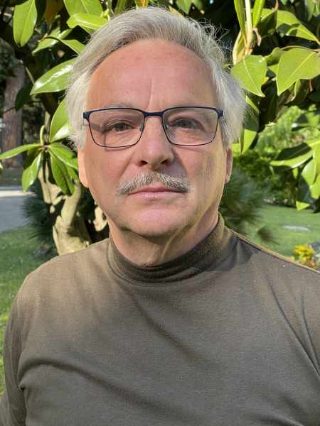

#### Obklopen Boží láskou

_Andrew McChesney_

Když šestnáctiletý Domenico potkal na taneční zábavě v italské Florencii Fulvii, nechtěl ji ztratit. A tak zalhal, když se ho zeptala na jeho rodiče.

„Co dělají tvoji rodiče?“ zeptala se.

„Moji rodiče jsou bohatí,“ odpověděl. „Mají krásné auto.“

Pak se Fulvia zeptala, kde bydlí. Bez přemýšlení jí dal adresu sirotčince, kde žil.

Ale když šla na uvedenou adresu a našla sirotčinec, Domenico už nemohl dál lhát. „Jsem sirotek,“ řekl. „Bydlím tady.“

Fulvia všechno řekla svému otci a Domenico si myslel, že tím jejich vztah skončil. Ale reakce jejího otce Domenica překvapila.

„Máme tři děti,“ řekl. „Pozvi ho k nám. Budeme mít čtyři.“

Fulviina rodina přijala Domenica jako syna a on je pravidelně navštěvoval. Obklopen jejich láskou, Domenico poprvé zakusil Boží lásku. O Bohu už slyšel, ale teď viděl Jeho lásku v reálném životě. V jeho srdci vzrostla touha poznat Boha a začal se modlit.

Uplynula léta. Domenico opustil sirotčinec a ve 22 letech se oženil s Fulvií. Stále chtěl poznat Boha. V sirotčinci viděl americký film Desatero přikázání z roku 1956 a zajímalo ho, zda existuje církev, která dodržuje všech deset přikázání. Zajímalo ho, zda někdo žije křesťanským životem, jak jej popisuje Bible.

Jednoho dne, když mu bylo 30 let, Domenico zapnul rádio a uslyšel hlas, který říkal: „Nyní budeme hovořit o apoštolu Pavlovi.“ Domenico poslouchal a všiml si, že moderátoři rozhlasového pořadu mluví jinak než všichni křesťané, které dosud znal. Začal tento rozhlasový pořad pravidelně poslouchat. Když jeden z řečníků zmínil knihu Ellen G. Whiteové Cesta ke Kristu, zavolal a požádal o její výtisk. Zeptal se také, zda by mu někdo mohl doručit knihu domů a odpovědět na otázky týkající se toho, co slyšel v rádiu.

Emmanuel a jeho žena se objevili u Domenica doma s knihou. Emmanuel otevřel Bibli, aby odpověděl na Domenicovy otázky, a na jeho žádost mu vyprávěl o historii Církve adventistů sedmého dne. Domenico chtěl poznat historii křesťanství, a tak si přečetl knihu Velký spor.

Po sedmi měsících studia Bible se Domenico cítil obklopen Boží láskou a nechal se pokřtít. „Jsem vděčný adventistickému rádiu, protože změnilo můj život,“ řekl Domenico Civardi, kterému je dnes 68 let.

_Děkujeme vám za vaše misijní dary, které pomáhají šířit evangelium prostřednictvím rozhlasových vysílání po celém světě._

 
