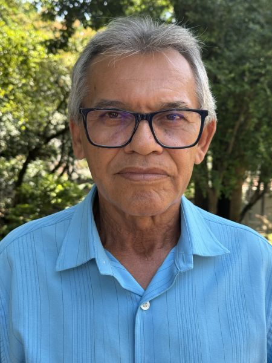

#### „Neboj se, Bůh ti pomůže.“

Když Inácio Manoel zaklepal na dveře jedné ženy v Brazílii, aby jí nabídl knihy Církve adventistů sedmého dne, žena na něj začla chrlit nenávist. „Nenávidím křesťany!“, křičela.

Inácio byl překvapený. Byl to první dům, ke kterému přišel v první den své práce knižního evangelisty. Nabízel knihy a studium Bible.

S přítelem šli k dalšímu domu. Z dvora zuřivě štěkal velký pes. Jeho přítel zamumlal něco o tom, že v prvním domě byla rozzlobená žena a ve druhém rozzlobený pes.

„Neboj se,“ řekl Inácio. „Bůh je s námi.“

Z domu vyšla žena a odvedla psa pryč. Potom pozvala Inácia a jeho přítele dovnitř. Trojice si od srdce popovídala a žena vyprávěla o svých těžkostech od té doby, co jejího manžela poslali do vězení. Následující sobotu přišla žena do sboru se svými třemi malými dětmi. Inácio byl ohromen a Bohu řekl , že chce po zbytek svého života vést lidi k Němu.

Největší překvapení však Inácia čekalo ve třetím domě, který on a jeho přítel navštívili první den práce. Žena, která tam bydlela, Edileuza, souhlasila, že se v sobotu odpoledne bude účastnit studia Bible. Jak četli týden co týden, dospěli k biblické pravdě o sobotě jako sedmém dni. Edileuza pracovala jako manikérka a hospodyně a neviděla žádnou možnost, jak by mohla v sobotu odpočívat.

„V ten den vydělávám nejvíc peněz,“ řekla. „Co mám dělat?“

„Neboj se,“ řekl Inácio. „Bůh ti pomůže. Má pro tebe něco lepšího.“

Při dalším studiu Bible Edileuza řekla, že potkala na ulici chlapíka, který se jí zeptal, zda nezná nějakou dobrou hospodyni. Práce nevyžadovala žádnou činnost během soboty, tedy od západu slunce v pátek do západu slunce v sobotu.

Edileuza zářila, když Ináciovi vyprávěla o tom, co se stalo. „Teď mám třikrát vyšší plat než jsem vydělávala jako manikérka a hospodyně,“ řekla.

Edileuza byla pokřtěna. Později ji následoval i zbytek její rodiny.

Inácio, kterému je nyní 68 let, vedl za posledních 36 let každý rok ke křtu čtyři až jedenáct lidí. Kamkoli jde, nosí s sebou biblické lekce. Jeho večerní modlitba zní: „Pane, dej mi do cesty někoho, s kým mohu sdílet Tvou lásku.“

„Mohu žít bez čehokoli na světě, ale ne bez studia Bible,“ řekl.

_Jedním z misijních projektů třinácté soboty pro toto čtvrtletí je sbor v Pernambucano Adventist Academy v brazilském státě Pernambuco, kde žije Inácio Manoel. Děkujeme vám že plánujete štědré dary._

_Podívejte se na krátké YouTube video Inácia: https://bit.ly/Inacio-Brazil._

