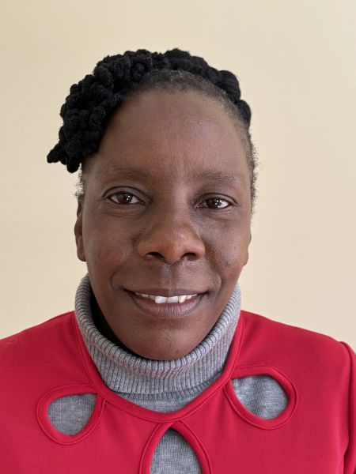

#### Cesta slz a mikin

Tsitsi Zondo nemohla uvěřit svým očím. Byla temná noc v Zimbabwe, když viděla svůj drahocenný náklad mikin rozházený po dálnici a matné postavy lidí, kteří se je snažili kvapně odnést.

Oči se jí zalily slzami. Půjčila si peníze, aby mohla v Jižní Africe mikiny nakoupit, a teď nebude schopná půjčku splatit. Neměla nic. Jak uživí své děti?

Modlila se: „Pane, ty víš, jak jsem se snažila, aby moje podnikání bylo úspěšné, a teď se stalo tohle. Ze všech tašek se otevřela jen ta moje.“

Tsitsi sbalila 60 mikin do velké tašky a naložila ji na střechu minibusu, aby je přepravila od hranic Zimbabwe s Jižní Afrikou do svého rodného města Bulawayo. Ale v polovině cesty jedna z cestujících vystupovala z minibusu a řidič při hledání jejího zavazadla otevřel a zavřel několik tašek na střeše minibusu. Tsitsiinu tašku však nechal otevřenou.

Minibus pokračoval v cestě, ale po ujetí určité vzdálenosti zastavil, protože na něj blikaly světla automobilu. Řidič automobilu řekl, že z minibusu vypadávají mikiny od té doby, co vystoupila ta cestující.

Tsitsi s hrůzou zjistila, že v tašce jí zbylo jen 10 mikin.

Řidič minibusu věděl, že je za to zodpovědný, ale bezmocně zvedl ruce. „Omlouvám se,“ řekl Tsitsi. „Prostě nemám peníze.“

Po modlitbě si Tsitsi otřela slzy. Vždy věrně odváděla desátky a dávala dary ze zboží, které dovážela z Jižní Afriky, a byla si jistá, že Bůh se o ni postará.

V Bulawayo se přátelé dozvěděli o Tsitsiině situaci a přišli se modlit. Jeden z nich jí nabídl půjčku, aby se mohla vrátit do Jižní Afriky a koupit další mikiny.

Tsitsi přijala peníze jako odpověď na modlitbu a vrátila se do Jižní Afriky. S novými mikinami byla schopna dodat všechny původní objednávky mikin. Na splacení obou půjček potřebovala celkem čtyři cesty do Jižní Afriky. Ale během té doby měla Tsitsi vždy dost peněz na jídlo a výdaje rodiny. Také nadále odevzdávala desátky a dávala dary.

Tsitsi nechápe, jak Bůh působí, ale nepochybuje o tom, že vždy zajišťuje vše potřebné.

„I když jsem přišla o všechno, moje rodina a já jsme nikdy netrpěli hladem. Vždy jsme měli co jíst,“ řekla. „Pokud jste věrní a dáváte Pánu desátky a dary, Pán se o vás vždy postarà.“

_Podívejte se na krátké YouTube video Tsitsi Zondo: https://bit.ly/Tsitsi._

