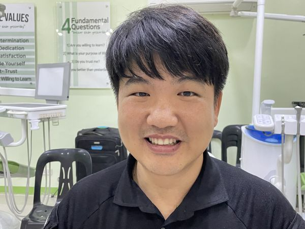

#### „Jak milujeme Boha?“

Kim Sun, misionář z Jižní Koreje, po dobu tří měsíců sdílel s obyvateli odlehlého městečka na Filipínách 15 příběhů o Boží lásce.

Místní obyvatelé byli ohromeni, když se dozvěděli, že Bůh stvořil vše na světě pro ně. Žasli nad Boží láskou v podobenstvích o milosrdném Samaritánovi a marnotratném synovi. Poznání, že Ježíš za ně zemřel na kříži, se dotklo jejich srdce. Po třech měsících mnozí řekli: „Chápeme, že nás Bůh miluje. Ale jak na to můžeme reagovat? Jak milujeme Boha my?“

„To je tak pravdivé,“ pomyslel si Sun s úžasem. „Když víme, že nás někdo miluje, chceme mu tu lásku oplatit.“ Bylo na čase se hlouběji ponořit do Bible.

Následující tři měsíce učil o sedmém dni -  sobotě, čistých a nečistých potravinách, desátcích a darech a dalších základech víry adventistů sedmého dne. Mnozí obyvatelé města přijali to, co se naučili. Chtěli vědět, jak milovat Boha, a učení jim ukázalo cestu.

Sun sloužil jako misionář po dobu 10 měsíců: tři měsíce bezplatně pracoval, tři měsíce vyprávěl příběhy o Boží lásce a tři měsíce se hlouběji zabýval Biblí. Zbýval mu jeden měsíc na rozloučení. Sun strávil poslední měsíc chozením od dveří ke dveřím a zval lidi, aby následovali Ježíše. „Brzy odjíždím,“ řekl. „Rád bych, abyste se připojili k mé církvi. Byl jsem tak požehnán a rád bych, abyste byli požehnáni také.“ Mnoho obyvatel města jeho pozvání přijalo.

Ellen Whiteová říká: „Pouze Kristova metoda přinese skutečný úspěch v oslovování lidí. Spasitel se stýkal s lidmi jako někdo, kdo jim přeje dobro. Projevoval jim soucit, staral se o jejich potřeby a získal si jejich důvěru. Potom jim řekl: ‚Následuj mě‘“ (The Ministry of Healing, str. 143). Deset měsíců Sun praktikoval Kristovu metodu: stýkal se s lidmi, chtěl pro ně to nejlepší, projevoval jim soucit, staral se o jejich potřeby a získával si jejich důvěru; pak je pozval, aby následovali Ježíše.

Dnes je Sun misijním pracovníkem na plný úvazek. Pracuje jako zástupce ředitele organizace 1000 Missionary Movement, která je součástí Jižní asijsko-pacifické divize Církve adventistů sedmého dne. Každý rok školí stovky misijních pracovníků v jejím sídle, které bylo postaveno v roce 1996 v Silangu na Filipínách díky sbírky třinácté soboty. „Být misionářem je nejvyšší povolání,“ řekl. „Misionáři nejen vyučují Bibli. Musíme zejména ukázat Ježíše v našich životech.“

_Stejně jako je sbírka třinácté soboty z roku 1996 stále cítit v celé Jižní asijsko-pacifické divizi a mimo ni díky práci hnutí 1000 Missionary Movement, i sbírka třinácté soboty tohoto čtvrtletí může s Božím požehnáním mít dlouhodobý dopad. Děkujeme vám za vaše štědré dary v tuto sobotu._

