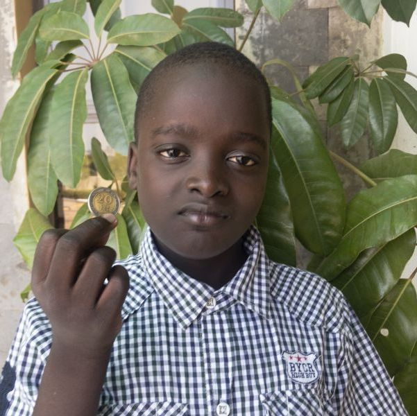

#### Peníze nikdy nedojdou

Když se jedenáctiletý Alvan Harold vracel ze školy v keňském městě Kisumu, rád poslouchal cinkání mincí ve své kapse. Mohl se totiž zastavit v obchodě a koupit si křupavé oříšky nebo studenou zmrzlinu.

Jednoho dne, když byl Alvan v páté třídě, jej šokovala učitelka Bible tím, že mu řekla o jeho milovaném kapesném. „Neměl bys utratit všechny své kapesné za oříšky a zmrzlinu,“ řekla. „Něco si schovej, abys to mohl dát Bohu v sobotu.“

Alvan dával v sobotu peníze do sbírky. Byly to peníze, které mu dal jeho otec v sobotu ráno. Učitelka mluvila také o těchto penězích. „Když dáš ve sboru peníze od svých rodičů, dáváš je jen za své rodiče,“ řekla. „Nedáváš své vlastní peníze.“ Přečetla Malachiáš 3:8: „Smí snad člověk okrádat Boha? Vždyť vy mě okrádáte! „Jak tě okrádáme?“ ptáte se. Na desátcích a obětech!“.

Alvan si myslel, že ho učitelka kritizuje, a to se mu nelíbilo. Ale pak si pomyslel: „Možná má trochu pravdu.“

Byl čtvrtek a Alvan už utratil všechno své kapesné, co na ten týden měl. Rozhodl se, že příští týden ušetří peníze pro Boha. Ale příští týden zase utratil všechny své peníze.

Uplynuly dva měsíce a Alvan byl sám sebou strašně zklamaný. Prostě nedokázal ušetřit peníze na dary.

Jednoho dne šel se svým sedmnáctiletým bratrem Allanem domů a míjeli zmrzlinárnu. Alvan měl v kapse dvacet šilinků (cca 4 koruny) a rozhodl se je utratit za zmrzlinu.

Ale jeho starší bratr ho zastavil. „Je dětinské chodit po ulici a jíst zmrzlinu,“ řekl. „Nebudu chodit po ulici s někým, kdo jí zmrzlinu.“ Alvan byl naštvaný. Chtěl zmrzlinu, ale nemohl se hádat. Tak si ji nekoupil.

Když přišla sobota, měl stále v kapse 20 šilinků. Dal minci do sbírky spolu s 20 šilinky, které mu ráno dali rodiče. Bylo příjemné dát Bohu své vlastní peníze. Vzdal se něčeho, co opravdu chtěl, aby mohl dát peníze do sbírky, a uvědomil si, že to zase nebyla taková ztráta.

Příští týden se Alvanovi podařilo ušetřit dalších 20 šilinků a dát je jako dar. Ten pocit se mu líbil! Rozhodl se, že každou sobotu bude dávat 20 šilinků – a dodnes to tak dělá. K jeho překvapení mu už nikdy nedošly peníze. Dříve neměl nikdy dost peněz na celý týden. Ale teď má vždy dost peněz. Ve skutečnosti mu často zbývá více než 20 šilinků a ty peníze dává otci, aby je uložil na spořicí účet.

Někdy je Alvan v pokušení koupit si oříšky nebo zmrzlinu, ale připomíná si, že v sobotu musí mít 20 šilinků pro Boha.

„Připomínám si, že Boží dílo je lepší než to, co chci já,“ řekl.

