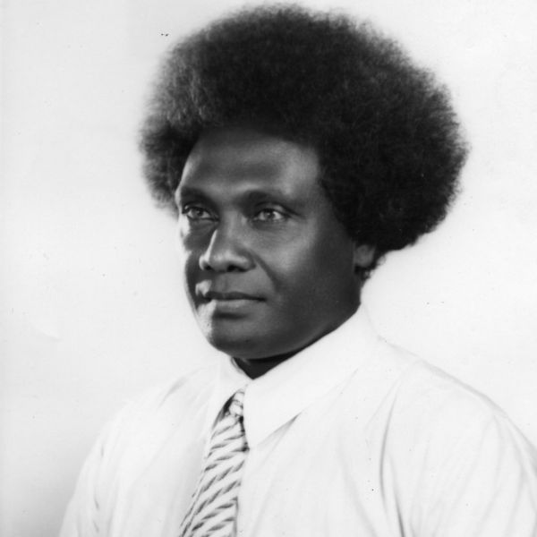

#### Žádné démonské provazy

_Olivia Fairfax_

Kmeny z laguny Marovo byly považovány za nejbojovnější a nejkanibalističtější z kmenů Šalamounových ostrovů. Uctívaly duchy svých předků, jejichž lebky si po smrti uchovávaly. Žily ve strachu z démonů.

Ale kolem roku 1902 si náčelník Marova jménem Tatagu začal klást otázku, zda se opravdu musí démonů bát. Rozhodl se to zjistit a při rybářské výpravě nepřipevnil na příď své kánoe lano z liány. Liána měla uklidnit démony a zajistit dobrý úlovek. Ale i bez liány byla rybářská výprava nakonec velkým úspěchem. Náčelník Tatagu se vrátil domů, našel novorozeného syna a pojmenoval ho Kata Ragoso, což znamená „žádné démonské provazy“.

Život Kata Ragosa měl v budoucnu odhalit Boží moc proměnit komunitu a odstranit provazy a pouta, které měl ďábel nad lidmi.

Kata Ragoso vyrůstal v době, kdy nepoctiví evropští obchodníci lákali obyvatele Šalamounových ostrovů ke svým lodím na zahraniční zboží, aby je unesli jako otroky. Ale v roce 1914, když bylo Katovi Ragosovi asi 12 let, připlula do laguny Marovo malá bílá loď pojmenovaná "Advent Herald". Posádka se nepokoušela nikoho lákat ani unášet. Místo toho kapitán Griffiths F. Jones požádal náčelníka Tatagu o pozemek pro školu. Následující rok byla v Sasaghaně postavena škola a Kata Ragoso se zapsal jako jeden z prvních 23 studentů. Ve škole přijal Ježíše a v roce 1918 byl mezi prvními deseti obyvateli Šalamounových ostrovů, kteří byli pokřtěni. Poté pracoval jako misijní učitel, překladatel a tiskař. V roce 1935 byl vysvěcen na adventistického duchovního.

Během druhé světové války byl Kata Ragoso pověřen vedením práce adventistů na Šalamounových ostrovech. Když japonská armáda vtrhla na ostrovy, nařídila mu zabíjet lidi s bílou pletí a příslušníky spojeneckých sil. Protože prohlásil, že raději bude poslouchat Boha než člověka, byl vyslýchán, bičován a nakonec odsouzen k smrti zastřelením. Vyšetřující důstojník, který měl silnou averzi vůči Církvi adventistů, nařídil popravčí četě, aby střílela, když napočítá do tří. Napočítal „jedna, dva...“, ale nebyl schopen říct „tři“. Zkoušel to mnohokrát, než to vzdal. Po deseti dnech věznění Kata Ragoso uprchl. Po zbytek války vedl záchranné operace pro spojence, jejichž letadla nebo lodě byly napadeny. Zachránil 27 amerických pilotů a 187 australských a novozélandských vojáků.

Kata Ragoso zemřel v roce 1964 ve věku 62 let, poté co sloužil církvi 37 let. Během té doby viděl, jak se Marovo proměnilo z válčící komunity v milosrdný lid sloužící Bohu.

_Dary třinácté soboty v tomto čtvrtletí půjdou na misijní projekty v Jižní tichomořské divizi, jejíž území zahrnuje Šalamounovy ostrovy. Děkujeme vám, že na březen plánujete štědré dary._

