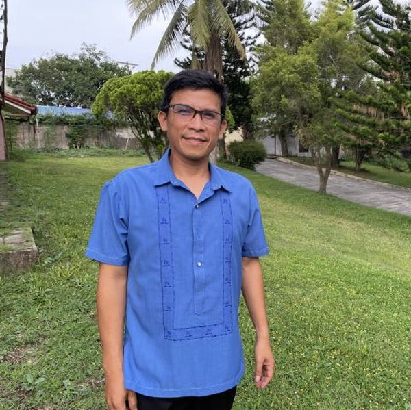

#### Stát se bohatým adventistou

Malý Rene měl rád všechno, co se týkalo adventistů sedmého dne. V jeho rodné provincii na Filipínách se zdálo, že všichni bohatí lidé jsou adventisté. Měli velké rýžové farmy a dobrou životní úroveň. Rene toužil po podobném životním stylu.

Jednoho dne ho několik adventistických dětí pozvalo, aby si s nimi četl Bibli. Potom ho syn zaměstnavatele jeho otce, adventistický rýžový farmář, pozval do sobotní školy a do sboru.

Rene poprvé slyšel o sobotě. Znělo to logicky. Také si všiml, že adventistické děti se dobře oblékaly. Líbilo se mu, že nenadávaly. Chtěl být jako ony.

Když mu bylo 12 let, nechal se pokřtít a vstoupil do církve adventististů.

Jenže ... nestal se bohatým a jeho život se zdál být čím dál horší. Jeho rodina jím kvůli jeho víře opovrhovala a přestala mu platit studium. Byl nucen opustit školu. Po čtyřech letech toho měl dost. V 16 letech opustil církev a připojil se ke svému otci na rýžových polích adventistického farmáře. Brzy začal pít, kouřit, hrát hazardní hry a jíst všechny druhy nečistých potravin.

Uplynuly dva roky a jeden sedmnáctiletý hoch, který se jmenoval Rodel, zaklepal na dveře.

„Jsem misionář,“ řekl Renově matce. „Mohu vejít?“

„Jaký typ misionáře?“, zeptala se.

„Z hnutí 1000 misionářů (1000 Missionary Movement),“ odpověděl.

„Co to je?“ zeptala se.

„Jsem misionář Církve adventistů sedmého dne,“ odpověděl.

„Jo ták..,“ řekla matka. „Můj syn je adventista, ale odpadl od víry.“

„Kde je?“

„Spí.“

Rene byl jako tvrdě pracující farmář vyčerpaný. Matka k němu Rodela zavedla.

„Příteli, proč jsi přestal být adventistou?“ zeptal se Rodel.

Rene byl překvapený, ale dal jasně najevo, že se do církve nevrátí.

„Moje rodina mě jako adventistu nenáviděla.“

„Můžu tě pozvat do sboru?“

„Myslím, že ne. Nemůžu jít.“

Rodel odešel. Ale o rok a půl později, když bylo Renému 20 let, se vrátil.

„Příteli, pojď se mnou na ryby,“ řekl.

Rodel se nesnažil přesvědčit Reneho, aby chodil do sboru. Prostě se s ním spřátelil. Chodili spolu na ryby. Po nějaké době se Rene v sobotu ocitl zpět ve sboru.

_Rene Tucaldo je finančním ředitelem hnutí 1000 Missionary Movement, jehož sídlo v Silangu na Filipínách bylo postaveno s pomocí sbírky třinácté soboty z roku 1996._

_Více se dozvíte příští týden._

 