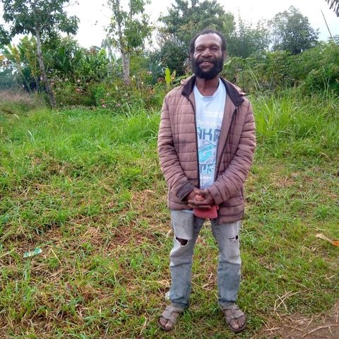

#### Jak ukradená Bible založila sbor

_David Fletcher_

V roce 2021 vypukly v Papui-Nové Guineji kmenové boje mezi pěti vesnicemi. V jedné z nich, v Kemefě, bylo vypáleno mnoho domů a došlo k rabování majetku. Nejméně 16 lidí bylo zabito.

Uprostřed konfliktu vnikl jeden z bojovníků do sboru Církve adventistů sedmého dne v Kemefě a ukradl Bibli. Bojovník Abuni Ane odnesl knihu do své rodné vesnice Orege.

Po skončení střetů začal Abuni ukradenou Bibli číst. Když četl, dotklo se to jeho srdce.

Uplynulo několik měsíců a Abuniho vesnici navštívil adventistický pastor. Abuni vytáhl ukradenou Bibli a vysvětlil pastorovi Dicksovi Nehezovi, co se stalo. Vyjádřil lítost a řekl, že chce činit pokání a zasvětit svůj život Bohu.

Pastor a Abuni založili v Orege domácí sbor a brzy se Abuni rozhodl nechat se pokřtít.

Při svém křtu Abuni sdílel svůj příběh s přítomnými členy církve v Kemefě, odkud Bibli ukradl. Požádal je o odpuštění a Bibli předal staršímu sboru.

Starší jménem sboru Abunimu odpustil a požádal ho, aby si Bibli nechal. Dal mu také jako dárek sborový zpěvník. Starší ho povzbudil, aby pokračoval ve čtení Bible, zpíval chvály Bohu a založil v Orege sbor.

Abuni se hned pustil do práce. Následující den šel s dvěma přáteli do lesa sbírat dřevo na stavbu polostálé sborové budovy. Pastor Neheza přinesl tesařské nářadí. Téhož dne byla v Orege založena církevní společnost se třemi zakládajícími členy.

Od té doby se sbor rozrostl na 18 členů, včetně osmi lidí, kteří byli pokřtěni během evangelizačních shromáždění „PNG for Christ“ v roce 2024.

Pastor Neheza je ohromen tím, že kmenové boje a ukradená Bible vedly k založení sboru. Řekl, že první stavba je nyní příliš malá a že jsou plány na vybudování větší, trvalé budovy.

_Vaše misijní dary podporují zakládání sborů v Papui-Nové Guineji a po celém světě. Sbírka třinácté soboty v tomto čtvrtletí poputuje do Jiho-tichomořské divize, jejíž území zahrnuje Papuu-Novou Guineu. Děkujeme vám za vaše štědré dary v tuto sobotu._

 
