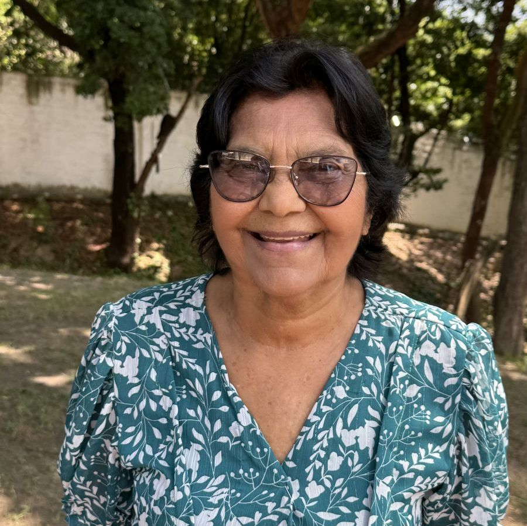

#### „Rádi pomáháme“

Po cestě k domu Jolandy v Belo Jardim, brazilském městě s 80 000 obyvateli, kráčela matka se třemi děvčátky.

Jolanda je viděla přicházet. Zrovna stála ve dveřích a dávala rýži a fazole cizímu člověku, který se zastavil, aby poprosil o jídlo. Její dům stál na rušné ulici a lidé k jejím dveřím chodili pro pomoc pravidelně. Byla si jistá, že i tito blížící se návštěvníci budou potřebovat pomocnou ruku, a tak po odchodu onoho člověka čekala.

Když matka s děvčaty došla ke dveřím, Jolandin pohled padl na nohy dětí.

„Proč jsou vaše děti bosé?“ zeptala se.

Žena vysvětlila, že se její osmileté dceři rozbily sandály, a tak požádala své čtyřleté a šestileté dcery, aby si ty své také sundaly, aby se jejich starší sestra nemusela stydět.

„Přinesu nějaké sandály a něco k jídlu,“ řekla Jolanda.

Zmizela v domě a za chvíli se vrátila se sandály pro osmileté děvče a s občerstvením v podobě obyčejných krekrů, sušenek a studené vody.

Holčičky zářily radostí. „Můžeme vám říkat babičko?“ zeptala se jedna z nich.

Matka byla Jolandinou laskavostí překvapena.

„Proč to děláte?“ zeptala se.

„Jsem křesťanka z Církve adventistů sedmého dne a my lidem rádi pomáháme,“ řekla Jolanda. „Šiji oblečení pro děti a členové sboru mi nosí mnoho darů. Mám tedy spoustu sandálů i oblečení.“

„Chci být součástí této církve,“ řekla matka. „Chci s vami studovat Bibli.“

O rok později byla matka pokřtěna a připojila se k Církvi adventistů.

Jolanda Xavier, 86letá prababička, věří, že nic není důležitější než uposlechnout Ježíšův příkaz: „Jděte ke všem národům a získávejte mi učedníky, křtěte ve jméno Otce i Syna i Ducha svatého a učte je, aby zachovávali všecko, co jsem vám přikázal.“ (Matouš 28,19–20).

„Misie je skutečně důležitá,“ řekla. „Všichni jsme se narodili z Boha, abychom byli misionáři.“

_Část darů z 13. soboty v minulém čtvrtletí, byla použita na otevření sboru na Adventistické akademii Pernambuco v brazilském státě Pernambuco, kde Jolanda žije. Děkujeme, že plánujete štědré dary pro projekty tohoto čtvrtletí. Podívejte se na video s Jolandou na YouTube: https://youtu.be/DLoixSojhF4?si=vZjdDEM1oOyuDIVF ._

 
