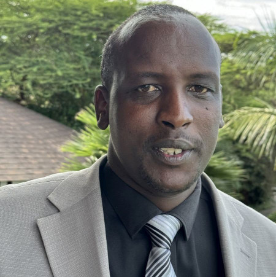

#### Naděje pro Masaje

_(pokračování z minulého týdne)_

Rompas, šestnáctiletý masajský chlapec z Keni, se po svém křtu rozhodl začít chodit do školy. Ze všeho nejvíc si přál, aby si mohl sám číst Bibli.

Musel čelit odporu svého otce i mnoha svých 82 sourozenců, kteří neviděli žádný důvod, proč by masajský chlapec měl získat vzdělání. Rompas se však stal prvním člověkem ze své rodiny, který dokončil základní i střední školu. Poté se rozhodl studovat teologii na Bugema University, adventistické univerzitě v Ugandě. Potřeboval však peníze.

Jednoho večera svolal své bratry a sestry, kteří stejně jako on zachovávali sobotu, a požádal je o modlitby, aby získal 7 000 keňských šilinků, což by mu umožnilo odcestovat do Ugandy a požádat o přijetí na Bugema University. Zatímco Rompas klečel na zemi, sourozenci se modlili. Po posledním „amen“ se ozvalo zaklepání na dveře. Byl to politik jménem Alex, který přišel navštívit Rompasova otce. Politici k nim chodili rádi, protože Rompasova početná rodina představovala v období voleb mnoho hlasů. Tento politik nebyl adventista a položil neobvyklou otázku: „Má tato velká rodina svého kazatele?“

Rompas byl Alexovi představen jako chlapec, kterému se v dětství přezdívalo „Kazatel“.

„Co potřebuješ nejvíce?“ zeptal se Alex.

„Potřebuji získat vysokoškolský titul na Bugema University v Ugandě.“

Alex vytáhl z kapsy 15 000 keňských šilinků a dal je Rompasovi. Byla to více než dvojnásobná částka, o kterou Rompas v modlitbě prosil.

Rompas odjel do Ugandy a byl přijat ke studiu teologie. Poté se vrátil domů, aby počkal na začátek výuky. V den, kdy dorazil domů, přišel Alex na další návštěvu. Když se dozvěděl, že Rompas byl přijat, podal mu chomáč amerických dolarů. Rompas nikdy předtím americké dolary v ruce nedržel. Částka stačila na zaplacení tří let studia na univerzitě.

Dnes je Rompas Josphat Lekishon adventistickým kazatelem s misionářským srdcem. Díky jeho úsilí se šest kostelů stalo sbory adventistů sedmého dne. Otevřel také sbor na pozemku svého otce, který daroval Církvi adventistů. Každou sobotu se tam ke společným bohoslužbám schází třiatřicet členů rodiny. Zvláště rád sdílí radostnou zprávu o Ježíšově příchodu s Masaji. V masajštině rozdal již více než 500 Biblí.

„Nejvíc mě těší, když mohu Masajům dávat Bibli,“ řekl. „Dává naději těm, kteří ji ztratili.“

_Část z letošních darů třinácté soboty, známé také jako čtvrtletní sbírka na misijní projekty, podpoří projekty v Keni a dalších místech Divize východní a střední Afriky._

_Podívejte se na video Rompase na YouTube: https://youtu.be/bap3Avkh-5c ._ 

 
