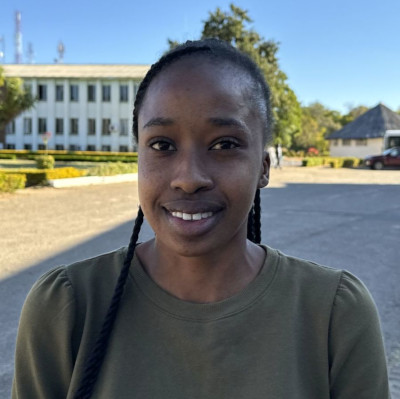

#### Schovat se na Solusi

Nebylo to kvůli víře, že šla Lindsay na univerzitu Solusi, adventistickou instituci v Zimbabwe. Nebyla adventistka. Nešla tam ani proto, že by tam měla přátele. Na univerzitě nikoho neznala. Na Solusi šla proto, že nechtěla být přistižena při lži.

Když Lindsay dokončovala střední školu, snila o studiu na univerzitě. Její rodiče jí však oznámili špatnou zprávu - neměli na to peníze.

„Musíš to pochopit,“ řekla matka. „Slibuji ti, že na univerzitu půjdeš, i když to bude nějakou dobu trvat.“

Matka byla švadlena a otec prodával šaty, závěsy a potahy na pohovky, které matka ušila. Když ale Lindsay dokončila střední školu, jejich podnikání se příliš nedařilo a rodiče se rozhodli přestěhovat do Botswany.

Otec se ji snažil povzbudit. „Bude zase lépe,“ říkal.

Dalších pět let Lindsay pomáhala v rodinném podniku. Staří přátelé ze Zimbabwe jí volali, aby zjistili, jak se jí daří.

„Co se děje ve tvém životě?“ ptali se.

„Studuji, stejně jako vy,“ odpovídala.

Jak čas plynul, téměř se svého snu o studiu na univerzitě vzdala.

Podnikání matky se postupně zlepšovalo. Získala více zákazníků a otevřela si obchod. Jednoho dne si ona a otec Lindsay zavolali a s úsměvem jí oznámili, že si může vybrat univerzitu, na které bude pokračovat ve studiu.

Lindsay byla nadšená, ale nebyla si jistá, kam jít. Uvažovala o Zimbabwské univerzitě, ale tam studovali její přátelé a ona nechtěla, aby se dozvěděli, že celou tu dobu nestudovala. Dívala se na Midlands State University, ale i tam byli její přátelé. Měla přátele na každé univerzitě kromě jediné: Solusi. Rozhodla se tedy jít tam.

Církev adventistů Lindsay vůbec neznala, když přijela. Přesto chodila každou sobotu do sboru a o osm měsíců později byla pokřtěna. Její rodiče její rozhodnutí žít pro Ježíše oslavovali.

Dnes je Lindsay Chikanda 24 let a dokončuje první rok studia. Nyní je připravena říct svým přátelům ze střední školy pravdu: „Moc mě to mrzí, ale neříkala jsem vám pravdu. Ve skutečnosti jsem nestudovala. Byla jsem v Botswaně, protože si moji rodiče nemohli dovolit platit školné, a já jsem s nimi pracovala. Pak jsem ale přišla na Solusi a našla Boha. Nechtěli byste Boha poznat také?“

_Vaše misijní dary v rámci sobotní školy podporují vzdělávání od Církve adventistů sedmého dne po celém světě. Děkujeme vám za vaše dary na misijní práci._

_Podívejte se na krátké video s Lindsay na YouTube na adrese https://youtu.be/zLLaqk3Yyh8 ._

 
