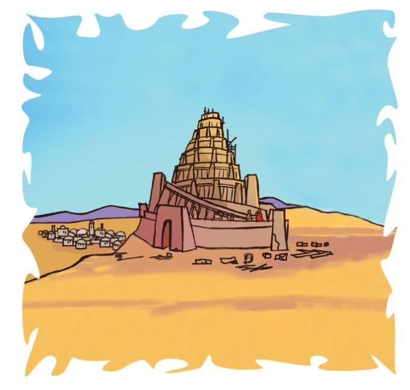
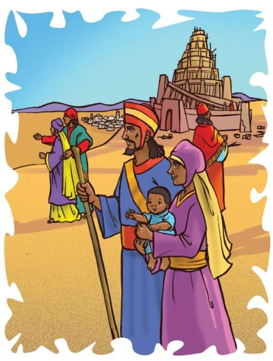

### Chhiar tûr
Genesis 11:1–9; Thlahtubulte leh Zâwlneite (2nd Edition, 2014), pp. 99–105.

> 
Châng vawn

> “Pathianin mi duhsak bîk a nei lo tih dik takin ka hria e; nimahsela hnam tin zîngah tupawh amah ṭiha fel taka ti apiang a lâwm zâwng mi an ni ṭhîn,” Tirhkohte10:34, 35.

> 
Thuchah

> Keimahni laka danglamte kan ṭanpui hian Pathian rawng kan bâwl a ni.

_Mi tute emaw an ṭawng leh thu sawi i hriat thiam miah lohte i tawng tawh ngâi em? Chu chu ṭawng dang hmang an nih vâng a ni maithei e. Hmânlâi hunah kha chuan mi tinte hian ṭawng thuhmun an hmang tlâng vek a. Mi ṭhenkhat phei chu Pathian thuâwihtute an ni a. Mahse, thil a lo danglam ta vek mai si a ni._

Hmânlâi hun rei tawh tak, Pathianin mihring lei a siam hnu lâwkah kha chuan, mi tinte khân ṭawng thuhmun an hmang tlâng ṭheuh a. Thil hming an phuah leh sawi dânte pawh a thuhmun bawk a. Khawi hmuna chêng pawh ni se, an ṭawng leh thil sawi chu an inhre tlâng vek bawk a. Mi ṭhenkhat chu tlêma hmun hla deuh zâwkahte an pêm darh a. Chutianga an pêm darh zêl takah chuan Shinar phâizâwl ram mâwi tak an hmu a, chuta chêng tûr chuan duhthlanna an siam ta a ni.

Shinar phâizâwla chêngte chuan hlum hmangin lei rawhchan an siam a. Chutiang hmang chuan inte sa-in, alkatra ang chi hmang hian an châr nghet tlat mai a ni.

Ni khat chu an zînga pakhat hian, “Hawh u, keimahni tân khawpui din ila, in chhâwng sângte pawh i sa ang u. A chhîp phei chu vân tawng hial tûra sângin kan sa dâwn nia,” tiin rawtna a siam a.

Mi dang tu emaw chuan, “Chutiang a nih chuan kan hmingthang ngawt ang. Chu khawpuiah chuan kumkhuain kan chêng ang a, tichuan lei chung zawng zawnga tih darh kan ni lo mai ang,” a lo ti ve bawk a.

Tichuan le, mite chuan hmanraw ṭûl tûrte chu an la khâwm ṭan ta nghâl a. Leirawhchan (brick) leh alkatra (tar) hmang chuan insak chu an ṭan ta a ni.

Ni tin mai hian, ni lengin ṭhahnemngâi takin an thawk a. Leirawhchan leh alkatra chu inpe chhâwngin, chung lama satute hnênah an pe zung zung a. An in chhâwng sak pawh chu a sâng sâwt hle mai a ni. Fing pawh an intiin, mahni leh mahni pawh an infak mawlh mawlh mai a ni.

An in chhâwng sa lâi chu Pathianin a lo thlîr ve reng a. An thil tihah chuan A lâwm ve lo. Khawvêl siam tirh lakah khân Adama leh Evi te hnênah leh, Tuilêt hnua Nova hnênah pawh khân, “Chi tam tak thlahin, lei hi luah khat vek rawh u,” tiin a lo hrilh tawh a. Chumi awmzia chu Pathianin an thlahte chu khawvêl hmun khat leka awm khâwm lo va, hmun tinrênga awm darh zêl tûrin a duh tihna a ni.

Mahse, Shinar phâizâwla awmte chuan Pathian thu sawi chu an ngâithla ve duh lo. Anni chuan hmun khata awm khâwm a, mahni duh dân dâna khawsak chu an duh zâwk a. Pathian aia fing zâwka inngâiin, a thu chu an âwih duh lo a ni.

Miten Pathian thu âwih duh lo mah se, ani chuan a la ngaihsak zui zêl tho va. Mi tinte khân ani tân chuan hlûtna bîk nei ṭheuh an ni.

Anni chu a hmangaih êm avângin, kawng dik an zawh leh theih nâna ṭanpui dân kawng a zawnsak a. An ṭawngte a tihdanglamsak a, thil pakhat an sawina thumalte pawh chi hrang hrang ni tûrin a tihsak ta a. Ṭawng thuhmun an hman chu, ṭawng hrang hrangah a chantîr ta mai a ni.

Thawktute zînga pakhat chuan, “Leirawhchan ka duh belh,” tiin thawktu dang chu a’n au va. Amah ṭanpuitu chuan a thu sawi chu a hre thiam ta hauh lo mai a, lei lama thawktu dangte pawh chu a zu au chhâwng ve pawh a ni maithei a. “Alkatra rawn dah belh r’u” tiin a hrilh pawh a ni maithei a ni!

Lei lama mite lah chuan, “Tui maw? Tui kan rawn thawn chho mêk e!” tiin an lo chhâng daih a. Chung lama thawktute tân chuan a thinrim thlâk hle ang tih chu in suangtuah thiam mai ang. Leirawhchan an mamawh lâiin, tui an pe chho daih mai zâwk si a!

Kâr lohah, thawktu zawng zawngte chuan an thu sawi chu inman thiam lovin, an inhau buai ta chiam mai a. An in chhâwng sâng sak pawh chu an chhûnzawm hleithei ta lo va. Chu vâng chuan khawpui pakhat chêng tlâng thei lo tûr khawpin an ṭawng an inman lo tlâng ta mai a ni.

Tichuan, mi ṭhenkhat chu khawchhak lamah te, a ṭhen khawthlang lamahte an pêm darh a. Ṭhenkhatin hmâr lam an pan lâiin, ṭhenkhatin chhim lam an pan ve thung a. Ṭawng inhre thiam chin chu a huho te tein khawvêl hmun hrang hrangah an pêm darhta zêl a. Chutiang chuan khawvêla mihringten ṭawng chi hrang hrang an lo hmang ta a ni.

Tûnah hian khawvêl pumah ṭawng chi hrang a tam êm êm mai a ni. Mahse, “Pathianin mi tu mah duhsak bîk a nei lo va” (Tirhkohte 10:34). Mi tinte hi hmangaihin, tu pawh a ṭanpui zêl ṭhîn a, keini pawhin mi tinte hi hmangaihin, kan ṭanpui ve ṭhîn tûr a ni!

### Tih Tûrte

**Sabbath**

- A remchân chuan, in chhûngte nên in chhâwng sâng awmna bulah lêng ho ula. A nih loh leh, remruattu fel tak kaihhruainain leilâwnah emaw, thingah emaw lâwn teh u. Tûnah Babel in sâng thlîr mêk angin inngaihruat ula. Chumi hnuah hmun fianrial remchâng lâiah in zirlâi hi in chhiar ho dâwn nia. Bible aṭangin in châng vawn (Tirhkohte 10:34, 35) chhiarin, sawi rual ang che u.

` `

**Sunday**

- Bible aṭangin Genesis 11:1–9-a Babel in sâng chungchâng kha chhiar teh u. Khâng mite kha an vaiin kha in chhâwng sângah khân chên ho phalsak lo ni ta se, hêng ang ei leh in, tui, fâina leh ni tin khawsak kawngah eng harsatna nge an neih theih ang le?
- Chanchinbu leh remchâng eng emaw aṭangin, in chhâwng sâng lem chep thla ula, lehkha phêk hlâi tak (century board) phêk mawng lamah châr bet ula, naktûk lam atân in dah ṭha rih dâwn nia..
- En lovin in châng vawn kha nâl takin puitling hmaah sawi ang che u.

` `

**Thawhṭanni**

- In chhûngte chu Tirhkohte 17:26 chhiar tûrin sâwm ula. He châng thu awmzia hi mahni ṭawng kauchhehin sawi fiah ang che u. Puitling tu emaw hnênah an hmaah mi tu emâwin ṭawng hriat lohin thu sawi ta se engtin nge an ngaih ang tih zâwt ang che u.
- Chanchinbu leh remchâng eng emaw aṭangin ṭawng dang hmang tute emaw lem zawngin chep thla ula, nimin lama in sâng lem in belna kiangah in char bet ve dâwn nia. Chûng chu in chhûngte hnênah entîrin, chumi chanchin chu in hrilh nghâl dâwn nia.

` `

**Thawhlehni**

- Babel In sâng lan dân tûr chu suangtuah chhin teh u. Chutiang lem tûra in ngaih ang chuan lehkha chep ula, chutah chuan in châng vawn in ziak kâi dâwn nia. Thumal hrang hrangte kha in milem hrang hrangah bel ula, in dah ṭha rih dâwn nia.
- In chhûngte nên Isaia 58:10 chhiar ho ula. He chang awmzia hi sawi ang che u. In vêng chhûngah leng chhuak ula. Chuta chêngten eng nge mamawh/tlâkchham an neihte ngaihtuah ula. Chung mamawh in phuhrûksak theih dân tûr chu in chhûngkuain ngaihtuah tlâng teh u. Chu chu tûn kâr chhûnga in hlen theih nân Pathian ṭanpuina dîlin ṭawngṭâi ang che u.

` `

**Nilaini**

- In vêng vêla tlachhamte ṭanpui dân tûr in ngaihtuah lâiin, he hla No 42: “We Are His Hands” (Sing for Joy, no. 129) tih hi sa ho, rimâwi tum or ngâithla tal ang che u.
- Châng vawn in ziahna kha hmangin, in chhûngte hriatah in châng vawn chu nâl takin sawi ang che u.
- Leirawhchan (brick/iṭa) anga hman theih tûr eng eng emaw dap khâwm ula. Engti anga sângin nge in tian theih han rem chhin teh u. In theih tâwpa sânga in rem hunah a sanzawng in teh dâwn nia.
- In chhûngte nên Genesis 11:4 chhiar ula. Insatute khân eng chêna sângin nge in chhâwng kha sak an tum kha?

` `

**Ningani**

- Bible engtik hun lâi vêl khân nge mite ṭawng dang hmanga thil an sawi tlân thut mai kha? En tûr: Tirhkohte 2:4. Hrilh fiahsak tûr che u-in puitling in sâwm dâwn nia.
- Ṭawng dang eng emaw ber hmangin “Hello” han ti teh u.
- Mi pahnih emaw tal hmaah in châng vawn kha sawi teh u.

` `

**Zirtawpni**

- In chhûngkaw worship-naah, Babel in sâng chanchin entîrna hmangin sawi ula; nâl takin in châng vawn sawi bawk ang che u.
- In ṭawng hman ang hmang ve lo hnam dang zînga ram thim rawngbâwltu chanchin chhiarin, ngâithla ho teh u.
- A huhovin 1 Johana 4:8 chhiar ula. In chhûngte nên, ṭawng dang hmang tu emaw hnêna Isua leh a hmangaihna chanchin hrilh dân tûr thutlûkna siam ho teh u. Ṭawngkama sawi chhuak si lovin, engtin nge “Isuan a hmangaih che,” tih in hrilh theih ang?
- Tûn kâr chhûnga mi dang tu emaw in ṭanpui avânga in rilru nawm sawt chungchâng sawi ula. Hlim leh phûr takin, Pathian hmangaihna lam hla saho ang che u.

` `