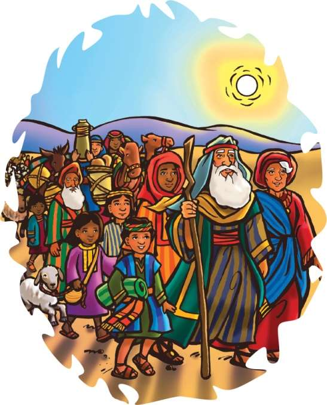

### Chhiar tûr
Genesis 12:1–7; Thlahtubulte leh Zawlneite (2nd Edition, 2014), pp. 106–113.

> 
Châng vawn

> “Tichuan ‘Tu nge ka tirh ang a, tu nge kan tân kal ang?’ tiin Lalpa aw chu ka hria a. Keiin, ‘Heta hi ka awm e, mi tîr ta che!’ ka ti a,” Isaia 6:8.

> 
Thuchah

> Ama rawngbâwl tûra Pathian min kohna ka ngâithla ang.

_Mika chuan, “Pêm ka duh lo,” tiin a rûm a. Anya chuan, “Kei pawh ka duh bîk lo. Mahse ka pa khân a hna thar thawk tûrin Lalpan hmun thar lam pan tûrin a duh tih a sawi a. Engtin nge Pathianin chutiang ti tûra a duh tih a hriat theih ka hre bîk lo,” tiin a chhâng a”_

_Mika chuan, “Hawh u, i zâwt ang u hmiang,” a lo ti ve a._

_Anya chuan a pa kawr hmâwra chelhin, “A pa, thil eng emaw te te kan zâwt duh che a. Engtin nge Pathianin pêm tûrin a duh che tih i hriat theih?” tiin a rûk deuhin a zâwt sa sa a._

_A pa chuan, “Chutiang zawhna chiah chu Pathianin Abrama pêm tûra a hrilh ṭuma mite zawhna pawh a ni ve maithei a ni. Thawnthu ka’n hrilh ang che u,” a ti a._

Abrama chuan Pathian a hmangaih a. Nilênga Pathian nêna inbiak changte pawh an nei fo ṭhîn a. Pathian sawi ang zêla tih duh mi a ni.

Ni khat chu Pathianin Abrama hnênah thu a sawi a. “Tûnah chuan Ur khawpui i chhuahsan hun a lo thleng ta tlat mai, Abram. I ṭhiante zawng zawng hi kalsan la, hmun ka la entîr tûr chu lam panin kal rawh,” a ti a.

Abrama chuan ṭawng ngaihna reng a hre lo. Engati nge Pathian chuan an khua chhuahsan a hmun danga chêng tûra a duh ni ang le aw tiin a ngaihtuah a.

Pathian chuan, “Abram, mal ka sâwm dâwn che a. Tu leh fate bâkah chi thlahte zêl pawh ka neihtîr ang che. I chhûngkua hi hnam chak takah ka siam ang a. Nasa takin mal ka sâwm dâwn che a ni,” tiin a hrilh zui a.

Tûnah chuan Abrama chuan mak a ti hle mai a; amah leh a nupui Sarai chuan fa pakhat pawh an la nei si lo va.

Chutichûngan, Abrama leh Sarai chuan Pathian thuâwih chu an thlang a. Pêm tûrin an thil neihte chu an tel fel a. An chhiahhlawhte pawh chuan an puan inte chu ṭhiatin, phurh theih tûrin an lo siam diam a. Pêm chhuah hun chu a lo thleng a, Abrama chuan a ruala kal ve duh zawngte chu a ko khâwm a. A unaupa fapa, Lota leh a chhûngte pawh an pâwl zîngah chuan an tel ve a.

Abrama chhûngte zawng leh Abraman Pathian chibai a bûkpui ṭhînte zawng chuan amah chu an zawm a. Chûng mite pawh chuan an sabengtung leh sanghawngseite chu thil phurhtîrin, ram hla taka pêm tûr chuan an chhuak ta a ni.

Abrama, Sarai, an chhûngkua leh chhiahhlawh zawng zawngte chuan thlalêr

vaivut hmun chu zawhin ni tinin hmalam panin an kal zêl a. Ni lah chu a sa thei êm êm a. Mahse chutiang paltlâng thei tûr chuan Pathianin an mamawh apiang A phuhrûksak zêl a.

A tâwpah chuan, Kanaan ram chu an thleng ta hlawl mai a. Mahse, châwl mai lovin, an sabengtung te, sanghawngsei te nên chuan an kal zêl a. Khawi hmunah nge an chawlh tak ang le? Khawi hmun thlengin nge Pathianin a hruai zêl dâwn le?

Sekem khua an thleng a, chutah chuan Kanaan mi tam tak an chêng a, ramhnuai thing chi khat Moreh Thing Lian an tihte chu a awm a. Abraman Moreh ngaw a thlen chuan, a chhiahhlawhte hnênah, “Ding tawh rawh u le! Hetah hian bûk i siam ang u,” a ti a.

Chhiahhlawhten bûk an zâr lâi chuan, Pathian chu rawn inlârin, Abrama hnênah chuan, “I kiang vêl hi han thlîr kual teh.

Hêng lâi ram hi nang leh in chhûngkaw hnêna ka pêk tûr chu a nih hi,” tiin a hrilh a.

Abrama chuan a’n thlîr kual vêl a. Ram zau ṭha tak mai, tlâng cham dûr leh hlobet hring dup hmunte chu a hmu a. Olive thing te, theipui bâkah tuikhur tui, nipui lâi pawha vawt tui tak awmna hmunte chu a hmu a. Mahse, Abrama chuan a rilru tinuam lo deuh mai thil hmuh a nei tel tlat mai. Thingbuk kâr vêlah chuan milem pathiante hnêna inthâwina an hlanna hmun, mâichâmte a hmu thluah mai a ni.

Abrama chuan lungte chhar khâwmin (Pathian nung) biakna tûr mâichâm a din ve ta nghâl thuai a. Chutah chuan Pathian chibai bûkna neih a, an zin kawng tluana A vênhimna avânga Pathian hnêna lâwmthu sawi inthâwina hlan a duh a ni. Pathianin kal tûra a duhna hmun apianga kal zêl a duh tih hrilh pawh a duh bawk a. Pathianin kal tûra a duhna lamah chuan kal zêl a inhuam sârh mai a ni.

_A pa chuan Anya leh Mika te hnênah chuan, “Chutiang chuan, keini pawhin Abrama anga Pathian hi kan ngaihchan ve a ngâi a. Pathianin Abrama hnênah tlang takin thu a sawi a. Tûnah keini hnênah pawh thu a la sawi thei tho, a Thu, Bible hmang te, emaw, mite hnên aṭanga thurâwn hmang emawte pawhin a sawi thei a, chûng kan zui zêl a ngâi a ni. Kei leh i nu chuan Pathian min tirhna apianga kal zêl tûra lâwm taka chhan kan tum a. Kan inhawng a nih phawt chuan Pathianin a duhzâwng chu min la hriattîr zêl ang. Ti tûra min duh chu kan thinlunga min hriattîr leh hriat thiamna min neihtîr tûrin min ṭanpui zêl dâwn a ni,” tiin a sawi a._

### Tih Tûrte

**Sabbath**

- In chhûngte nên, ri chi hrang hrang ngaihthlâk theihna tûr hmun fianrial pan ula. Eng ri/thâwm nge in hriat? Ziak chhuak teh u.
- In zirlâi thawnthu chhiar ho ula. Chumi chungchâng sawi ho bawk ula. In chhûngkaw tan eng awmzia nge a neih? Châng vawn chhiar tlâng ula, a awmzia in sawi ho dâwn nia. Pathian aw in ngaihchân fo theih nân A ṭanpuina dîlin ṭawngṭâi ang che u.

` `

**Sunday**

- Minute nga chhûng vêl nangmahni chauhin pindan chhûngah ṭhu vâng vâng ula. Eng ri nge in hriat. Hriat theihna in neih avângin Pathian hnênah lâwmthu sawi ang che u.
- Poster emaw bookmark emaw siamin: “Rawngbâwl tûra Pathian min kohna ka ngâichang ang” tih in ziak kuau dâwn nia. In chhûngkaw worship-naah in chhûngte in hmuhtîr ang a, chutah tûk tina in hmuh remchân theihna tûr hmunah in târ dâwn nia.
- Châng vawn ennawn nân sawi rual ang che u.

` `

**Thawhṭanni**

- Vawiin worship neih nân Genesis 12:1–7-a Abrama leh Sarai te chanchin chhiarin, sawi ho ang che u.
- In chhûngkua hmun khat aṭanga hmun danga in pêm/insawn chanchin sawi ula. In chhûngte hnênah Pathianin eng emaw ti tûra a sâwm nia an inhriat lâi hun chungchâng sawitîr ang che u.
- Lehkhaah in ke thla ziak ula, chutah chuan in châng vawn thumal tinte in ziak kai dâwn nia. Chep sâwmin, thu indawt dikin in rem ṭha leh ṭhîn dâwn nia. Pathian rawng in bâwl theihna tûr hmuntea in ke a hruai thlenna tûra a ṭanpuina dîl ang che u.

` `

**Thawhlehni**

- Abrama koh a nih leh, an zin chhuah tâk chanchin a lemin siam ula. Chu chu in chhûngte hnêna entîr pahin, worship-naah a chanchin in hrilh dâwn nia. Inzawh tûr: Pathianin Abrama hnênah eng thutiamte nge a siam? Engtin nge Pathianin a thutiamte a hlen? In chhûngkaw tan Pathianin eng thutiamte nge a siam ve?
- Ziakna tûr bu te siam ula, chutah chuan in chhûngkuain thutiam in ngâinat bîk pakhat ṭheuh in ziak dâwn nia. Pathianin a thutiamte a vawn avângin lâwmthu sawi ang che u.
- Ke thlaa châng vawn rem tûr kha rem leh ula, chutah in chhûngkuain in sawi rual dâwn nia.

` `

**Nilaini**

- Chhûngkaw worship-naa inzawh tûr: Engtin nge in hnêna Pathian thu rawn sawi chu in lo hriat? Engtin nge a aw in ngaihthlâk? Sawi lâwk lêm lovin “Hello” tiin thinṭhâwng deuh thu, lungngaihna, thinrimna ang chite sawi chhuak phût teh u. Inzawh tûr: Kan hnêna Pathianin thu a sawiin engang aw/ri nge a hman ṭhîn?
- Châng vawn sawi rual ula. Ni tina in hnêna thu a rawn râwn ṭhîn avângin Pathian hnênah lâwmthu sawi ang che u.

` `

**Ningani**

- In chhûngkuaa chaw in kî ho leh hunah, engtia rei nge ṭawng lova in awm theih hriat tum ang che u. Engtin nge in chhûngte hnênah thil in dîl ṭhîn? An hnêna thu in sawiin eng ang awki nge in hman tlângpui?
- In chhûngte hriat tûrin en lovin châng vawn sawi ula. He changin Pathian chungchâng a sawi nia in hriat dân chu hrilh ang che u. Ṭawng theihna Pathian thilthlâwnpêk avângin lâwmthu sawi ang che u.

` `

**Zirtawpni**

- Chhûngkaw worship-naah Genesis 12:1–7 chhiar leh ula. Inzawh tûr: Engati nge Abraman mâichâm a din? Tûnlâi hian chhûngkaw mâichâm in la mamawh em? Eng vâng nge?
- Pathian ṭhatna chungchâng hriat rengna bu siam ula: Pathian enkawlna bîk in dâwn chungchâng chu sawi ṭheuhin, puitling tu emaw in chhinchhiahtîr zêl dâwn nia. In chhinchhiah zawh fel hnuah, Pathian enkawlna chunga lâwmthu sawina leh fakna hla sain, ṭawngṭâina in hlan dâwn nia.

` `