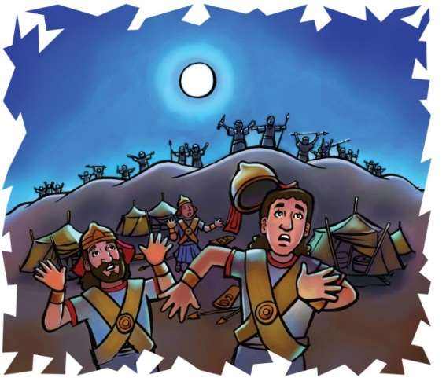
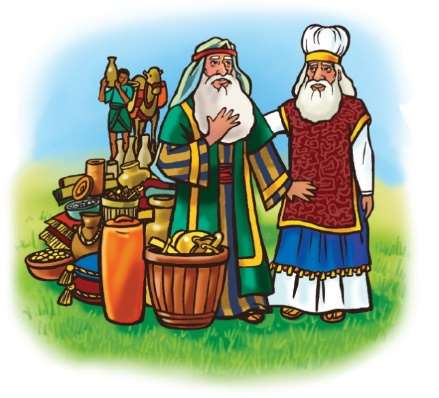

### Chhiar tûr
Genesis 14; Thlahtubulte leh Zawlneite (2nd Edition, 2014), pp. 116–119.

> 
Châng vawn

> “Hmangaihnain . . . rawng inbâwlsak tawn ṭheuh rawh u,” Galatia 5:13.

> 
Thuchah

> Hmangaihnain mi dangte rawng ka bâwlsak ang.

_Pu Thanga chu a dam lo va, hun rei tak hospital-ah a awm a ngâi a. Rami, Mâwii, Kima leh Ruata te chuan pu Thanga nupui pi Liani ṭanpui tûrin thutlûkna an siam hlauh mai a. Thu eng mah sawi lâwk lêm lo chuan an huana hnimte an thlawh fâisak vek a . . . pi Lianin pawisa pêk a tum pawhin an dawng duh miah lo a ni._

_An haw kawng tluan mai chuan boruaka kâng delh delh ni mai hian an inhria a. Chutiang deuh chiah chu Abramam Melkizedeka a hmuh nia a awm dân chu a ni._

A inṭan dân chu hmêlma lal ropui tak tak paliten, an sipai rual ropui tak nên Kanaan rama khawpui lian vak lo lal pangate rûn tûrin an lo thawk a. Chûng khawpui an rûn zînga pakhat chu Sodom niin, Abrama unaupa fapa, Lota te chênna khua a ni. Chûng khawpui lal pangate chuan an hmêlma sipaite do tûrin an sipai neih chhûnte chu Siddim Ruamah an hruai a.

An beisei dân chuan, “Hmêlma lal ropui palite chu kan ṭhâwng thut ang a. Tichuan an sipaite chu kan dang ang a, kan khawpuite chu kan vêng him thei mai ang,” an ti a.

Tichuan Sodom khaw lal Bera chuan hma a hruai a, mahse an ruahman angin thil a hlawhtling ta si lo. Chu lâi phâizâwl vêlah chuan alkatra khur a tam mai a. An sipai tam tak chu chûng khurah chuan an tla ta mai si a ni.

Hmêlma lalte erawh chuan chung alkatra khur chu a hêlna lâi tûr an hria a. Tichuan, Sodom khawpui chu an thleng a. Hmêlma sipaite chuan khawpui chu hnehin, khuaa chêngte chu an man a, Lota te chhûngkua pawh an man tel a. Mihring, ran leh bungruate chu manin, an ram lam panin an hawpui leh ta a ni.

An mi man zînga pakhat chu a tlân chhuak thei hlauh a, Abrama hnên a lo thleng a. Abrama hnênah chuan, “Hmêlma lal ropui paliten min rawn rûn a. I unaupa fapa Lote te chhûngkua pawh an man tel,” tiin a rawn hrilh a.

Abrama chuan rang takin a hnêna awm indo dân zir thiam sa mi 318-te chu a ko khâwm nghâl vat a. An ṭhenawm hnaia hruaitu pathumte pawh an mite nêna amah rawn ṭanpui tûrin a sâwm a. Chûngte nên chuan hmêlma lalte ûm tûr chuan hmanhmawh takin an thawk chhuak tlâng ta a ni.

Abrama leh a sipai tlêm te chauhin hmêlma lal ropui pali leh an sipai rual indo thiam sâng rual an han ûm zui tûr chu han suangtuah chhin teh u. Chuti zozâi hmêlma sipai rualte chuan Abrama leh a hote mi tlêm te chu an lo that chimit vek thei hial maithei a ni!

Mahse Abrama chu Pathian lamṭang a ni miau mai. Ṭanpuina dîlin Abrama kha Pathian hnênah a ṭawngṭâi ngei ang. Tichuan, hmêlma lalte leh an sipaite chawlhna hmun chu an va thleng ta a ni.

Zanah Abrama leh a ṭanrualpuite chuan an bei thut a. Hmêlma lal palite chuan an hmêlma sipai rual ropui takten an hual phui vek tawh emaw an inti hial a. An thil neih zawng zawngte chu hnutchhiahin, an tlânsan ta vek a. An sal mante leh Sodom khawpui aṭanga an thil lak leh anmahni thilte pawh eng mah chuh lovin, an tlânsan vek a. Bâk lêngin hmêlmahote chuan Damaska tlân pelin, Hoba thlengin an tlân chhia a.

Sodom khuaa an mi man, Lota leh mi dangte pawh chu an lo zalên leh ta. An za vai chuan hmêlmate thil tlanchhiatsan thilte chu an la khâwm a. Kâr lohah an chênna Sodom lam panin an chhuak leh ta a. Abrama chu a hlim hle mai a. Pathian ṭanpuina zâra Lota te chhûng bâkah, Sodom mite an chhanchhuah theih avângin a lâwm a ni.

An hawn kawngah chuan, Abrama leh a pâwlte chuan Shave Ruam an thleng a, chu chu Jerusalem khua aṭanga hla vak lo a ni. Chutah chuan Sodom lalin Abrama chu a rawn hmu a. Chu lal chuan Abrama chu a ngâisâng hlein a rinawm e. Lal panga ṭangrualten an tih theih loh kha ran rual vêngtu Abrama leh a ṭhiante pathum chuan Pathian ṭanpuina zârah an ti thei ta mai si a ni!

Salem lal, Melkhizedeka, Pathian rawngbâwltu puithiam ni bawk chuan Abrama leh a ṭhiante chu a lo hmuak a. Ani chuan chung raldo mi lo hawte tan chuan ei tûr leh in tûrte an rawn kensak a. Puithiam leh lal ni bawk chun Abrama chu malsâwmin, a ṭawngṭâisak a, heti hian a chham a: “Lei leh vân neitu Pathian Chungnungbera chuan Abrama malsâwm rawh se. I hmêlmate i kuta petu, Pathian Chungnungbera chu fakin awm bawk rawh se,” (Genesis 14:19, 20) tiin.

Abrama khân Pathian zârah hnehna a chang a ni tih a hria a, chu vâng chuan rangkachak te, tangkarua leh ran rualte a rawn hawn lehte chu a chhiar vek a. Sâwma pakhat zêl chu Pathian puithiam hnênah chuan lâwm takin a hlân vek mai a ni.

Sodom lal chuan sâwma pakhat zêl Abraman a pêk chu a lo hmu ve a. Hmêl hlim takin Abrama hnênah chuan, “Mihring hi min pe kîr leh la, thil dang zawng zawng chu nangman nei vek ang che,” (ch. 21) a ti a.

Mahse, Abrama chu mi duham lo, thilphal tak mai a ni a. A ṭhianten amah an ṭanpuina manah an chanvo tûr chu laktîr tûrin a ti a. Ani kha chuan mi dangte chanpual eng mah a lâksak ve ngâi lo va, mi dangte ṭhatna tûra ṭanpui kha a hlimna a ni zâwk a ni!

### Tih Tûrte

**Sabbath**

- In chhûngkuain hmun fianrial zawng ula, tah chuan zirlâi thawnthu hi in chhiar dâwn nia. Engati nge Abraman hmêlma lalte kha a ûm zui? Kan chhûngte zînga harsatna tâwk an awmin, engtin nge kan tih ang?
- In chhûngte hnênah châng vawn zirtîr ang che u.
- Indona avânga hrehawm tuar zawng zawngte tan ṭawngṭâisak ang che u.

` `

**Sunday**

- In chhûngte nên Genesis 14:8–24 chhiarin, sawi ho ang che u. In Bible zirlâi thawnthu nên khaikhin ang che u. Zirlâia chuang chiah lo eng Bible zirlâi nge in zir chhuah?
- In chhûng zînga mi ni lo, mi tuin emaw a ṭanpui che u kha ngaihtuah teh u. Lâwmthu sawina (Thank you card) siamin vawiin hian pe/thawn ang che u. Chu mi avâng chuan Isua hnênah lâwmthu in sawi dâwn nia.

` `

**Thawhṭanni**

- Zirlâi thawnthu hi Genesis 14:8–24 chhiarin ennawn leh nân hmang teh u. Mahni ṭawng kauchhehin, he thawnthu hi in chhûngte hnênah hrilh ang che u.
- In chhûngte nên in inṭanpui tlan theih dân tûr chu sawi ho teh u.
- In châng vawn kha sawi rual ang che u.
- Mi dangte ṭanpuina tûr remchâng in neih theih nân ṭawngṭâiin dîl ang che u.

` `

**Thawhlehni**

- In chhûngte nên Genesis 14:18–20 chhiarin, sawi ho ang che u. Inzawh tûr: Melkizedeka kha tu nge ni? Engati nge Abrama leh a ṭhiante hmuak tûra a lo thawh chhuah? Eng thil nge Abraman Melkizedeka hnênah a pêk? Engvâng nge?
- Châng vawn kha sawi rual ula. Chutah in ram hruaitute tân ṭawngṭâiin, anmahni vêngtute tân pawh dîlsak ang che u.

` `

**Nilaini**

- Chhûngkaw worship-naah, Malakia 3:6–12 chhiarin, sawi ho ula. Inzawh tûr: Engtin nge miin Pathian an rawk ṭhîn? Tûnah Rs. 10 lo nei ta ulang, chêng eng zât nge sâwma pakhatah in pêk ang? Sâwma pakhat leh thawhlâwm danglamna chu eng nge ni?
- In chhûngkua kha Pathian hnêna sâwma pakhat pêk kîr leh thawhlâwm thawh kawnga in rinawm tlat theih nân a ṭanpuina dîl ang che u. Pêk tûr in neih theih avângin Pathian hnênah lâwmthu in sawi dâwn nia.

` `

**Ningani**

- In lâwmna thlentu eng thil emaw chu a lem siam ula. Worship-naah in chhûngte in entîr dâwn nia.
- Chhûngkaw worship-naah Genesis 14:21–24 chhiarin, sawi ho ang che u. Inzawh tûr: Engati nge Sodom lal kha Abrama chungah a lâwm viau? Engati nge Abraman hmêlmate kuta an thil mante kha mahni tan a hauh ve loh?
- Thil eng emaw tak avânga Pathian chunga an lâwmna chhan sawi tûrin in chhûngte chu sâwm ṭheuh ula. Chûng in thil chhinchhiahna buah in ziak lût dâwn nia.
- Pathian chibai bûkna leh a hnêna lâwmthu sawina lam hlate sa ho ula; in chhûngkaw tana A thilpêkte chungah lâwmthu in sawi zui dâwn nia.

` `

**Zirtawpni**

- Chhûngkaw worship-naah in châng vawn kha en lovin sawi ula. Thil ṭha eng emaw mite tana in duhsak chhan sawi ula. Vawiina thil ṭha eng emaw mi dangte tana in tihsak chu sawi bawk ang che u.
- In ṭhenawmte tana thil ṭha eng emaw tihpui tûr che uin in chhûngte sâwm ula. Ruahmanna siamin, in titlâng dâwn nia. Lâwmman in phût ang em?
- Mi dangte ṭanpui tih lam hla sa ho ula, chutah in ṭhenawmte chu in ṭawngṭâisak zui nghâl dâwn nia.

` `