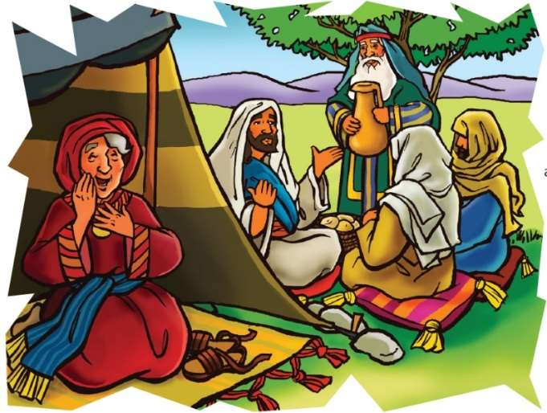
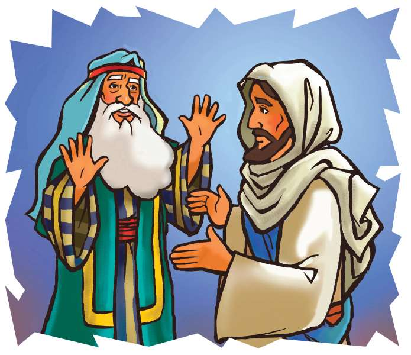

### Chhiar tûr
Genesis 18:20–33; Thlahtubulte leh Zawlneite (2nd Edition, 2014), pp. 114–128.

> 
Châng vawn

> “Mahni hlâwkna tûr ûm lovin, mi dang hamṭhatna tûr zawng ṭheuh zâwk rawh u,” Philipi 2:4.

> 
Thuchah

> Pathianin mi dangte hnêna thu sawi ṭhîn tûrin min duh.

_Mi i ngaihsak takten ṭanpuina an mamawh changin Pathian hnênah i thlen tawh ngâi em? Chûng mite tâna thil eng emaw tihsak tûrin Pathian i ngên ṭhîn em? Mite chu lo fel lo viau pawh ni se, an tan thu kan sawisak thei tho a ni. Hmânlâi hunah pawh khân, Abrahaman mi dangte tan Pathian hnênah a lo ngensak tawh a ni. A thu kalhmang chu hetiang hi a ni. . . ._

Ni khat khaw lum ni tak hian Abrahama chu thingbuk hlimah ṭhuin, an chênna phâizâwl lam chu a thlîr mai mai a. Tute emaw kal vêl a hmuh chuan a mit a la ta riau mai a. An chênna hmun piah deuh lâwkah chuan mi pathum hi an lo ding reng mai a ni.

Abrahama chu a tho thuai a, chûng mite hnên lam chu pan nghâlin, an hmaah chuan chibai bûkin a lu a kun a.

An hnênah chuan, “Khawngaihin kan puan in lamah lo châwl rih rawh u. Tui in tûr leh chaw ei tûr ka rawn lak ang che u. Thingbuk hlimah hian lo ṭhu châwl rih rawh u,” tiin a sâwm a.

Chûng mite chuan, “Kan lâwm e, kan lo châwl ang e. I sawi ang chuan va ti ta che,” an ti a.

Abrahama chu hmanhmawh takin an puan in lamah chuan a kal nghâl thuai a.

“Sari, inleng kan nei a. Khawngaihin an ei tûrin chhâng han ursak ta che,” a ti a. Chutah ani chu a chhiahhlawh buatsaih tûr thil ngaihtuahin a kal nghâl vat a. Rei lo teah ei tûr chu an peih a. Amah Abrahama ngei chuan an mikhualte hnênah chuan ei tûr chu a hlui a. Chutia an ei lâi chuan an kiang hnâi thingbuk hlimah chuan a ding a. Sari pawh chu an bul lâwk puan in chhûngah chuan a awm a, an thu sawite pawh a lo ngâithla thei a.

Mikhual zînga pakhat chuan, “Khawiah nge i nupui Sari a awm?” tiin a zâwt a. Abrahama chuan, “Puan in chhûngah a awm,” tiin a chhâng a. Mikhual chuan, “Nakun hetih hunah hian fapa a nei ang,” tiin a hrilh a.

Puan in chhûnga Sari chuan lo hriain, a nuih a za a. Ani ang kum upa lutuk tawhin fa a han hring leh tûr chu suangtuah chhin teh mah u.

Mikhual chuan, “Engati nge Sari chu a nuih mai? Lalpa tan thil harsa lutuk a awm thei em ni?” a ti a.

Chutah chiah chuan Abrahama leh Sari te nupa chuan an inlêng chu amah Lalpa ngei chu a ni tih an hre thiam ta a ni.

Abrahama inlengten chaw an ei kham hnu chuan, kal zêl tûrin an tho ta a. An hnam tih ṭhîn dân angin, Abrahama chuan thui vak lo a va thlah a. Abrahama hnêna thil hrilh tûrin Lalpa chu a ding a, mi dangte erawh chu an kal zêl a.

Lalpa chuan, “Sodom khaw sualzia ka lo hria a,” tiin Abrahama chu a hrilh a.

Abrahama pawhin Sodom mite khawsak dân chu a hre ve fo ṭhîn a. Chuta chêng Lota leh a chhûngte chu a ngaihtuah thei hle ṭhîn a. Abrahama chuan Lota te chhûng chu a hmangaih êm êm a. Lota chu mi dangte anga sual a ni ve lo tihte pawh a hria a, mahse Abrahama chuan Sodom mite chu a vei hle a. An zînga tam tak phei chuan Pathian hriatna pawh an la nei lo a ni.

Abrahama chuan, “Lalpa, Sodom khuaa mi ṭhate pawh chu mi sualte nên i ti boral dâwn em ni? Sodom-ah chuan mi ṭha 50 lo awm maithei a. Khawpui chu i zuah dâwn lo’m ni?” a ti a.

Lalpa chuan, “Mi fel 50 ka hmuh phawt chuan Sodom mite chu ka zuah ang a, ka tiboral lo vang,” tiin a chhâng a.

Abrahama chuan a’n ngaihtuah leh vang vang a. A rilru ngilneihna avâng chuan Lalpa hnênah chuan zawhna dang a zâwt leh a. “Lalpa, mi ṭha 45 chauh lo awm ta se engtin nge ni ang?” a ti a.

Lalpa chuan, “Mi fel 45 an awn chuan Sodom chu ka tiboral lo mai ang,” tiin a chhâng leh a.

Abrahama chu a la ngaihṭha thei chiah lo va. Ṭum thum lâi khawpui zuah tûrin Lalpa hnênah a ngên zui leh a. A vawi ruknaah Abrahama chuan Lalpa hnênah, “Ka chungah thinrim mai lo la, vawi khat chauh ka’n ngên nawn leh teh ang che. Mi ṭha 10 chauh awm ta se i zuah thei hram dâwn lo’m ni?” a ti a.

Lalpa chuan, “Chûng mi ṭha 10 te avâng chuan khawpui chu ka tiboral lo mai ang,” tiin a chhâng a.

Tichuan, Lalpa chu Sodom khawpui lam panin a kal ta zêl a. Abrahama pawh an puan in lamah a hawng a. Pathian chuan thil dik leh ṭha chu a ti mai dâwn a ni tih a hria a ni.

### Tih Tûrte

**Sabbath**

- A remchân chuan, in chhûngte nên thingbuk hlimah ṭhu châwl ula, a nih loh leh thingbuk lem in ziak dâwn nia. Chutah Genesis 18:20–33 chhiarin, sawi ho ula. Abrahama tlawhtute chawlhna Mamre Thing chungchâng sawi ula. Thing avângin Pathian hnênah lâwmthu sawi ang che u.
- Châng vawn chhiar rual ula. A awmzia in chhûngte hnênah zâwt teh u.

` `

**Sunday**

- Vawiin chhûngkaw worship-naah zirlâi thawnthu hi chhiar ula. Engati nge Abrahaman Sodom mite chunga thil thleng kha a ngaihvên viau? Keini hi tuin nge min ngaihsak ṭhîn?
- I thil tuipui zawng eng emawte lem chu ziak ula. Chûng Pathianin a tuipui ve che u ang em? Engati nge? In thil tuipuina Pathianin a ṭanpuina tûr che uin, ṭawngṭâi teh u.
- In chhûngte hnêna châng vawn zirtîr ve nân Sabbath Sikul lama zaizir/chêt vêl dân tûr in zir kha hmang ṭangkâi ang che u.

` `

**Thawhṭanni**

- Abrahaman mi dangte a ṭanpui chungchâng in chhûngkuain ngaihtuah tlâng teh u (Hmâwrhmuh nân: Genesis 14 en ula.) Engati nge Abrahaman khâng mite kha a ṭanpui? Abrahama khân lâwmman a dawng ta em? Mi dangte ṭanpui vâng hian lâwmman dâwn lêt ṭhîn tûr a ni ang em?
- Sabbath Sikula ṭawngṭâina thutiam in siam kha tu emaw in duh ber hnênah hrilh/sem ve ang che. Anmahni in ngaihsakziate hrilh ula. Chûng mite tan chuan ni tin ṭawngṭâisak ṭhîn tûr a ni tih hre reng ang che u.

` `

**Thawhlehni**

- Worship lâiin, lungte 50 chhiar ula (a nih loh leh remchâng dang pawh). Chûng Sodom mite angah in ngaihruat dâwn nia. In chhiar pahin lungte chu zirlâiin a sawi zât ang zêl la sawn ula, a tâwpah chuan 10 chiah a bang mai ang. Pathianin chung mi 10 chauhte chu a la ngaihsak reng tho em? A nih leh mi pakhat lek hi? Engtin nge Abrahaman Sodom mite a ṭanpui?
- In khuaah mi sualte an awm ve em? Chûng mite chu Isuan a hmangaih ang em? Engtin nge in hriat theih? (En tûr: Rom 5:8.) In khua leh vênga Isua la hre ve lote tân ṭawngṭâi ang che u.

` `

**Nilaini**

- In chhûngte nên Isaia 58:7 chhiarin, sawi ho ang che u. He changah hian eng tlakchhamnate nge chuang? Chutiang harsatna neite chu engtin nge in chhûngkua khân in ṭanpui ve ang? Chutiang tûr chuan ruahmanna siam lâwk ang che u.
- Mi dangte ṭanpui tih lam hla sa ho ula. Mamawh leh tlachhamte in ṭanpui theih nân Pathian ṭanpuina dîlin ṭawngṭâi ang che u.

` `

**Ningani**

- In chhûngte ṭanpuinain, Isua la hre lo, hriat mamawhtu mi panga hming ziak chhuak ula. Chûng mite thil tuipui zawng pakhat ṭheuh tal ziak bawk ula. Engtin nge in chhûngkua khân hma in laksak theih ang? Ṭanpui dân tûr in hriat theih nân Pathian hnênah ṭawngṭâi ang che u. In thil ziah chu naktûk lam atân in dah ṭha rih dâwn nia.
- Châng vawn sawipui tûr che uin, in chhûngte sâwm ang che u.

` `

**Zirtawpni**

- In chhûngkaw worship neihnaah in zirlâi hi lemchanah hmang ho ang che u. A nih loh leh Thlahtubulte leh Zawlneite, pp. 138–140 in chhiar dâwn nia.
- Nimin lama in hming ziah chhuah kha thlang ṭheuh ula. An hnêna Isua chanchin in hrilh theihna tûra an thil tuipui zawng eng emaw chu ngaihtuah teh u. Card mâwi tak siamsakin, Isua chanchin ziahna Bible châng ziakin, in thawn dâwn nia. Anmahni in ngaihsak leh veizia chu hrilh bawk ang che u.
- Pathianin mite a hmangaih tih lam hla sa ho ula. Chutah mi in vei zâwngte tân chuan ṭawngṭâi ang che u.

` `