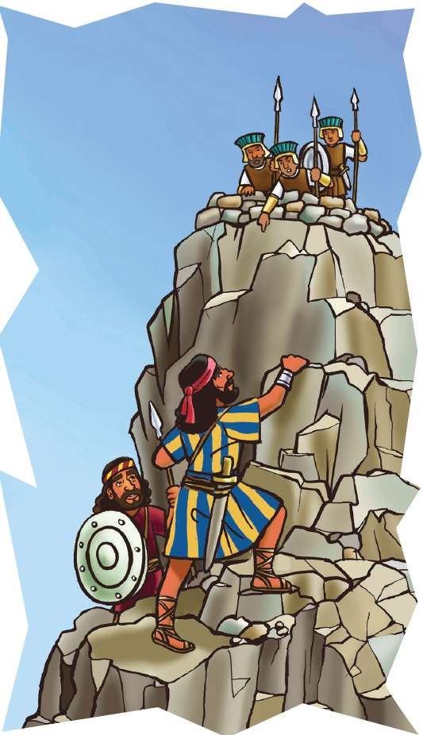
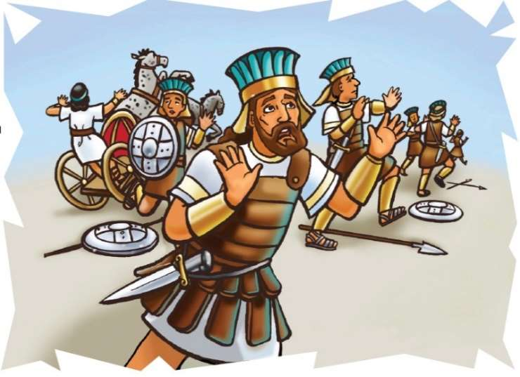

### Chhiar tûr
1 Samuela 13:16–22; 14:1–23; Thlahtubulte leh Zawlneite (2nd Edition, 2014), pp. 652–662.

> 
Châng vawn

> “Lalpa chhandamna chu eng mahin a dâl thei lo,” 1 Samuela 14:6.

> 
Thuchah

> Pathianin hnehna min chantîr ṭhîn.

_Ka thei lo! Ka thei lo! Ka ti thei thlawt lo mai!” Chutiang dinhmunah chuan i ding ve tawh ngâi em? Thil a buaithlâk leh khirh viau lâite hian, tu hnênah nge ṭanpuina i dîl ṭhîn? Jonathana khân tu hnêna dîl tûr nge a hre chiang a. A chanchin chu hetiang hi a ni . . . ._

Lal Saula sipaite chu Gibea khaw kiang thingbuk hnuaiah riahbûk neiin an awm a. Philistia mite pawh chu tlâng kâr khân zim tak kiangah an inkulh bawk a. Philistia mite chuan ni tin hian Israel mite suam a, an thil rawksak tûrin an sipaite chu an tîr chhuak ṭhîn a.

Philistia mitechuan sakawr–tawlâilir za tel bâkah indo mi sipai sâng tam tak an nei bawk a. Israelte erawh chuan sipai 600 emaw chauh an nei a, an zam chhe êm êm mai lehnghâl!

Israelte zîngah chuan ngûnhnâm (indona chem) leh fei keng pawh an awm ve lo va. Saula leh Jonathana te pa–fa chauh chuan an nei a. Israel sipaite râlthuam neih ve chhûn chu lehlehna te, bawngtuthlawh te, hreipui te leh favahte chu a ni mai. Mahse indo nân êm chuan hêng hmanrua ngawt hi chu a tihtlâk vak loh a ni! Chutiang a nih avâng chuan Israel mite chu an zamin, an hlau va, pûkah te, lungpui phenahte an biru a. Jonathana erawh chu chutiang a ni ve lo. Amah chauh chu indonaa hnehtîrtu chu Pathian a ni tih ngaihtuahtu awm chhûn a ni.

Ni khat chu, Jonathana chuan a râlthuam leh phâw rit tak kengtu sipai hnênah chuan a ruk deuh hian, “Hawh teh, min rawn zui rawh,” a ti a. Chu sipai chuan Jonathanân chet dân tûr ruahman ruk a nei a ni tih a hre nghâl mai a. A insiam sawk sawk a, an riahbûk aṭang chuan Jonathana nên chuan an inzui chhuak a. Mi tu dang mahin an chhuak tih pawh an lo hre lo.

Joanthana chuan, “Philistia mite râl vên bûk kan thlen theih chuan, tlâng kâr khân vêl khi kan la thei mai ang. Pathianin râl vêngtute min paltlângtîr chuan hnehna kan chang thei mai ang. Pathian min chhandamna tûr hi tu mahin an dang thei lo ang,” tiin a ṭhianpa chu a hrilh a.

Râlthuam kengtu chuan, “Hma hruai rawh, ka rawn zui zêl ang che,” a ti a.

Jonathana chuan, “Hawh, i kal ang. Min lo hmuh a lo nghak tûra min tih leh kan nghak ang a. Mahse, ‘Kan hnênah lo chho rawh u’ an tih chuan, chu chu Lalpan hnehna min chantîr dâwn tih chhinchhiahna a ni ang,” a ti a.

Harsa takin, an kut leh ke hmangin âwih pangah chuan an lâwn chho dun ta a. Huaisen takin Philistia râl vêngtute hmuh tûrin an inlantîr a.

Philistia râl vêngtute chuan, “En teh u! Israel-hote chu an bihrûkna pûk aṭangin an lo chhuak ta!” an ti a.

Mi dangte chuan, “Lo chho rawh u, thil kan lo zirtîr ang che u!” tiin an lo au khum bawk a.

Jonathana chuan, “Chu chu kan tan chhinchhiahna a nih chu! Pathianin kan kutah min pe ta a nih chu,” a ti a. Tichuan, an pahnih chuan khamah chuan an lâwn chho ta zêl a. A chhîp an lâwn chhuah chuan, Jonathana chuan hma lam a pan zêl a. A râlthuam kengtu pawh chuan a rawn zui nghâl zêl a. Philistia râl vêngtu sâwmhnih chuan rang takin an rawn bei nghâl a. Mahse, Jonathana leh a râlthuam kengtu chuan Pathianin A ṭanpui dâwn tih an inhre reng a. Rang takin Philistia mite chu an hneh ta mai a ni.

Philistia râl vêngtu dang, tlâng chhîpa awmte chuan thil thleng an hmuh chuan, nasa takin an tâl buai a, chet ngaihna pawh an hre lo. Philistia sipai riah hmuna mite chu zu auvin, thil awmzia chu an hrilh a. Chung sipai rualte pawh chu an tâl buai êm êm mai a.

Sakawrtawlâilîr khalhtute pawh chu an tâl buai a. Chutianga rilru buai taka an awm tâkah chuan, anmahni leh anmahni chu an inbei chiam a, tlânna lam tûr pawh hre lovin, an pâwng tlân tawn vêl ruai a. Sipai leh sakawr tawlâilîr rual ropui tak lo thleng tûr ang maiin lei hi a nghawrin a nghawr dur dur mai a. Jonathana leh a râlthuam kengtu bâkah Philistia mite pawh chuan Pathianin Israelte chu a ṭanpui a ni tih an hre ṭheuh a ni.

Lal Saula leh a sipai 600-ten thil awmzia an hriat a, Philistia mite an tlân bo zo va, Jonathana leh a râlthuam kengtu chauh chu tlângah an ding tih an hmu a. Israel sipaite chuan Pathianin an hmêlmate chu a hnehsak a ni tih an hria a. “Vawiin hian Lalpan min chhanchhuak a ni,” an ti a.

Jonathana leh a râlthuam kengtu pawh chuan chutiang chu a ni tih an pawm a.

Lalpan hnehna ropui tak a chantîr a ni. Eng mahin Pathian chhandamna chu a dâl thei lo a ni.

### Tih Tûrte

**Sabbath**

- A remchân chuan, in chhûngkuain tlângah lâwn ula. In chawlhna hmun khatah chuan he Bible thawnthu hi chhiar ang che u. Jonathanan Philistia râl vêngtute awmna hmun lam harsa taka a pannaa tel angah inngaihruat chhin la. Kea kal thei leh lâwn thei in nih avângin lâwmthu sawi ang che u.
- Châng vawn kha Bible aṭangin (1 Samuela 14:6) ring takin chhiar rual ang che u.

` `

**Sunday**

- Chhûngkaw worship-naah, Bible thawnthu (1 Samuela 14:1–23) hi chhiar ho ang che u.
- Chutah châng vawn chhiar leh ula. Nambar in hriat zawnga tam ber leh tlêm ber chu a lem ziak ula. Heti zâta tam emaw, heti zât leka tlêm emaw nên hian hnehna in chang thei ang em? Engtin nge in hriat theih? (En tûr: 1 Samuela 14:6.) Indona min hnehsak tûra thiltihtheihna a neih avângin Pathian hnênah lâwmthu sawi ang che u.
- Lehkha phêkah bial (0) lem lian tâwk takin ziak ula. Bial lâi takah chuan in châng vawn thu kha ziak ang che u. Mâwi taka cheiin, ni tina in hmuh theihna tûr remchâng lâiah in târ dâwn nia.
- Pathianin ṭha taka a enkawl che u avângin lâwmthu sawi ang che u.

` `

**Thawhṭanni**

- Nimin lama bial chhûnga châng vawn mâwi taka in chei kha in chhûngte entîr ula, chutah en lovin châng vawn chu in sawi dâwn nia.
- In chhûngte nên 1 Samuela 14:2, 3, 18 chhiar ula. Saulan hnehna a chan theih nâna ṭanpui tûrin eng nge a neih? Thil pawimawh ber Saulan a neih ve si loh chu eng nge ni? Chumi chungchâng chu sawi ho teh u.
- Pathian i rinchhan lehzual theih nân a ṭanpuina dîlin ṭawngṭâi ang che u.

` `

**Thawhlehni**

- In châng vawn sawi rual ula. A thlûk siamin, worship-naah in sa rual dâwn nia.
- Bible thawnthu dang, Pathianin a mite a chhanchhuah thu ngaihtuah theih dang in nei em? In chhûngkuain Bible thawnthu hrang hrang ngaihtuahin sawi tlâng teh u.
- Ni tina Pathian vênhimna in dawn ṭhîn avângin lâwmthu sawi ang che u.

` `

**Nilaini**

- Chhûngkaw worship-naah in châng vawn kha sawi rual ula. A awmzia inhrilh ang che u. In chhûngte chu Pathian chhanchhuahna emaw, ṭanpuina bîk emaw an dâwn chungchâng in sawitîr ṭheuh dâwn nia. Chûng chu Zirlâi 2-naa in lo tih ṭan tawh, Pathian ṭhatna chhinchhihna bu-ah khân in chhinchhiah dâwn nia.
- A hu hovin Sam 34:7 chhiar ula. Vântirhkohten mite an ṭanpui chungchâng Bible thawnthu ngaihtuah teh u. (Entîr nân, Daniela 6:22.) Engtin nge hei hian phûrna leh huaisenna a pêk che u?
- Pathian enkawlna chungchâng hla sa ho ula, chutah lâwmthu in sawi nghâl dâwn nia.

` `

**Ningani**

- In chhûngte hnênah Pathianin Jonathana te hnehna a chantîr thu kha hrilh ve ula. In châng vawn pawh sawi ang che u.
- Lehkhabu-ah emaw, internet-ah emaw, atakin emaw tlâng dungte thlîr kual vêl teh u. Tlâng mâwi tak takte avângin Pathian hnênah lâwmthu sawi ang che u.
- Tlâng mâwi tak lem ziak ula. Tu emaw chu Sam 121:1, 2 chhiarsak tûr che uin sâwm ula. A thu chu in tlâng lem ziahah chuan in ziak dâwn nia.

` `

**Zirtawpni**

- Chhûngkaw worship-naah, hêng hi tih tum dâwn teh u: Châng vawn sawi ula. “Eng mah” tih aiah hian ‘tui lian’ te, ‘mei’ te, ‘thlipui’ te, ‘lîrnghîng’ te, ‘indona’ leh thil dang dang hman ni se. (Entîr nân: Tuilianin Lalpa min chhandamna a dâl thei lo.)
- Chutiang zêla ti ve tûrin in chhûngte chu sâwm ula. Chutiang chuan hêng changte hi ziak ṭha ula, in Bible-ah in zep ṭha dâwn nia. Chutiang chuan tûn kâr Bible zirlâi thawnthu hi in ti vek dâwn nia.
- Nangmahni fuih phûrtu Bible thutiam chhiar ula (entîr nân, Joshua 1:5).
- Lalpa sipaite in nihna târ lang thei hla hrang hrangte sa ho ula.
- Pathianin in chhûngkua a vên reng che u avângin lâwmthu sawi ang che u.

` `