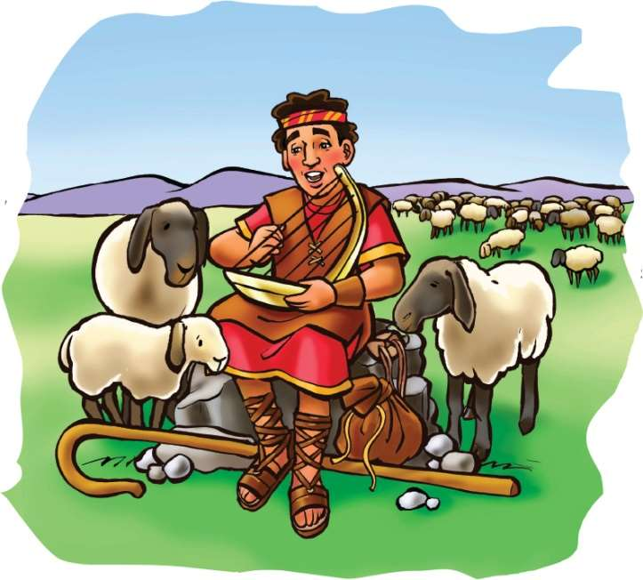

### Chhiar tûr
1 Samuela 16, 17:33–36; Sam 23; Thlahtubulte leh Zawlneite (2nd Edition, 2014), pp. 675–687.

> 
Châng vawn

> “LALPA chu min vêngtu a ni a, eng mah rêng ka tlachham lo ang. Ani chuan hlobet hring dup hmunahte mi bawhtîr ṭhîn a!” Sam 23:1, 2.

> 
Thuchah

> Mahni ka inchhandam thei lo va, Isuan min chhandam.

_Jamie chuan berâm chungchâng report a ziah a ngaih ṭumin, a nuin Bible-a a chhiar a lo ngaihthlâk tawh kha a la hre reng a. A ngaihtuah chhuah theih chu hetiang hi a ni. . . ._

Davidan phûl hlobet hmuna berâm rual tam vak lo hi a vêng ṭhîn a. Chûng berâm hmul pûk tak chu a ṭhiante an ni ber a, ani chu an tan chuan vêngtu a ni ve thung a. Chhûn khaw lum lâi tak hian tui tling awmna hmuna hruaiin, a intîr ṭhîn a. Hlobet hring dup awmna lamahte a hruai leh bawk ṭhîn a ni. Mi dang tu mah a bulah an awm ve lo va, mahse eng mah a hlau chuang lo. Pathianin a awmpui zêl a ni tih a inhria a. Ṭha taka a berâmte a vêng ṭhîn ang bawkin, ani tan pawh Pathian chu amah vêngtu (berâmpu) niin, ṭha takin a enkawl ṭhîn a ni tih a hria a ni.

Davida chuan, “Inrâlring a ka invên reng a ngâi! Ka muthilhsan chuan berâm note an lo vâk bo mai ang,” tiin mahni leh mahni a inhrilh mawlh mawlh ṭhîn a. Chutianga harh ṭha tak a nih reng theih nân lungpui sâng deuh chungahte chuangin a thlîr vêl ṭhîn a. A remchân chuan a phênglawng leh ṭingṭangte ngaihnawm takin a tum a. Chutah aw ring leh fiah ṭha tak hian, “Lalpa chu min vêngtu a ni a, eng mah ka tlachham lo ang,” (Sam 23:1) tiin a zai bawk ṭhîn.

Ni khat chu Davidan a mit sîr teah hian thil che zeuh awmin a hria a. A ṭingṭang chu dah ṭhain, a virvawm chu a la vat a. A ipteah chuan lung mûm ṭha tak hi hman maitheih tûrin a ak ṭhîn a. A berâm vên lâi rawn tihnat/seh tum rêng rêng bei tûrin a inpeih sa reng a ni.

Sakeibaknei pakhat hi tui awmna sir hnim buk phênah chuan a bawk khuau mai a. Berâm rawn zuan tûra a inring tawh la zuan chiah lo chu Davida chuan a virvawm chuan a’n vawm a. Lung chu a ving phei fua mai a! Sakeibaknei chaldârah tak chuan a vawm fuh siah mai a. Chutiang chuan a ti nawn leh a, chutah sakeibaknei chu berâm zuan thei lo tûrin a awp ta rawp a.

Rang takin Davida chuan a virvawm chu a dah a, berâm zîngah chuan kal nghâlin, an kim leh kim loh a chhiar vat a. An lo la kim vek a, hliam tuar pawh awm lovin an la him tlâng vek a ni! A berâmte a vênhim theih nân Lalpan a ṭanpui a. Lungpui chungah chuan chuang lehin, a ṭingṭang chu a tum leh a. Chumi ṭum chuan, “Thihna hlim kawr ruam zawh mah ila, thil ṭha lo rêng rêng ka hlau lo ang, Nang ka hnênah i awm si a!” (châng 4) tih chu a sa ta thung a.

Ni dang lehah pawh, Davidan a berâm rualte chu tlâng ram lama thlah tumin a hruai ve thung a. Hêng hmunah hian hnim chawrno thar chu berâmten an pet thei dâwn a ni. Mahse, tlâng ram vêlah hian thil hlauhawm chi dang an awm ve thung a. Tlâng ram pûkahte chuan savawm hi an tawm ṭhîn a, chawi ei tûr zawngin an vakvêl ruai ṭhîn a ni.

Davida chuan fîmkhur takin a berâmte chu a vêng a. Hnim sâng tak tak zîngah chuan eng emaw thil che hi a hmu leh tlat mai. Inring takin a lo en reng a! Ramsa buang–dum deuh thur, lian tak hi berâm awmna kiang lawkah chuan a lo tlân a. Chak takin hma lam a rawn pan mêk a ni!

Davida chuan rang takin a virvawm chu phawrhin, a lung pai chu a’n vai vir leh pap pap a. A’n thlah chiah chuan lung chu a ving phei leh ta fua mai a. Savawm chaldârah tak chuan a fuh leh siah mai a, tho leh tûr awm lovin a let nghâl tawp mai a. Davidan a berâmte a chhanhim theih nân Pathianin ani chu a ṭanpui leh ta a ni.

Chu mi tlâi chuan, Davidan a berâm rualte chu a him takin a hruai haw leh dam dam a. An hâwn pah chuan, he hla: “Ma thei lovin ṭhatna leh hmangaihna chuan ka dam chhûng zawngin min zui zêl ang a, tichuan Lalpa inah kumkhuain ka chêng reng ang,” (châng 6) tih hi a sa maithei a ni!

Khâng berâmte ang khân, min vênghimtu tûr kan mamawh a. Berâmpu ṭha Isua chu kan mamawh a ni. Mahni kan invênghimin, kan inchhandam thei lo va. Mahse, Isuan min chhanhim thei a, ani chuan min chhandam dâwn a ni!

### Tih Tûrte

**Sabbath**

- In chhûngte nên, lui/dîl kam hlobet hmun remchângah kal ula. Davida leh a berâm rual awm ve anga ngaihruat chungin in zirlâi hi chhiar ho ang che u. Nangmahni enkawl leh vêngtu tûr in neih avângin lâwmthu in sawi dâwn nia.
- Sam 23:1 keuvin, chhiar ho ula, chutah chumi lem chu in ziak dâwn nia. “Sam 23” bu te siamin, hmang ṭan ula. Tûn kâr ni tinin milem in ziah belh zêl dâwn nia.

` `

**Sunday**

- Chhûngkaw worship-naah, Sam 23 chhiar ho ang che u. In “Sam 23” bu teah khân Sam 23:2 lem ziakin, in bel dâwn nia. Ran vêngtu leh enkawltute tan Pathian malsâwmna dîlsak ang che u.
- Berâm lem ziakin, chep thla ula, a hmul puk lem atân lapua in bel dâwn nia.

` `

**Thawhṭanni**

- In chhûngkaw worship-naah Sam 23 chhiar ula. In chhiar pahin, berâm vêngtuten an berâmte tana thil an tihsak ṭhîn thil chi hrang hrang chhiar ang che u. Chumi zât chu hetah hian ziak ula: [_](). Nangmahni tâna Isuan thil ṭha a tihsak che u pahnih sawi teh u. Chumi avâng chuan lâwmthu in sawi dâwn nia.
- Berâmpu tiang ang tûrin lehkha chep ula, chutah chuan châng vawn in ziak dâwn nia. In chhûngte hnêna châng vawn zirtîr nân in hmang nghâl ang che u.
- Sam 23:3 hi vawng ula, a lem ziakin Sam 23 bu-ah in bel dâwn nia.

` `

**Thawhlehni**

- In chhûngte nên 1 Samuela 17:34–37 chhiarin, sawi ho teh u. Davidan a sawi “Philistia mi” chu tute nge ni a? Buaina i tawh changa Pathianin a ṭanpui dân che u kha sawi ang che u. He châng vawn hi Pathian ṭhatna chungchâng sawina (Zirlâi 2-na) bu-ah khân in belh dâwn nia.
- “Lalpa Kan Lâwm E” tih lam hla sa ho ula, chutah, buaina huna Pathian ṭanpuina chungah lâwmthu sawi ang che u.
- Sam 23:4 thu vawng ula, a lem ziakin Sam 23 bu-ah in bel dâwn nia.

` `

**Nilaini**

- In chhûngkaw worship-naah Sam 23:5 leh Luka 10:34 chhiar ula. Chung aṭang chuan hriak chungchâng engte nge in zir chhuah? Bible hun lâi vêlte kha chuan berâm hliam enkawl nân Olive hriak an hmang ṭhîn a. Israel lalte pawh kha, Pathian thlan an nihzia lantîr nân hriak an thih ṭhîn a ni.
- Hriak thih tûr siamna hmanrua hriat nân Exodus 30:22–25 chhiar ula. In neih remchân theih chuan Olive hriakin eng rim nge a neih hnim tlâng teh u.
- Pathian fa nih in duh tih in sawi lâi taka in chala hriak hnâwih tûrin puitling tu emaw sâwm ang che u.

` `

**Ningani**

- Chhûngkaw worship-naah Sam 23 chhiar ula. A hnuaia thu thlan chhuak awmze inmil deuhte chu thai zawm zêl ang che u:*

`hlobet hmun`

`lungngaihna`

`tlachham`

`thil dik ti`

`felna`

`talhtum`

`ruam thim ber`

`ramhnuai`

`tiang sei`

`tiang hawl chi`

`tiang`

`thil mamawh nei`

- Sam 23:6 thu vawngin, a lem ziak ula, Sam 23 bu-ah in bel dâwn nia.

` `

**Zirtawpni**

- Sam 23 bu te in siam kha rem khâwmin, a kawm tûr siam ang che u. Worship-naah mi dangte in entîr ula. Chung chângte chu in chhûngte hriat atân sawi ula, anmahni nên pawh in sawi rual ang a. Chutah mahni sawi thiam dân ang angin zirlâi thawnthu chu in sawi dâwn nia.
- Sam 23:4 thu hi nâl takin sawi rual ula. Chutah êng tithim ula, chhûngkhat angin in inkuah hlawm dâwn nia. Thim chu eng angin nge in ngaih? Chhiar rual tûr: Sam 32:7; Sam 34:4, 6, 7, 17, 19. Nangni leh in chhûngte tan hêng chângte hian eng awmzia nge an neih?
- Isuan in chhûngkua him leh hlim taka a vên che u avângin lâwmthu in sawi dâwn nia.

` `