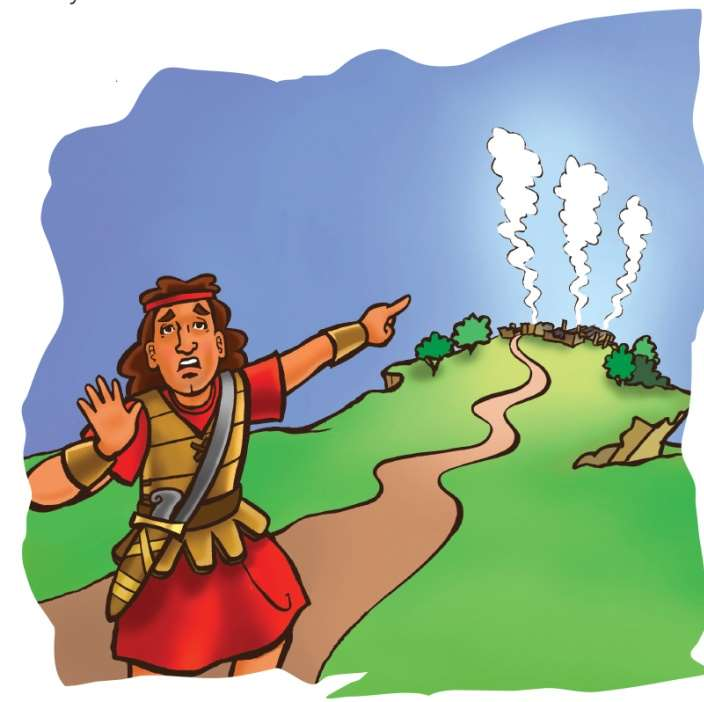

### Chhiar tûr
1 Samuela 29; 30:1–25; Thlahtubulte leh Zawlneite (2nd Edition, 2014), pp. 629–733.

> 
Châng vawn

> “Matheilovin ṭhatna leh ngilneihnain ka dam chhûng zawng hian mi zui zêl ang a; tichuan LALPA inah kumkhuain ka chêng reng ang” Sam 23:6.

> 
Thuchah

> Pathian chu hnehtu a nihin, hnehtu kan ni ve ṭhîn.

_Mikhail-a chuan, “Kan chak! Kan chak! Keima zârah kan chak!” tiin ring takin a au lauh lauh a. A pâwlte erawh chuan thinrim deuh takin ani chu an hawisan hmak a. Chawlh lâwk a lo zo va. Bible class neih a lo hun ta chiah mai. Chuta a’n thil zir leh tak chungchâng chu hetiang hi a ni. Eng thil nge Mikhail-a chuan zir chhuaka in rin le?_

Davida leh a mi 600-te chu Philistia lal Akis-a ṭanpui tûrin indona hmun lam panin an khua Ziklag aṭangin an chhuak a. Mahse Philistia milian dangte chuan indonaa Davida leh a hote an kal ve chu an phal lo va. Chu vâng chuan Ziklag khaw lam panin an kîr leh ta a ni.

Ziklag khua chu hla tak aṭangin an hmu thei a, mei khu ding luah chuan chûng mite chu hlauthawng takin a siam a. Indona hmun lam pana an chhuah bo hlan khân Amalek mite chuan an khua chu rawn rûnin, an hal chhe vek mai a ni! An nupuite leh an fanaute bâkah, an ran rualte pawh an man a, an kalpui ta vek a. An hnutchhiah zawng chu meivap leh meikhu chu a ni mai!

A hote chuan Davida hnênah, “Nangmah vâng vek a ni. Kan chhûngte vênghim tûrin sipai ṭhenkhat tal dah tûr a nia,” tiin an mawhpuh a. Davida chu a mangang hle a. Ama chhûngte ngei pawh chu a chan ve si a. Tûnah a hoten amah chu an mawhpuh bawk si! Eng nge a tih tak ang le? A rilrua lo lang hmasa ber chu a harsatna Pathian hnêna thlen a ni. Pathianin thil tih tûr chu a kawhhmuh ang tih a ring tlat a ni.

Abiathara hnênah chuan, “Puithiam kawr (ephod) mi han lak te,” a ti a. Davida chuan Lalpa hnênah chuan, “Amalek mite hi kan um zui ang em? Anni chu umphakin, kian chhûngte kan chhanchhuak leh thei ang em?” tiin Lalpa chu a rawn a.

Puithiam kawr (ephod-ah hian lunghlu tlâng lian tak pahnih a awm a. Puithiamin Pathian a biak rawn chang hian, a chhanna chu lunghlu-ah chuan a lo lang ṭhîn a. Chutiang chiah chuan “Kal” tûra tihna chu a lo lang a. “Ûm rawh u, in ûm phâk ang a, engkim in hmu lêt leh vek ang,” tih chu a lo lang a.

Tichuan, Davida leh a sipai 600-te chuan Amalek-hote chu an um ta ngat ngat a. Mahse Besor Luite an thlan chuan an châwl a. Mi 200-te chu an chauh tawh êm avângin an kal ve zêl thei ta lo va. Davida chuan an bungruate lo vêng tûrin a hnutchhiat ta a ni.

Piah deuhah chuan Davida leh a mite chuan phula Aigupta mi lo let reng chu an hmu a. Amalek pa pakhat chhiahhlawh hi a lo ni a, a dam loh avângin a pu chu thi tûrin a lo kalsan a ni. A dam loh bâkah, a tuihal leh rilṭam tawh em avâng chuan a chauvin, a chak lo êm êm a. Davida leh a mite chuan tui in tûr leh ei tûr an pe a; Amalek mite awmna hmuna hruai tûrin an ngên a. Tichuan Aigupta mi chuan Amalek mite riahbûk awmna lamah chuan a hruai ta a ni.

Ral hla deuh hlek aṭangin Amalek miten hnehna lâwma ruai ṭheh leh zu–ina, nuamtawl vêl chu an thlîr a.

Davida leh a mite chuan Amalek mite chu tlâi ni tlakah an bei a. Zankhua leh a tûk thlengin an indo va. A tâwpah chuan Amalek mite chu an tlâwm a. Mi 400 chauh chu sanghawngsei chunga chuangin an tlan chhuak a. Davida leh a mite chuan Ziklag khuaa an thil chan zawng zawng chu an hmu lêt leh vek a ni.

Davida leh a mite chuan an chhûngte bâkah an bungrua leh rante chu an khâwm leh vek a. Amalek mite laka an thil mante nên, in lam panin an inchhawm hâwng leh ta mup mup mai a ni.

Besor Luite an lo hnaih chuan, mi 200 bungraw vênga an hnutchhiahte khân an lo hmuak a. Mahse, Davida mite zînga ṭhenkhat chuan chutia hahdam taka an lo awm bîk chu an hmu mawh hle mai thung a.

“An nupuite leh an fate hi chu pe kîr leh ila, râl laka kan thil man dangte hi chu, engmah kan pe ve tûr a ni lo. Hnehna kan chan theih nân min ṭanpui ve lo va, chu vâng chuan bungruate pawh hi kan sem ve lo ang,” tiin an lungâwi loh thu an sawi a.

Davida erawh chuan, “Ngâwi lawk teh u. He indonaa hnehtu hi tu nge ni? Keini hi kan ni hauh lo; Lalpa chu a ni zâwk. Keini hi min vêng him a. Chu vâng chuan engkim hi ang khatin kan insem tlâng ṭheuh tûr a ni dâwn lo’m ni?” a ti a. Chutiang chuan an ti ta a ni.

Pathian khawngaihna chanchin ṭha pawh hi chutiang chiah chu a ni. Pathianin indonaa hnehna a chanin, a hnehna chu keini pawh min chantîr ve ṭhîn a. Isua zârah sual leh Setana chunga hnehna changtu ṭheuh kan ni tih kan inhre reng dâwn nia!

### Tih Tûrte

**Sabbath**

- A remchân theih chuan, in chhûngte nên hmun sâng lamah lâwn ho teh u. Chuta ṭang chuan phai hmun la deuh lama in kang leh meikhu dum ngut ngut thlîr angin inngaihruat teh u. Tichuan in Bible zirlâi thawnthu hi in chhiar dâwn nia. Davida leh a sipaiten an chênna in hmêlmaten an hal leh an chhûngte an man a, an kalpui daih rilru awm dân tûr chu sawi ho ang che u.
- Sam 23 thu kha sawi rualin ngaihtuah tlâng teh u. Pathian vênhimna avângin lâwmthu sawi ula.

` `

**Sunday**

- Chhûngkaw worship-naah 1 Samuela 30:1–3 chhiarin, sawi ho ula. In khuaah khân kangmei rapthlâk tak chhuak ta se eng angin nge in ngaih ang? In chênnate kang chhe vek ta se? Eng nge in tih ang tih chu in chhûngkuain sawi ho ula. Rikrum thila in chhûngkaw tana ruahmanna in neih chu in nu leh pate hnênah zâwt ula. Chutiang chu in nei lo a nih chuan, ruahmanna siam lâwk tûrin fuih ang che u.
- A remchân chuan, kang ṭhelh pâwl (fire brigade) hmun tlawh ula. In khua leh vêng vênghim tûra kangṭhelh pâwlte hnênah lâwmthu in sawi dâwn nia.
- Pathian enkawlna chunga lâwmna lam hlate sa ho ula, A chungah lâwmthu sawi ang che u.

` `

**Thawhṭanni**

- In chhûngte nên 1 Samuela 30:4–6 chhiarin, sawi ho teh u. In chhûngkuain hun harsa in paltlâng tawh chungchâng sawi ho ula. Engkim a fel vek tawh a nih chuan Pathian in fak ho dâwn nia. A la kiang lo a nih chuan a ṭanpuina dîl ang che u.
- Inzawh tûr: Lungngaihna hunah pawh Pathian ṭhatna leh hmangaihna kan hre chhuak thei ang em? (Châng vawn khân eng nge a sawi kha?) A rualin Sam 23:4 chhiar ang che u. Vawiin hian eng thilah nge Pathian hnênah lâwmthu in sawi ang?

` `

**Thawhlehni**

- Chhûngkaw worship-naah 1 Samuela 30:6 chhiarin, sawi ho ula. Davida hote khân eng nge tih an duh? Eng vâng nge? Chang hnuhnung ber hi chhiar leh teh u. Davida tih aiah nangmahni hming in dah dâwn nia.
- Chhûngte hnêna zawh tûr: Mi tute emaw in chunga an thinrim changin eng rilru nge in put ṭhîn? Engtin nge in tih zui ṭhîn?
- Hla sak tûr: “I’ve Got Peace Like a River” (Sing for Joy, no. 108). Vawiin hian Pathianin Ama thlamuanna a pêkna tûr che uin dîl ang che u.

` `

**Nilaini**

- Vawiin chhûngkaw worship-naah 1 Samuela 30:7, 8 chhiarin, sawi ho ula. Inzawh tûr:Indona hmun a pan hmain Davidan eng nge a tih hmasak? Pathian chhanna chu eng nge ni? Engtin nge Davida nuntawng kha kan chhûngkuain kan hlâwkpui ve theih ang?
- Harsatna in neih changin tu hnênah nge in thlan hmasak ber ṭhîn? Eng vâng nge?
- In châng vawn kha sawi rual ula. Eng rilru nge in put phah ṭhîn?
- Pathian rinchhan tih lam hlate sa ho ula, chutah amah in rinchhan lehzual theih nân a ṭanpuina dîl zui ang che u?

` `

**Ningani**

- Vawiin chhûngkaw worship ṭan nân châng vawn sawi rual ula. Chutah 1 Samuela 30:9–25 chhiarin, sawi ho ang che u. Pathianin Davida lungngaihna hnehnaa A chantîr tak dân kha mahni ṭawngkauchhehin in sawi dâwn nia. Sual emaw, lungngaihna emaw chunga Pathianin hnehna a chantîr dân che u chungchâng sawi ang che u.
- Pathian ṭanpuina lam hla sa ho teh u. Pathianin sual leh lungngaihna chunga hnehna a chantîr che u avângin lâwmthu in sawi dâwn nia.

` `

**Zirtawpni**

- Chhûngkaw worship-naah zirlâia Bible thawnthu hi lemchanah hmang teh u.
- 1 Samuela 30:22–24 chhiarin, Davida hnên aṭanga zirlâi in zir chhuah chu sawi ho ang che u. Engtin nge Pathian malsâwmna in dâwn chu vawiinah te, nakin lamah te pawh mi dangte hnênah in sem ve ang? Chutiang atân chuan ruahmanna siam lâwk ula. Eng chanchin ṭha nge in sem chhuah ve ang?
- Hla sak ho tûr: “Ka Puang Chak E!” (AH, No. 189/Sing for Joy, no. 68). Chutah Pathian hmangaihnaa tlanna chungah lâwmthu sawi ula. Hnehna in chan theih nâna Isua a rawn tirh avângin lâwmthu in sawi bawk dâwn nia.

` `