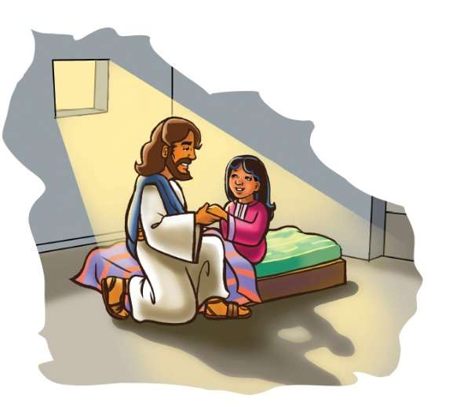

### Chhiar tûr
Matthaia 9:18–26; Marka 5:21–42; Chatuan Nghahfak (2nd Edition, 2014), pp. 380, 381.

> 
Châng vawn

> “Isuan, ‘Kei hi thawhlehna leh nunna chu ka ni,’ a ti a” Johana 11:25.

> 
Thuchah

> Chatuan nunna min petu Pathian chibai kan bûk.

_Dam lova nat deuh viau chang i nei tawh ngâi em? Khum aṭanga tho chhuak peih lo deuh hialin i awm em ni? I nun chhan nâna doctor–in injection a pêk che emaw, thawkna dawt vuahsak ngâi hialin em ni i awm? Tûnah hian hmeichhe naupang pakhat, doctor ṭanpuina bâk mamawhtu chanchin kan chhiar dâwn a ni._

Jaira fanu kum 12-a upa, tleirâwl ve ṭan chu hun eng emaw chên a na tawh a. A lo dam leh theih nân tiin a nu leh pate chuan an tih theih ang ang chu an tihsak tawh a. Mahse, ani chu a chau telh telh si a ni.

Nu leh pa ṭha takte chuan an fate hi an hmangaihin, dam leh hrisêl ṭha tûrin an tih theih apiang an tihsak ṭhîn. Jaira pawh a fanu neih chhûn khatianga a dam loha a rilru mangan dân tûr chu in suangtuah thiam mai ang. Kal pawh a kalsan phal tawh lo. Vawi tam tak doctor-te a kohtîr tawh ṭhîn a, mahse tihsak theih vak pawh an nei si lo a ni.

Chutah Jaira chuan Galilee lama Zirtîrtu Ropui Isua leh a thilmak tih chungchângte a ngaihtuah chhuak ta thut a. Jaira tan Isua chu a beisei awm chhûn a ni ta. A fanu dam lo beng bulah chuan, “Ṭanpuina zawng tûrin ka kal dâwn a nia,” tiin a hrilh sa sa a. Tichuan Jaira chuan an in chu chhuahsanin, hmanhmawh takin Matthaia te in lam chu a pan ding nghâl a. Chutah chuan Isua a va hmu thei dâwn tih a inhria a ni.

A va thlen chuan Isua hnênah, “Ka fanu dam lo a na viau mai a. A thih pawh a hlauhthawnawm khawp mai. Khawngaih takin kan ina lo kalin, a chungah i kut nghat ta che. Tichuan ani chu a lo dam leh mai ang,” tiin a ngên a.

Jaira rinna chuan Isua chu a tilâwm hle mai a. Jaira hnêna kal tûr chuan an chhuak ta nghâl vat a. Mahse, mipui tam takin Matthaia in aṭanga Isua lo chhuak tûr chu an lo nghak a. A kal ta pawh chu an zui dûl dûl a. Mi tin chuan a kiang hnâia awm an duh ṭheuh va, chu vâng chuan an innek tawlh tawlh hlâwm a. A châng chuan amah Isua pawh an nêk tawlh tawlh ṭhîn a ni.

Chutah Isua chu a ding chawih a, “Tuin nge min dek?” tiin A zâwt vêl a.

Petera chuan, “Mipui heti zozaiin an zuiin, an nek che a lâwm Lalpa. Engati nge ‘tuin nge min dek i tih mai?” tiin a lo chhâng a.

Isua erawh chuan amah dektu chu a zawng zui zêl a. A tâwpah hmeichhe pakhat hi A hmaah a lo ding a.

Ani chuan, “Keima’n ka tawk che. Hun rei tak dam lo tawh ka ni a. Kum 12 chhûng chu intihdam duhin theihtâwp ka lo chhuah tawh a, mahse eng ka ang thei si lo. Nangmah hi dek che ila ka dam mai ang tih ka inring ta a ni,” a ti a.

Chutiang taka amaha rinna chak chu nuin a neih avâng chuan Isua chu a hlim êm êm a. Chu vâng chuan han kalsan nghâl maithei a ni lo. “I rinna hi i dampui a ni e. Thlamuang leh hlim takin awm rawh,” tiin a thlamuan a.

Isua leh Jaira te an kal leh hma chuan, Jaira chhiahhlawh zînga pakhat chu mipui zîngah a rawn inzep lût tawlh tawlh a. Jaira hnênah chuan, “Zirtîrtu kha tubuai duh tawh suh. I fanu te chu a thi ta!” tiin a hrilh a. Jaira chu a va khawngaihthlâk em! Hmangaihtu a pa thinlung chu lungngaih vângin a hrehawm hle ta ve ang!

Mahse, Isuan Jaira chu enin, “Hlau suh. Ring mai rawh!” tiin a thlamuan a.

Isuan Petera, Jakoba, leh Johana chu amah zui tûrin a hrilh a. Anni nên chuan Jaira in chhûngah chuan an lût a.

Jair te in chhûngah chuan mipui an lo khat hmur mai a, ṭhenkhat chu mangang taka ṭapin, an lo chiau vak vak hlawm a. Ṭhenkhat chu Jaira hmêlhriatte pawh an ni lêm lo va; mahse amah hnem leh leênpui tûrin an lo kal khâwm ve hrim hrim a.

Isuan chung in chhûnga mite chu, “Chhuahtîr vek rawh u. I fanu chu a thi lo ve. A muhîl mai a ni,” tiin a hrilh a. Mahse, mipuite chuan a thu sawi an hriat chuan an nuihsan vêl a.

Amah Isua chuan mipuite chu chhuak vek tûrin a hrilh a. A zirtîr pathumte bâkah Jaira te nupa chu a hruai lût a.

Hmeichhe naupang ruang awmna pindanah chuan lûtin, a khum kianga dingin Isuan a kut chu a chelh a, “Chêmte, tho rawh,” a ti a.

Naupang chuan a mit a meng a, a ṭhu chhuak a. Isua hmêl hlim tak a’n hmuh khân, a hlim dân tûr chu in suangtuah thiam mai ang chu!

A nu leh pate hnênah chuan Isuan, “Ei tûr eng emaw pe rawh u,” a ti a. Jaira fanu chu a lo dam ṭhain, a lo chak leh ta a ni.

Isuan damlote tihdam hi a duh a ni lek lo va, mite hnêna nunna pêk leh pawh hi a hlimna a ni. Ani chuan, “Kei hi thawhlehna leh nunna chu ka ni,” (Johana 11:25) tiin a sawi a. Thihna aṭanga min chhanchhuak a, nunna min pe tûrin khawvêlah a lo kal a. Chatuan nunna min petu Pathian chu chibai kan bûk ṭhîn. Nangni, amah chu in hmangaih ve em le?

### Tih Tûrte

**Sabbath**

- A remchân chuan in chhûngkuain thlânmual fang ula, chutah chuan in Bible zirlâi hi in chhiar ho dâwn nia. Isua lo kal leh huna thilthleng tûr chu suangtuah chhin teh u.
- Bible-ah Johana 11:25 chhiar ula. Mi ṭhenkhat hi chatuan nunna an neih hmain vawi khat tal an thi phawt dâwn em?
- He hla hi “Jesus Loves Me” tih thlûkin han sa teh u:

“Christ is coming, this I know,\
He Himself has told me so.\
John fourteen and one, two, three,\
Read yourself and there you’ll see.\
Yes, He is coming, Yes, He is coming,\
Yes, He is coming. The Bible tells me so.”

` `

**Sunday**

- In chhûngkua a Marka 5:21–42 inchhiar chhawkin, sawi ho teh u. Engtiang kawngin nge ‘thihna’ chu ‘muhîl’ ang a nih? (châng 39.)
- He lei dam chhûng nun in hmuh dân sawi ho ula. Chanchinbu vêl aṭangin hnim/thlâi leh ransa, sava, sângha leh mipui lem chepthla ula. Poster board-ah in bel zêl dâwn nia. A chungah “Pathian: Nunna zawng zawng hnâr” tih in ziak dâwn nia.
- Card-ah in châng vawn ziak ula, mâwi takin in chei dâwn nia. En lova sawi tûrin zir nghâl ula. Pathianin nunna a pêk che u avângin lâwmthu sawi ang che u.

` `

**Thawhṭanni**

- In chhûngte nên ‘thil nghah’ chungchâng sawi ho ula. Nghâktua ṭan hi eng angin nge in ngaih ṭhin? Jairan Isua a lo nghah lâi khân eng rilru nge a put in rin?
- ### Chhiar tûr
Sam 27:14. Thil pawimawh nghak thei tûrin Isua ṭanpuina dîlin ṭawngṭâi ang che u. Amah chu lo kal leh thuai tûrin in sâwm dâwn nia.
- Nâl takin châng vawn sawi rual teh u.

` `

**Thawhlehni**

- In dam loh leh nat viau lâi kha in la hre thei em? Nat chu nuam in ti nge hrehawm in ti zâwk?
- Worship-naah, in chhûngte chu an dam loh lâi leh an lo dam leh dân chungcha sawi tûrin sâwm ang che u. Sam 103:1–3 chhiar ho ula, chutah Pathianin nunna leh hrisêlna a pêk che u avângin lâwmthu sawiin, ṭawngṭâi ang che u.
- In châng vawn kha a thlûk siamin, worship-naah sa ang che u. Damlo in hriat apiangte tân damna dîlin ṭawngṭâi ang che u.

` `

**Nilaini**

- Chhûngkaw worship-naah Marka 5:25–29 chhiar ho ang ula. Isua puan fêm dektu hmeichhe lem kha ziak ula. Khatih lâia Jaira lo tih mêk lem pawh târ lang tel ang che u. Kha hmeichhiain a tih ang kha in rin ve theih nân Isua ṭanpuina in dîl dâwn nia.
- In châng vawn ziahna card kha entîrin, a thlûk in siam ang khân in sa dâwn nia.

` `

**Ningani**

- Damlo kanna (get well) card in chhûngte nên siam ho ula. Chutah chuan Johana 10:10, tâwp lam thu kha in ziak dâwn nia. Damlo hnênah hlan ula, a nih loh leh dakah in thawn dâwn nia. Chu mi chu in tlawh chhuah theih nân, in chhûngkuain ruahmanna siam ho ula. An tân in châng vawn kha in sawisak dâwn nia.

` `

**Zirtawpni**

- Chhûngkaw worship-naah, tûn kâr zirlâi Matthaian a sawi dân Matthaia 9:18–26 chhiar ang che u.
- Jaira fanu chanchin hi in chhûngkuain lemchanah hmang ho teh u. Isua puan fêm dektu hmeichhia pawh kha telh in duh maithei e.
- In chhûngte hriatah in châng vawn hla kha sa ho teh u. Anni pawh sakpui tûr che uin sâwm ula. Pathian chanchin chiang zâwka in hriat theihna tûr Bible thawnthu ngaihnawm tak takte avângin ama hnênah lâwmthu sawi ang che u.

` `