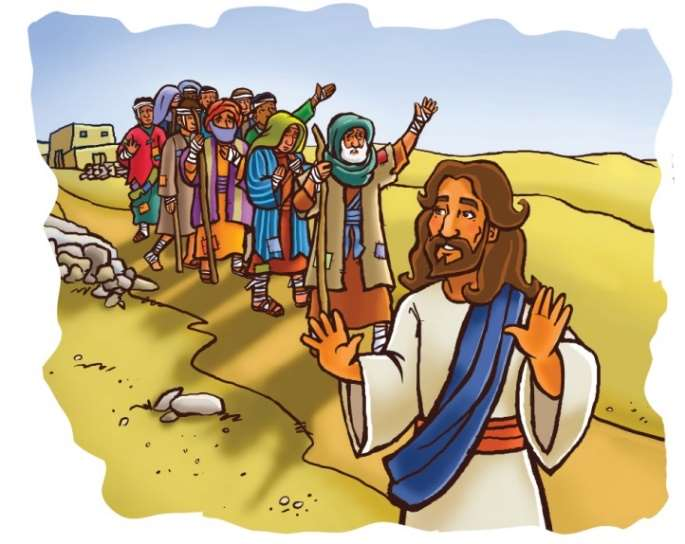
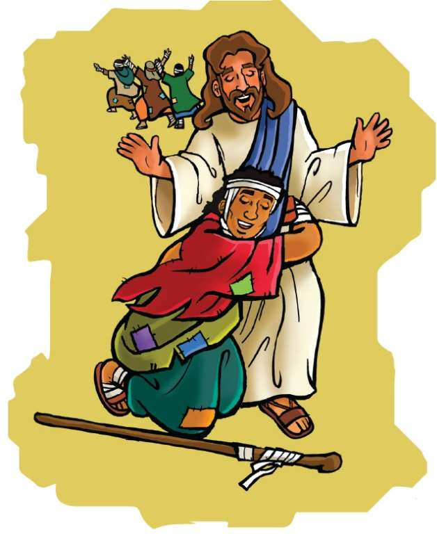

### Chhiar tûr
Luka 17:11–19; Chatuan Nghahfak (2nd Edition, 2014), pp. 279–284, 385–6.

> 
Châng vawn

> “Aw ka nunna, LALPA chu fak la, a thiltih ṭhat zawng zawng chu theihnghilh suh. Ani chuan i sualna zawng zawngtea ngâidamin, i natna zawng zawng a tidam ṭhîn,” Sam 103:2, 3.

> 
Thuchah

> Ama hnêna lâwmthu sawinain Pathian chibai kan bûk ṭhîn.

_Vânduaithlâk takin zawnghri in lo vei tawh ngâi em? In vei a nih chuan hun eng emaw chên chu khung hran in ngâi ngei ang. Vei chunga sikul in kal chuan in kâi chhâwng ang a. Tûnlâi Covid-19 hrilêng ang hian inkâi chhâwn a awl êm êm a ni. Vawiin zirlâiah hian natna inkâi chhâwn awlsam tak mi 10-in an vei thu kan chhiar dâwn a ni._

Ni khat chu Isua leh a zirtîrte chu Jerusalem lam panin an zin a. Galilee leh Samaria ram inrina lâi vêl an thleng a. Thingtlâng khaw pakhat an luh dâwn lâiin, phar natna vei mipa 10 hian, “Isu, Zirtîrtu, min khawngaih rawh!” tiin ral aṭangin an lo au va.

Isua chu a hawi vêl a, khaw pawna chung phar hri veite chênna bûk chu a hmu a. Silhfen chhe tak an inbelte chu a hmu bawk a. An ke te, an kut an tuam lek lûte chu A hmu vek a. Chûng mite chu phar hri veite an ni tih chu rang takin a hre nghâl a.

Chûng mite a hmuh chuan a khawngaih êm êm a. Dam an chak ve-zia pawh a hre vek bawk a.

He leia Isua mihringa a rawn chan kum tam tak kal taah khân, Mosian phar hri veite chunga tih dân tûr a lo hrilh diam tawh a: Phar hri vei niawm rinhlelhawma an lan reng reng chuan puithiamin a endik ang a. Puithiam chuan uluk takin a lo en vêl ang a, phar hri vei an nih chuan khaw chhûnga an chên phal lovin, khaw pawnah an hnawt chhuak tûr a ni. Hun bi an ruat ang a, chumi chhûnga a dam loh chuan chu mi chu ‘mi bâwlhhlawh’ a ni tih a puang ang, a chhan chu phar hri vei a nih vâng a ni.

Phar hri veite chu khaw pawn bûkah an chêntîr ṭhîn a. An dam leh hma loh chuan an chhûngte hnênah an rawn haw pawh phal a ni ngâi lo. Dam beisei, dam hlei thei si lo hian hun rei tak an awm ṭhîn a ni.

Chung phar hri vei sâwm zînga pakua chu Juda mi an ni a, pakhat chu Samari mi a ni thung a. Anni hian Isua chanchin mi sawite an lo hre ve tawh a. Isua an hmuh chuan a ṭanpuina dîlin a lamah an bante an phar chhuak a.

Chutah Isuan an hnênah, “Kal ula, puithiamte hnênah va inêntîr rawh u,” tiin a hrilh a.

Pharte chuan a ngaihna tak hre lovin, an han ngaihtuah buai deuh a. Chutah thil awmzia chu an manthiam leh ta thuai a. Eng vânga Isuan puithiamte hnêna inêntîr tûra tîr ta mai nge an nih chu an hre ta a ni.

Pharte khân anmahni chu puithiamte hnêna an inêntîr a ngâi tih an hria a. Puithiamin an dam tawh tih a lo hrilh chuan, an zain mahni hmun lamah an hawng leh thei mai dâwn a ni. Mahni inah hawngin, an chhûngte nên an chêng ho leh thei dâwn a nih chu!

An rilru te te chuan, “Eng nge kan nghah reng?” tiin an inngaihtuah pawh a ni maithei e. Tichuan hmanhmawh takin puithiam hnên lam pan chuan an tlan ta vâng vâng a. An tlân pah chuan an ke leh kutte chuan hriatna a lo nei leh ta mai a. An pante pawh chu a lo damin, hmuh tûr pawh a awm ta lo. An lo dam ta tak hlâwm a nih chu!

Samari mi pawh chuan a ṭhiante ruala puithiam hnên thlen ve chu a duh hle nain, a ding leh rih ta zâwk a. A inher a, Isua hnên lam panin a tlân leh ta zâwk a. Pathian fak leh lâwmthu sawi mawlh mawlh chûngan Isua ke bulah a bawkkhup nghâl a.

Zâwi deuh sap hian, “I chungah ka lâwm e,” tiin chutah a aia ring deuh zâwkin, “Ka lâwm e, ka lâwm e, I chungah ka lâwm lutuk e!” a ti zui mawlh mawlh pawh a ni maithei a ni.

Isua pawh hlim takin a meng iau iau va. Isua hnêna lâwmthu sawi nachang hria hi an tam vak lo ṭhîn a ni. Ani chuan kawngpui lam chu a thlîr a, Juda hote kha chu hmanhmawh takin an tlan zui zêl a ni.

Lungngâi takin Isuan, “Mi 10 kha an lo thianghlim ta a ni lo’m ni? Khawiah nge pakuate kha? Samari mi chauh hi Pathian hnêna lâwmthu sawi leh fak tûr em ni le?” a ti a.

Chutah Isuan Samari mi lam chu hawiin, “Tho la, kal tawh rawh. I rinna nasa tak hian a tidam ta che a nih hi,” a ti a. Chu pa thinlung chu lâwmnain a khat liam a. Thinlunga lâwmna khat liam chunga Pathian chibai a bûk ta a ni.

### Tih Tûrte

**Sabbath**

- A remchân chuan, in chhûngte nên khua/in hmu phak siin leng chhuak ula. Chhûngte nêna chên ho theih si loh chu engang taka hrehawm nge ni ang suangtuah chhin teh u. Chutah chuan in zirlâi Bible thawnthu hi in chhiar ho dâwn nia. A theih phei chuan damlo tu emaw hnênah a thawnthu hi in hrilh ve dâwn nia.
- Mahni ṭawng kauchhehin a thawnthu hi sawi tum ula. In chhûngte tan châng vawn thu hi Bible aṭangin in chhiarsak dâwn nia.

` `

**Sunday**

- Vawiin chhûngkaw worship neih nân, zirlâi Luka 17:11–19 chhiar ang che u.
- Damlo en nân thilpêk heksak tham lo te ngaihtuah ula. Mâwi taka funin thil lem mâwi tak in bel bawk dâwn nia. In châng vawn thu kha ziak bawk ula. A remchân chuan nangmahni ngein hlan ula, a hlat deuh leh dakah in thawn mai dâwn nia.
- He hla “God Made Our Hands” (Sing for Joy, no. 57) tih hi rimâwiin tum ula, a nih loh leh in ngâithla tal dâwn nia. Hrisêlna in neih avângin Pathian hnênah lâwmthu sawi ang che u.

` `

**Thawhṭanni**

- Chhûngkaw worship-naah Luka 17:15, 16 chhiar ula. Engati nge Luka hian phar sâwm zînga pakhat kha Samari mi a ni tih a sawi lan kher nia in rin? ### Chhiar tûr
Tirhkohte 10:34, 35.
- Ram dang mi ṭhian in nei em? Tu nge ni? Map-ah an ram zawng chhuak ula, in ṭawngṭâisak nghâl dâwn nia.
- In kut emaw, ke emaw thla chu lehkhaah ziakin, chep thla ang che u. Chtuah chuan in châng vawn ziak ula, in chhûngte hnêna zirtîr nân in hmang dâwn nia.

` `

**Thawhlehni**

- In chhûngte ṭanpuinain phênglawng siam ula. Cardboard tube (toilet paper tube, etc.) zawng ula. Phênglâwng kaw bulah chuan rubber band-in in ṭawn bet ang a. Fakna hla in ngainat chu in tum dâwn nia, chutiang in tih lâi chuan in chhûngte chu in châng vawn lo chhiarsak tûr che uin in sâwm dâwn nia.
- ### Chhiar tûr
Rom 1:21, 22. Pathian malsâwmna dawna chunga lâwmthu sawi nachang hre lo chungah eng nge thleng thei? Vawiin Pathian malsâwmna engte nge in dawn? Lâwmthu sawi nghâl ang che u.

` `

**Nilaini**

- In chhûngkaw worship-naah, in dam loha in nat viau lâi chanchin hrilh teh u. Engtiang kawngtein in in damlohna chu phâr hri vei nên a inâna, a danglam bawk? In dam leh theih nân tuin nge ṭanpui che u? In ṭawngṭâi hunah, damdawi lama thawktute avâng leh hrisêlna thilpêk avângin Pathian hnênah lâwmthu sawi ang che u.
- Kutzungpui tel lovin in hming han ziak dâwn teh u. Tûna in nih anga siam in lo nih avângin Isua hnênah lâwmthu in sawi dâwn nia.
- In kut/ke thla in siam kha vawiina châng vawn ennawn nân in hmang ṭangkâi dâwn nia.

` `

**Ningani**

- In chhûngte nên, Luka 17:17 chhiar ula. Phâr 9-ten Isua hnêna lâwmthu an sawi ve lo kha eng vâng nge a nih in rin? In lâwmna chhan thil pathum chu hetah hian ziak teh u:
- Isua hnênah lâwmthu sawi nghâl ula. Lâwmthu sawi nachang hria Samari mi Isua ke bula bawkkhup angah inchan teh u.

` `

**Zirtawpni**

- In chhûngkaw worship-naah, infak rei siak teh u. Tâwp nei mai lovin Pathian fakna hla sa ula. Hla sak tûr chu inthlan chhawk ula. Pakhat a tâwp veleh a dawtah in pakhai nghâl vat zêl dâwn nia. Chutiang chuan hla eng emaw zât in sa ho dâwn nia. ### Chhiar tûr
Sam 138:1 leh 145:1, 2 ṭawngṭâina angin in hmang dâwn nia.
- In chhûngkaw “Malsâwmna Bu” siam ula. Zirtawpni tlâi apiangin, in chhûngkuain kâr tluana malsâwmna in dâwnte in ziak ṭhîn dâwn nia. Chung malsâwmna in dawngte avâng chuan kut insuihin, Isua hnênah lâwmthu in sawi dâwn nia.
- In chhûngkuain in châng vawn kha thiam nâl takin sawi rual ṭhap ṭhap ang che u.

` `