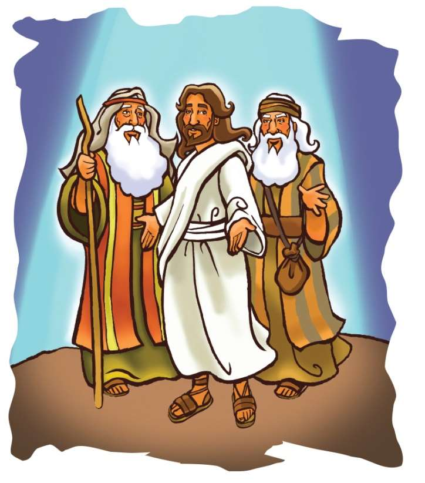
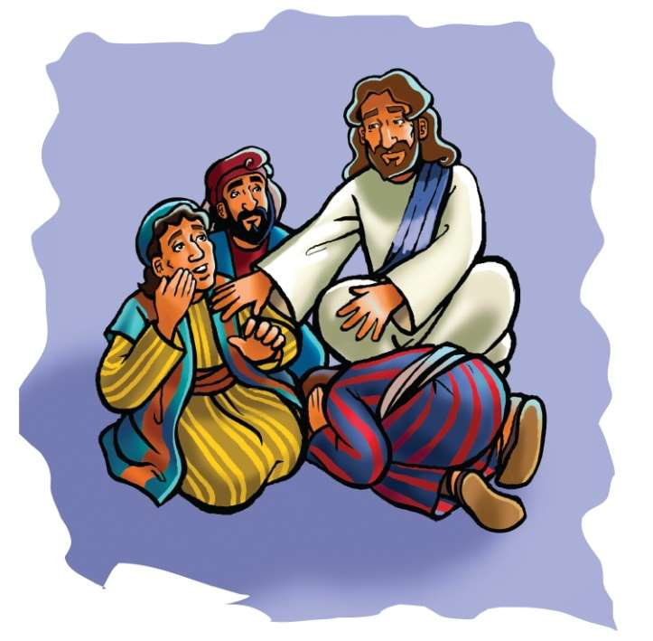

### Chhiar tûr
Matthaia 17:1–13; Luka 9:24–36; Chatuan Nghahfak (2nd Edition, 2014), pp. 473–478.

> 
Châng vawn

> “Lalpa-ah chuan lâwm fo rawh u. Ka ti leh pek ṭhîn ang, lâwm rawh u!” Philipi 4:4.

> 
Thuchah

> Chibai bûkna hi Pathian chên chilh nuam tihna hi a ni.

_Thil êng tak mai, chhûng ên lâi pawha hriat hran theih khawpa eng i hmu tawh ngâi em? Ṭum khat chu Isua zirtîr pathumten thil eng tak mai an hmu a, Petera phei chuan nuam a ti nasa êm êm mai a ni. A chhan hriat i’n tum dâwn teh ang u. . . ._

Isuan ṭum khat chu Petera, Jakoba, leh Johanate hnênah, “Hawh u, ka rualin tlângah lo lâwn ve rawh u,” a ti a. A ṭhian pathumte chu tlan chhîp bulah chuan a awmtîr a.

Zirtîrte pawh khân makti takin, ‘Keini pathum chauh chu?’ tiin an ngaihtuah pawh a ni maithei e. Mahse, Isua hmêl chu an hmu leh ta thut a. An hmâichhan ngeia a hmêl lo danglam ta chu an hmuhin, thil dang chu an hre chang tawh lo!

Vân aṭangin Isua chungah chuan eng a lo eng chhuak a. A hmêl chu chhûn ni êng ang mai hian a lo êng a. A thawmhnâwte lah chu lal thuam inbel ang maia vâr thianghlim hlak hian a lang a, a ên êm avângin zirtîrte chu an che châng thei lo a ni.

Isua kianga mi pahnih ênga inthuam dingte pawh chu an hmu a. Pakhat zâwk chuan savun upte, Elija ah ṭhîn ang kha a ak pawh a ni maithei e. Pakhat zâwk chuan Israelten Tuipui Sen an kêi theihna tûra an hman Mosia tiang ang kha a keng bawk a.

“Elija leh Mosia te em ni dâwn le?” tiin zirtîrte chuan mak an ti hle a. Chutah hai rual lohin anni chu Mosia leh Elija te an ni tih an chiang zui ta nghâl a.

Thil mak ropui tak mai a lo thleng mêk a ni. Âwihawm lo deuh hial khawp a ni mai. Isua hnêna thu sawi tûrin Mosia leh Elija te chu an lo kal a. Petera phei chuan chutiang thil chu mi dangte hnêna a hrilh lo a nih chuan puak keh mai tûr angin a inngâi a. Isua chunga a lâwmzia chu engtin nge a lantîr tak ang le?

Petera chuan phûr zet hian, “Lalpa, heta awm hi a ṭha e! Chênna tûr bûkte pathum sa tûrin min duh em? Nangma tân pakhat, Elija tan pakhat, Mosia tân pakhat?” tiin a zâwt a.

Chutih lâi tak chuan chhûm êng takin anmahni chu a rawn chîm ta hmuk mai a. A lan dân chuan rawng mâwi taka lunghlu maktaduaih tel tle sep septe pawh a ang a ni.

Chutiang eng mâwi tak kâr aṭang chuan Pathian aw a lo chhuak a. “Hei hi Ka Fapa duh tak, ka lâwm êm êma chu a ni. A thu ngâichêng rawh u!” (Matthaia 17:5) tih a ni.

Zirtîr pathumte chu leiah an bawkkhup a. Hetiang hian an ngaihtuah pawh a ni maithei e: “Keini ang mi sualte hi Pathian chênna hmuna awm ve tlak kan ni lo,” tiin. Mihring tih dân phung reng angin, an maimitchhîng tlat a. Pathian thianghlim awmna hmunân chuan eng nge thleng thei (hriain an hlau a ni).

Chumi hnua an thil hriat leh chu, Isuan anmahni a rawn dek a, aw dam tein, “Tho rawh u. Eng mah hlauh tûr a awm lo ve,” tiin a hrilh a.

Petera, Jakoba, leh Johana te chu an lo thova, an han hawi vêl ruai a. Mosia leh Elija te chu an lo awm ve tawh lo. Êng ropui pawh kha a awm tawh lo va. Isuan ama ruala tlâng aṭanga chhuk tûrin a hrilh a.

Zirtîrte chuan an thil hmuh chu titi nân an hmang ṭan pawh a ni maithei e. Mahse Ani chuan an hnênah, “Mihring Fapa hi thihna aṭanga a thawhleh hma loh chuan in thil hmuh leh hriat te kha tu ma hnênah hrilh suh ang che u,” (ch 9) a ti tlat a.

Zirtîr dangte hmu tûra an chhuk pah chuan, zawhna tam tak Isua hnênah an zâwt hlâwm a. An thil hriat thiam loh ṭhenkhat chu a hrilh fiahsak a. Chumi ṭuma thil ropui tak an hmuh chu an dam chhûng zawngin an theihnghilh leh tawh ngâi lo ang. Thil hlimawm leh zahawmzia pawh an hre reng bawk ang. Pathian awmna hmuna awm an ni tih chu an hre reng dâwn a ni.

### Tih Tûrte

**Sabbath**

- In chhûngte nên thil eng tak awmna hmunah kal ula, a lum hrehawm lutuk loh chuan in Bible zirlâi in chhiar dâwn nia.
- In châng vawn (Philipi 4:4) hi Bible aṭangin chhiar ula, chutah “Rejoice in the Lord Always,” tih kha in sa ho dâwn nia.
- Ni tina Pathian chênna hmuna in awm theih dân tûr sawi ho ula. Chutah lâwmthu in sawi nghâl dâwn nia.

` `

**Sunday**

- Chhûngkaw worship-naah Matthaia 17:1–8 chhiarin, sawi ho ula. ### Chhiar tûr
2 Korinth 3:18. Tûn kâr chhûnga ‘Pathian ropuina’ in târ lan theih dân tûr sawi ho teh u.
- Hla sak ho tûr: “Jesus Bids Us Shine” (Sing for Joy, no. 133). Pathian ropuina in târ lan theih nân a ṭanpuina dîlin ṭawngṭâi ang che u.
- Tlâng–chhîp lem 14 lehkhain chep ula. A chhîp chu rawng mâwi chi hrang hrangin in cheimâwi dâwn nia. Chutah chuan châng vawn thumal ziak zêl ula. Chawhpawlh ula, indawt dik takin in rem leh dâwn nia. Ni danga hman leh tûrin in dah ṭha rih dâwn nia.

` `

**Thawhṭanni**

- Chhûngkaw worship neih nân Matthaia 17:4 chhiar ula. Tlânga Isua hova awm kha engangin nge Peteran a ngaih kha? Chênna hmun pathum Peteran sak a duh chhan kha eng nge ni tûra i ngaih?
- Pathian chênna atâna sak biak in mâwi tak lem ziak ula. A hnuaiah chuan châng vawn ziak ula. Biak in in neih avângin Pathian hnênah lâwmthu sawi ula.
- Zirtawp tlâi/zâna chhûng worship hlimawm tak nei tûrin ruahmanna siam ang che u.

` `

**Thawhlehni**

- Chhûngkaw worship-naah, in chhûngte chu an hlimna thlentu thil pahnih ṭheuh sawi tûrin sâwm ang che u. ### Chhiar tûr
Matthaia 17:5. Engtik lâi hunah nge Pathianin a Fapa chungchâng thu hi a lo sawi? (En tûr: Matthaia 3:17.)
- Zirtawp tlâi/zâna worship hlimawm tak nei tûrin ruahmanna siam ang che.
- Inchhawk te tein châng vawn thumal kha sawi ula. Châng vawn hi hlain sa ula, thirfian khawngin in rem dâwn nia. Chhûngkuaa hun hlimawm tak in neih avângin lâwmthu sawi ang che u.

` `

**Nilaini**

- Chhûngkaw worship-naah he Bible thawnthu hi in chhûngte hnênah in hrilh dâwn nia. Tlâng chhîp lem insiam kha hmang ṭangkâi tawh ula. Châng vawn sawi nân pawh in hmang dâwn nia. Tlâi ni tla leh zîng ni chhuak vêla chhûm rawng mâwi tak in hmuh chungchâng in sawi dâwn nia.
- In in chhûnga eng in neih zât chhiar ula, Chutah Pathian hnênah êng avângin lâwmthu sawi ang che u.

` `

**Ningani**

- Chhûngkaw worship-nah Matthaia 17:1–3 chhiar ho ang che u. In chhûngte chu Mosia leh Elija khân mi duh loh nih an tawrh lâi chanchin sawi tûrin sâwm ula. Isuan kraws a hmachhawnna tûrin eng fuihna thute nge A hnêna hrilha in rin? In chhûngkua khân Mosia leh Elija te hnên aṭangin eng zirlâite nge in zir chhuah theih ang? Mi dangte fuih phûr dân tûr chu tu emaw sawitîr teh u.
- Châng vawn sawi pahin tlâng chhîp lem in siam kha hmang ula, chuah hlaah sa ho ang che u.
- Naktûk tlâia chhûngkaw worship hlimawm neihna tûra ruahmanna kha ti zo diam tawh ang che u.

` `

**Zirtawpni**

- In ruahman lâwk anga chhûngkaw worship hlimawm chu nei tawh rawh u le. In châng vawn kha hlâin in sa/sawi dâwn nia. Naktûk lama biak ina inkhâwm hlimawm tak in neih theih dân tûr sawi ho bawk ula.
- Sam 126:3 chhiar rual ula. Kâr kal ta Zirtawpni tlâia in chhûngkaw “Malsâwmna Bu” in siam kha ziah zawm zêl ang che u. Chutah he hla “Rejoice in the Lord Always” hi hlim taka sa ho vin, a malsâwmnate avângin Pathian hnênah lâwmthu sawi ang che u.

` `