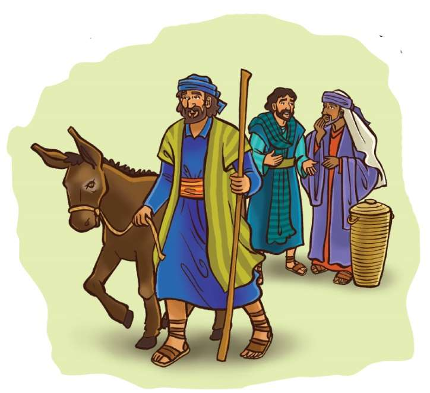
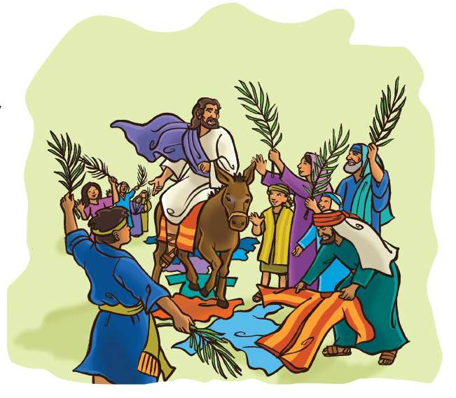

> 
Châng vawn

> “‘Hosanna!’ ‘Lalpa hminga lo kal chu a eng a thâwl e!’” Johana 12:13.

### Chhiar tûr
Matthaia 21:1–11; Marka 11:1–11; Luka 19:28–40; Johana 12:12–19; Chatuan Nghahfak (2nd Edition, 2014), pp. 633–639.

> 
Thuchah

> Amah ka fak hian Pathian chibai ka bûk a ni.

_I ṭhianin thil danglam deuh, tûn hma lama an la tih ngâi loh, eng emaw tak a tih tawh ngâi em? Kan Bible thawnthuah hi chuan, Isua chu Jerusalem khawpuia lût tûrin a inpeih a. Mahse a hnu rei vak lo vah tihhlum a ni dâwn tih a inhre sa a. Chu vâng chuan tûn hma lama a la tih ngâi loh, thil danglam deuh tak a ti ta a ni. Thil lo thlen dân chu hetiang hi a ni. . . ._

Isua leh a zirtîrte chuan Jerusalem lam an pan mêk a. A zirtîr pahnihte hnênah chuan: “An hnênah, ‘In hma zawn khuaah sâwn va kal ta ula; tin, in luh tirhin sabengtung no thlun, tu ma la chuan ngâi lohna in va hmu mai ang; chu chu phelh ula, han kai rawh u.

Tu pawhin, ‘Kha kha engah nge in tih?’ an tih che u chuan, ‘Lalpain a duh a ni, hetah a rawn dahtîr leh thuai ang e,’ ti ang che u,” a ti a.

An kal ta a, kawtthlerah kawngkhar pawn lama sabengtung no thlun an va hmu a; chu chu an phelh ta a. Chuta ding tute emaw chuan an hnênah, ‘Sabengtung no kha engah nge in phelh?’ an ti a. Anni chuan Isua sawi ang tak khân an hnênah an sawi a; tichuan an kal an phal ta a.” (En tûr: Marka 11:2–6.)

Tichuan zirtîrte chuan sabengtung no chu Isua hnênah an rawn kai a. A chungah chuan an kawrchungte an phah a, ani chu an ṭhuttîr a. “Isua khân Juda lalten khawpuia an luh dâwna an tih dân ṭhîn anga ti ve a ni.”1 Sabengtung no kha hmânlâi Israel lalte chuan ṭhînna ang a ni. A hma kum eng emaw zâtah zawlnei Zakarian chumi chungchâng chu a lo hrilh lâwk tawh a. A ziah dân chuan Messia chu Jerusalem mipuite hmuh tûrin sabengtung chunga chuangin a intâr chhuak dâwn a ni (En tûr: Zakaria 9:9.)

Chumi hrilh lâwkna chungchâng chu mipuiten an hria a. Chutia Isua sabengtung chunga a chuan vêleh chuan, zirtîrte leh mi dangte pawh chu ring takin an au rual ṭan ta a! Mipuite chuan an Lalber, Messia angin an chawimâwi a ni.

Isua zirtîrte chuan an kawngchungte chu sabengtung rah tûrin a hmaah an lo phah a. Mi dangte pawhin thil thleng chu an hmuh chuan, ring taka au chungin an kawngchungte pawh chu an phah ve ta zêl a. Zirtîrte nên chuan “ ‘Hosanna!’ ‘Lalpa hminga lo kal chu a eng a thâwl e!’ (Johana 12:13) tiin an au rual a. (Hosanna tih chu ‘Pathian chu fak rawh u’ tihna a ni.) An hnêna an nghahfâk (Messia) chu a rawn tirh tak avângin Pathian hnênah lâwmthu an sawi a. Tûnhma lam ang lo takin Isua chu an chawimâwi tlâng ta a ni.

Mi tam tak chu Kalhlên Kût hmang tûrin Jerusalam-ah an lo kal khâwm a. Kalhlên Kût chu tûn hma hun rei tawh taka Pathian hruainaa Israelten Aigupta ram an chhuahsan hriat rengna hun a ni. Chung zînga mi tam tak chuan Isua chanchin pawh an la hre ve ngâi lo. Isua kiang vêla mipui pungkhâwm chu hmuin, a chanchinte an zâwt a. Chutiang chuan Isua chanchin chu an lo hre chawp ve a. Amah fakna kawng zawhnaah chuan phûr takin an tel ve ta hlâwm a.

Mi tam tak chuan Isua kha an hre sa a. Damlo a tihdam leh mi thi a kaihthawh thu te pawh an hria a. Chutiang chuan mipui tam tham tak chu Isua chu zuiin, Jerusalem an luh lâi chuan ring takin an au rual a.

Mahse, Juda hruaitute erawh chuan amah fakna an aupui ve hauh lo thung a. Anni chuan Isua kha an itsik tlat zâwk a. Mipuite chu ngawi tûra khap beh an tum a, mahse an thei ngang si lo. Thinrim takin Isua hnênah chuan, “Zirtîrtu, mipuite hi ngawi tûrin khap rawh!” an ti a.

Ani erawh chuan, “Ka hrilh a che u, anni hi an ngâwih mai chuan, lungte an auchhuak zâwk ang!” (Luka 19:39, 40) tiin a hrilh a. A sawi awmzia chu Pathian anga amah an châwimâwi chu mipuite chuan an tiṭhain an tidik chiah a ni. Mipuiten an ti lo a nih chuan, a thilsiam kutchhuak dangten an ti mai zâwk dâwn a ni!

An kawng zawh a lo tâwp chuan, Isua zirtîrte chu an phûrin, an hlim khawp mai. An beisei dân chuan Isua chu an lal chak leh thiltithei takah ṭangin, Israel chungah ro a rêl tawh mai dâwn a ni. An tân a thi thuai tawh dâwn a ni tih lam rêng an hre thiam thei si lo.

Mahse, kha ni khat na na na kha chu, mipuiten lalber anga an en nih chu Isuan a inphal ve a ni. Amah chibai an bûk nih pawh a inphal a. “ ‘Hosanna!’ ‘Lalpa hminga lo kal chu a eng a thâwl e!’” tia an au pawh a phal a. Hetiang hian amah an hmangaih leh zahna chu an lantîr a ni.

Tûnah pawh hian Isua chu kan fak changin, ani chu kan Lalber leh Chhandamtu a nihna angin chibai kan bûk tihna a ni. Ani chu fak tlâk leh phu ngawih ngawih a ni si a!

1Chatuan Nghahfak, p. 634.

### Tih Tûrte

**Sabbath**

- In chhûngkuaa thingbuk hlimah emaw, hmun fianrial dangah emaw ṭhuin in Bible thawnthu hi chhiar ang che u. Inzawh tûr: Isua fak nân mipuite khân engtin nge an au rual? Eng nge an tih bawk? Eng vâng nge? Mipuiten amah fak lo ta se lungte khân eng nge an ti ang tih Isuan a sawi?
- Sabbath sikul lama tûmkau lem in ziah kha mi dangte entîr ve ula. A nih loh leh, tûnah ziak chawp mai ula, chutah chuan Isua in fakna chhan tûr in ziak dâwn nia. In hmuh fo theihna tûr remchâng lâiah târ ang che u.

` `

**Sunday**

- Chhûngkaw worship-naah Luka 19:28–40 chhiarin, sawi ho ang che u. In chhûngkua khân Isua hming in fakna chhan tûr thil chi hrang 12 ziak chhuak ula. Tûn kâr ni tinin chung thil chi hnih zêl chu ṭawngṭâi thupuiah in hmang ṭhîn dâwn nia.
- Hre reng rawh! Isua fak tih chu hlasak leh ṭawngṭâi ngawt bâk deuh a ni. In thil sawi leh tih zawng zawng hmangin Isua chu in fak thei zêl a ni. Mahni inzawh tûr: “Vawiin hian engtin nge Isua ka fak le?” In chhûngte chu vawiin hian engtin nge Isua an fak tih zâwk ang che u.

` `

**Thawhṭanni**

- Chhûngkaw worship-naah Johana 12:12–19 chhiarin, sawi ho ang che u. Engtin nge he lâi thu hi Luka 19:28–40 nên a danglam?
- Tûmkau lema châng vawn in ziah kha ring tâwk takin au chhuahpui ang che u. Nangni leh in chhûngte tana Isuan thil a tihsak che u avângin amah chu fak ang che u.

` `

**Thawhlehni**

- Vawiin chhûngkaw worship bulṭan nân, in chhûngte nên fakna hla sa ho ang che u. Chutah Matthaia 21:1–11 chhiar ho ulang, nimin lama Bible chang in chhiar tak nên khân a danglamna hriat tum ang che u. engtin nge a danglam a, engtin nge a thuhmun bawk?

Tûm kûng leh hnah lan dân chu lehkhabu-ah emaw, internet lamah emaw en teh u. Khawi hmunahte nge a ṭo ṭhîn a, Isua kha sabengtung chunga chuangin in kawtthlerah lo kal dâwn ta se, eng thing hnah ang chite nge kawngah in lo phah ve ang a, in lo vai vawk ang le? Vawiin hian eng thil vângin nge amah chu in fak ang?

` `

**Nilaini**

- Chhûngte hnêna zawh tûr: Engtin nge thilsiamten Pathian an fak ṭhîn? (Arsite an de sep sep a, pângpâr mâwi takin an lo pâr vul a, chutiang zêlin). Kawng hrang hrang in ziak chhuak dâwn nia. Chutah pawnah leng chhuak ho ula, Pathian thilsiam hmuh theihna remchângah ding ula, in châng vawn kha ring takin in sawi rual dâwn nia. Kut insuihin, in chhûngkuain in chên tûr thil eng emawte Pathianin a siamsak che u avângin lâwmthu in sawi dâwn nia.
- In luh leh hmain fakna hla in sa ho dâwn nia.

` `

**Ningani**

- Chhûngkaw worship-naah Marka 11:1–11 chhiarin, sawi ho ang che u. Chîk deuh takin chang 9-na en ula. Bible ṭhenkhatah chuan ‘Lalpa’ tih sîrah hian hawrawp sîn bîkte in hmu ang. Chu chu châng dang pawh en mil tûr tihna a ni. Chu chu Sam 118:25, 26-na a ni. Eng nge in hmuh le? Chutiang a nih chhan chu eng ni tûrin nge in ngaih?
- Chanchinbu-ah emaw magazines leh lehkhabu lamah emaw miten Pathian biak leh chibai bûkna an nei lâi lem en ula, engtin nge an tih? Chûng zînga ṭhenkhat chu in chhûngkua khân in ti ve chhin dâwn nia. Chutiang atâna in chunga thil thleng entîrnate in sawi dâwn nia.
- In chhûngkua kha ding kual ula. Lehkha têl mûm beng kâng ula, in inhlân chhâwng ang a, chumi pah chuan Pathian fak in duh chhan pakhat in sawi zêl dâwn nia.

` `

**Zirtawpni**

- Bible thawnthu hi in chhûngkuain lemchanah hmang ho teh u. In rumawl emaw scarve emaw chu tûmkau âia vaiah in hmang dâwn nia. Isua hmaa phah atân kawrchung âiah towel in hmang thei bawk ang. Chatuan Nghahfak, bung 63-na tîr lam paragraph kua chu chhiar rualin, a chanchin hriat belh nân in hmang dâwn nia.
- Pathian fakna atân Bible châng khat ṭheuh chhiar tûrin in intuk ang a. Fakna hla sak hnuah ṭawngṭâiin in khâr dâwn nia.

` `