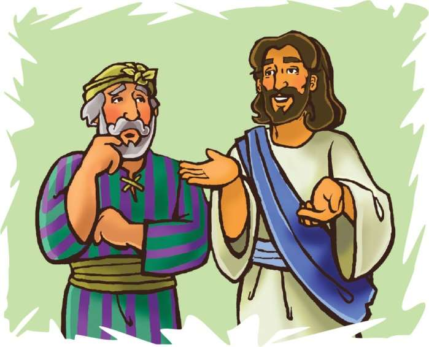

> 
Chângvawn

> “Thinlung takin in unaute ngâidam theuh rawh u,” (Matthaia 18:35).

### Chhiar tûrte

Matthaia 18:21–35; Krista Tehkhin Thute (2nd Edition, 2015), pp. 203–210.

> 
Thuchah

> Pathianin thinlung taka mi dangte ngâidam thîn tûrin min duh.

_Tu chungah emaw nasa taka thinrim vânga ngaihdam harsa tih chângte i nei tawh ngâi em?_

Ni khat chu Petera’n Isua hnênah, “Ka chunga thil tisualtu chu vawi eng zâta tam nge ka ngaihdam tûr ni ang? Vawi sarih thlengin em ni ang?” tiin a zâwt a. Isua hun lâite kha chuan puithiamte leh an sakhaw zirtîrtute khân vawi thum thleng chiah ngâidam tûrin an zirtîr thîn a. Chuvâng chuan Petera khân vawi sarih thlenga ngaihdam thu a sawi khân sawi huang deuh viauah a inngâi pawh a ni maithei e.

Isua erawh chuan, “Vawi sarih lek ka ti lo va, vawi sawmsarih hmun sarih thlengin ka ti zâwk a ni,” tiin a chhâng thung a. Chu chu vawi 490 lâi a nih dâwn chu! Chutiang thleng thlenga mi dangte ngâidam tûra an sualna chhiarsak chu a harsa deuh maithei a ni. Chutianga tam Isua’n a sawi chhan chu, ngaihdam zât chhiar kher lo va, ngâidam zêl zâwk tûra a duh vâng a ni. A thil sawi tih chian nân Isua’n thawnthu pakhat a sawi ta a.

Mi pakhat hian lalber tân hna a thawhsak a, a tangka sum a enkawlsak thîn a ni. Ni khat chu lalber chu a sum dinhmun endik tûrin a thu a. Chutianga an han endik chuan, chu pa chuan leiba a ngah hle mai a, chêng maktaduaih tam tak, a rulh lêt theih rual loh tûr a ni tih an hmu chhuak ta a ni. Lalber chuan, chu pa leh a nupui fanaute bâkah, a thil neih zawng zawng pawh chu hralh vek tûrin thupêk a chhuah a. An hralhna man chu a leiba rulh nân hman vek tûr a ni.

Chu pa chu lalber hmaah chuan thingthîin, a chunga zahngaihna lantîr tûrin a ngên a. “Hun remchâng min siamsak leh lawk la; tichuan, ka leiba zawng zawng chu ka rûl vek ang che,” a ti a. Lalber chuan a leiba chu a rûl kim thei dâwn lo tih chu a hre chiang hle thung a. Mahse, chu pa chu a khawngaih êm êm a, a leiba chu ngaihdamsakin, a chhuahtîr ta a.

Chhiahhlawh pa pawh chu a thaw a vêng ta huai a, lâwm takin a kal bo ta nghâl a. Chutia a kal kawngah chuan chhiahhlawh dang pakhat—sum tam vak lo batsaktu chu a hmu a. A batsak hnem vak lo, ni khat hlawh ang vêl lek a ni. Chu pa chuan a hrawkah rêkin, thaw tha hlei thei lovin a siam a. A hnênah chuan, “Ka pawisa i bat kha min pe nghâl rawh,” a ti vêl a.

Ani chuan, “Khawngaih takin min dawh rih lawk teh. Remchânna min pe lawk la, ka leiba chu ka rûl leh vek ang che,” tiin a ngên a. Mahse, chu chhiahhlawh pa chuan a ngenna chu a pawm deuh lo va, a leiba a rulh hma loh chu tân ina tâng tûrin a khung ta hmiah mai a.

Chutiang thil duhawm lo tak thleng chu chhiahhlawh dangte’n an lo hmu a. Lalber hnênah chuan an hrilh ta vat a. Lalber chuan chu chhiahhlawh pa chu a kohtîr nghâl a. Thinrim tak chungin, “Chhiahhlawh sual, ka laka i leiba tam tham tak kha ka ngaihdamsak che a. Chutiang chuan mi dangte pawh i ngâidam ve tûr a ni dâwn lo’m ni? I laka leiba tlêm tê neite phei chu i ngâidam tûr a ni lo’m ni?” tiin a chhuahchhâl a. Tichuan, tân ina tâng tûrin a thawn ta hmiah mai a ni.

Keini pawh hi eng emaw chângte chuan lalber chhiahhlawh sual ang mai hi kan ni ve thîn a. Ani pawh khân a rulh theih loh tûr khawp lâiba a nei a. Ngaihdamsak nih chu a duh a, mahse, mi dangte chu a ngâidam duh dêr sî lo a nih kha.

Lalberin a leiba a ngaihdamsak ang khân, keini pawh kan sualte chu Pathianin min ngaihdamsak a. Chutianga Pathianin kan sualte min ngaihdamsak ang chuan mi dangte pawh ngâidam ve zêl tûrin min duh a. Mi dangte chunga ngilneihna lantîr a, kan chunga an tihsualte ngâidam zêl tûrin min duh a ni.

### Tih Tûrte

#### Sabbath

- He Bible thawnthu hi in chhûngkuaa in chhiar pahin rimâwi tum ngaihnawm tak ngâithla pah ang che u. Sawmsarih hmun sarih chu eng zât nge ni?
- Eng thilah nge ngaihdam ngâi i nih ngaihtuah vang vang la. Tuin nge i ngaihdamna lo mamawh ve thung tih ngaihtuah bawk ang che. Sawi dun ula, ataka hlen tûrin thutlukna siam ang che.
- Chângvawn chhiarin, vawng tûrin zir tan ang che.
- Nangma chunga ngilnei lo tak tân tawngtâisak ang che.

#### Sunday

- Chhûngkaw worship-naah, Matthaia 18:21–35 chhiarin, lemchangah hmang ho nghâl ang che u.
- In nu leh pate hnêna thla tina bill pêk tûr an neihte entîr tûr chein sâwm la. Lalber chunga chhiahhlawhin leiba a neih zât kha ngaihtuah teh. I nu leh pate bill pêk ngâi tlêm ber chu lek chhuak la. Chhiahhlawh dangin leiba a neih zât kha ngaihtuah ang che. A tu khân nge leiba ngah zâwk?
- In chhûngkua khân fing taka sum in hman thiamna tûra Pathian tanpuina dîlin tawngtâi ang che u.

#### Thawhtanni

- Worship neih ho hmain, he zirlâia thilthleng lem hi i thiam angin lo ziak lâwk la. Chumi hmang chuan i chhûngte hnênah Bible thawnthu chu i hrilh chhâwng dâwn nia.
- Sawi ho tûr: Mi tute’n emaw ngaihdam an dîl chein, ngaihdam i awlsam thîn em? Thil ngâi bawk tisual leh ta se, i ngâidam nawn zêl thei ang em? Matthaia 18:21, 22. hi chhiarin, sawi ho ang che u. Mi dang pathumte hriatah in chângvawn kha sawi ang che.
- Mi dangte i ngaihdam theih nân Pathian tanpuina dîlin tawngtâi ang che.

#### Thawhlehni

- Worship neih dâwnah, plastic bottle ruak hmangin thinlung lem chep thla la. Thinlung lemah chuan a kua siamin, lazâi inches 6-a sei thil tlang ang che. Thinlung lem chu vûr thlengah dahin, lazâi hmawr chu pawnah i ti lawr ang a, tui i chhûng dâwn nia. Chutah vûr siamna bâwmah dah la, naktûka worship neihnaa hman tangkâi tûrin i khêk rih dâwn nia.
- Worship-naah, Matthaia 18:23–27 chhiar ho ang che u. Mi dangte i ngaihdam a i hmêl lan dân lem tûr chu ziak ang che.
- Chângvawn sawi tlâng ula. ‘Thinlung’ tih âiah eng thumal nge hman remchâng ang le?

#### Nilaini

- Chhûngkaw worship-naa sawi ho tûr: Eng vângin nge mi dangte ngaihdam hi a harsat thin le? Chhiar ho tûr: Matthaia 24:12.
- Nimin lama thinlung lem i siam kha hmang tangkâi tawh ang che. Sualna hian kan thinlung (rilru put hmang leh nun) chu tisakin, mi dangte ngâithei lo takin min siam thîn a. Chutiang thinlung sak putute chuan mi dangte an ngâidam duh ngâi lo va, sual takin an che thîn. Thinlung sak tinêm theitu chu eng nge ni le? (Lehkha emaw, towel puan emaw hmang la. Vûr khang laka thinlung tikiang tûrin vûr chu titui ang che.) Thinlung sak tinêm theitu chu Isua chauh a ni. Ani chu kan thinlunga kan chentîr phawt chuan, mi dangte ngaihdam leh ngaihsak chu kan tithei mai dâwn a ni.
- Chângvawn kha a thu ni lo, a lem zâwk chu i ziak dâwn nia. Thinlung ngilnei, mi dangte ngâidam duh in put theih nân tawngtâiin dîl ang che u.

#### Ningani

- Chhûngkaw worship-naah Matthaia 6:12, 14 chhiar ula. Hetiang thu a sawi lâiin, Isua’n eng nge a tih mêk? I chunga thil sual titu tân tawngtâisak la. Thinlung taka ngaihdam theihna dîl ang che.
- Zirlâia lalber angah khân inchan la. Leiba rûl thei lotu chungah khân eng nge i sawi ang le? I chhânna chu Matthaia 18:27 thu nên khâikhin ang che.
- He Is Our Song, no. 125-na, “He Has Shown Thee (Micah 6:8)” tih hi in thiam dân dânin tum/sa/ngâithla/hmûi chîp chunga sak tum teh u.

#### Zirtawpni

- Worship-naah zirlâi thawnthu atanga zawhna siamin, inchhânsiak tlâng teh u.
- Thil dik lo eng emaw i lo tih tâk chungchâng/lem emaw ziak la. Isua ngaihdamna dîl la. Ani chuan ngâidam chein, thinlung thar (rilru sûkthlêk thar) a pe dâwn che a ni.
- Lehkha phêk senin thinlung lem siam la. Thinlung thar a pêk tâk che entîr nân Isua leh ziak/bel ang che. Chhiar rual tûr: Ezekiela 11:19 leh Ephesi 4:32.
- Mi dangte ngâidam zêl thei tûra inpeih sâ thinlung ngilnei chu dîlin tawngtâi ang che u.