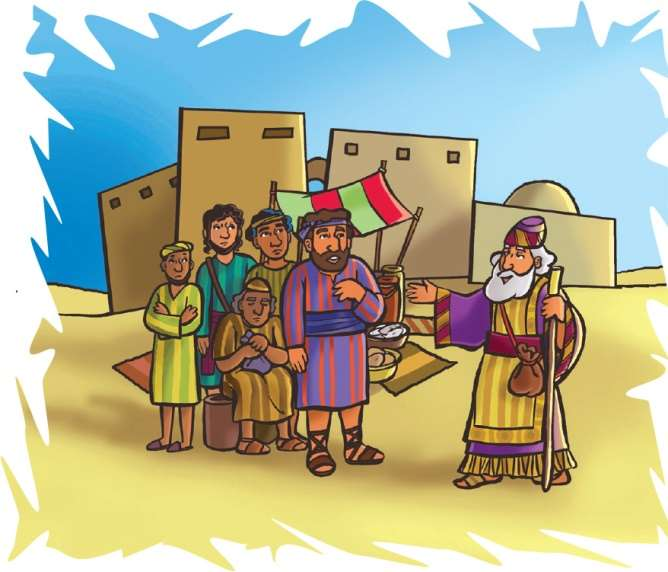
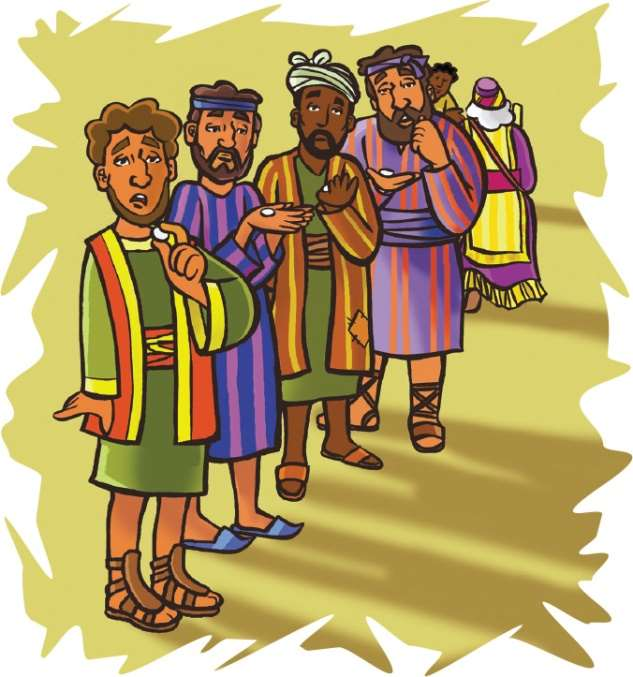

> 
Chângvawn

> “Pathianin mi duhsak bîk a nei ngâi lo,” (Tirhkohte 10:34).

### Chhiar tûrte

Matthaia 20:1–16; Krista Tehkhin Thute (2nd Edition, 2015), pp. 350–359.

> 
Thuchah

> Pathianin min en dân anga mi dangte en ve tûrin min duh.

_John-a chuan huanah hnahthel tlâa phiat a. Dârkâr khat emaw vêl hnuah chuan a thian pa Liam-a chu lo kalin, rawn thawhpui a tum a. John-a chuan phiahna dang lâin, an pahnih chuan an phiat dun ta a. Dârkâr hnih vêl an thawh dun hnu chuan an hna chu an thawk zo thei ta a ni. John-a pa chu a lâwm hle mai a. Lâwmthu sawi nân an pahnih hnênah chuan pawisâ tlêm a pe ve ve a. John-a khân dârkâr khat emaw chuan a thawk tam nâin, Liam-a nên chuan inzât chiah an dawng a. John-a chuan a rilru tê têin, ‘Hei hi a dik chiah lo,’ a tî a. Chutah chiah chuan hmanlâi huna Isua’n hlawh inzât chungchâng a sawi kha a hre chhuak ta a ni._

Isua hun lâite kha chuan, mipate hi zîng dâr 6 vêlah hian dâwrpui hmunah an chhuak khâwm thîn a. Anmahni ruai duhtute an awm beiseiin, an lo nghâk tawp mai a. Tûk khat chu grêp huan neitupa hian hlawhfaa rawih tûr mi a rawn zawng a. Zîng dâr 6-ah chuan hlawhfa tûr mi eng emawzât a ruai a. Dârkâr 12 chhûng thawk a, an hlawh zât tûr pawh an inberem sâ diam a ni.

Dâr 9:00 vêlah chuan dâwrpui hmunah a lo kal leh a. Mi tute emaw lo tei mai mai chu a hmu a; an hnênah chuan, “Nangni pawh ka grêp huanah va thawk ve rawh u, a âwm tâwk hlawh ka pe dâwn che u nia,” a ti a. Chhûnah leh chawhnu dâr 3 vêlah pawh chuan mi dang a rawih belh leh a. Chutah tlâi dâr 5, tlâi ban hun hma dârkâr khat chauh a awm tawh tih ang vêlah pawh chuan mi dang a rawih belh leh a.

Tlâi dâr 6:00-ah chuan huan neitupa chuan hnathawk hotupa hnênah chuan thawktute hnêna hlawh sem tûrin a hrilh a. A mi rawih hnuhnung berte hnên atanga sem tan a, thawk hmasa berte chu a hnuhnung bera pe tûrin a hrilh bawk a.

Hnathawk hotupa chuan dârkâr khat chauh thawk hmante chu a pe hmasâ a. An hnênah chuan ni khat hlawh a pe ve tho va. Chutah dârkâr 3 thawkte hnênah pawh ni khat hlawh a pê a. Chutiang an hmuh chuan thawk tan hmasâte chu an nui var var mai a ni.

Anni khân mi dangte âia dawn tam deuh an inbeisei a. Anni kha hlawhfa dangte âi chuan an thawk reiin, an thawk hnem ngei mai rêng a. Hlawh dawn hnem bîk chu phuin an lang pawh a ni maithei a ni. Mahse, an hlawh an han lâk ve tâkah chuan, an hlim hmêl kha a lo dang ta daih mai a, thinrim hmêl an pu ta tlat mai! Mi dangte hlawh lâk zât tho an dawng a nih chu!

Anni chuan, “Ngâi teh! Dârkâr khat lek thawkte khân kan dawn ang zât tho an dawng a. Keini hi chhun ni sensa hnuaia hna zawng zawng thawktute kan ni si a,” tiin an phun nâwi a.

Grêp huan neitupa chuan, “Tih dik loh eng mah ka nei hlei nêm! Ni khat hlawh inpe tûrin kan inruai a nih kha. Chutiang chiah chuan ka pê che u a nih hi! Ka pawisa hi chu ka duh duh a ka tih a thiang a lâwm! Ka thilphal avâng ngawt chuan in thîkthu lo tichhe viau teh suh u,” a ti a.

Chutah Isua’n heti hian a sawi zawm a, “Hnuhnung berte pawh hmasa ber an la ni ang a, hmasa berte pawh hnuhnung berte an la ni ang,” tiin.

Nangni ti dikin in hria em? In ngâi ve chiah lo maithei a ni. Chu tak chu Isua sawi tum kha a ni rêng a. Pathianin kan phu ang chiahin kan chungah thil a ti ngâi lo. Kan phu tâwk âia tha zâwk fêin thil min tihsak thîn a ni. A khawngaihna vângin kan zâin min chhandam a, hman deuha amah pawmtute leh nakin hnua amah la pawm tûrte a chhandam vek dâwn. Chu chu min hmangaih vânga min tihsak a ni.

Pathianin a en dân ang chein Pathian chhûng zînga mi dangte hi in en ve thîn em le? Mi tute emaw chu in chungah lo che mâwi lo pawh ni se, hmangaihna leh ngilneihna nên in en tho dawn lo’m ni? Pathianin min en dân angin mi dangte hi kan en thîn tûr a ni.

### Tih Tûrte

#### Sabbath

- A remchân theih chuan puitlingte nên grêp hmun emaw, thlâi chînna hmun remchângah kalin, zirlâi hi chhiar ho ang che u. Zirlâi thawnthute grêp huana inhlawhfate hnathawk lâi thlîr angin inchan ang che u.
- Chângvawn Tirhkohte 10:34 tâwp lam kha en chîk deuh ula, a awmzia inhrilh teh u. Grêp bâwr lem chep thlâin, bawr khat zêlah chângvawn thumal pakhat ziak zêl ang che.
- Thlawhhma leh lo lam thlâi hmuna thawktute tân tawngtâisak ang che u.

#### Sunday

- Chhûngkaw worship-naah zirlâi thawnthu Bible châng (Matthaia 20:1–16) chhiar ang che u.
- I thil ngâinat chi hrang hrang (hêng ang inawm lemna te, silhfên te, milem) chi hrang hrang ziak chhuak la. I thil ngâinat ber chu ziak hmasa ber ang che, chutah thil dang dang chu i ngâinat dân indawtin i ziah zawm dâwn nia. Tûnah chuan i thiante hming ziak leh thung teh. I ngâinat ber hming ziak hmasa ber la, chutah mi dangte hming ziak zêl ang che. Pathianin chutiang chuan duhsak leh ngâinat bîk deuhte A nei ve ang em?
- I thiante tân tawngtâisak la. Grêp bâwr lema chângvawn i ziah kha indawt dik thlapin rem teh le.

#### Thawhtanni

- In chhûngkaw worship nân Johana 13:35 chhiar ho ang che u. I chhûngte chunga tha zâwka thil i tih dân tûrte ngaihtuah la. A taka tih dân tûr lem ziak teh. Chûng milemte chu ni tina hmuh theihna tûr remchâng lâiah târ ang che. Pathianin a en dân che anga i chhûngte i en theih nân, Pathian tanpuina dîlin tawngtâi ang che.
- Chângvawn kha dik takin rem nawn leh la, i chhûngte hnênah zirtîr ve ang che.

#### Thawhlehni

- Chhûngkaw worship lâiin, in sikul leh inkhâwmna hmuna mi dangte chunga ngilneihna lantîr dân tûr kawngte ngaihtuah ang che. Chûng chu in chhûngkuaa in hlen theih nân ruahman ang che u. Johana 13:35 chhiar ho leh teh u.
- In chângvawn sawi tlâng ula. Sing for Joy, no. 139: “The Family of God” tih hla kha in thiam leh remchân dân angin sa/tum/hmûi chîp chungin sa ho teh u.

#### Nilaini

- I chhûngte nên Rom 2:11 chhiar ula. Engtin nge i hriat lohte chungah i tih ang? Engtin nge in chhûngkua khân in tih ang? Pathian chuan mite hi an phu tâwk âia tha zâwkin thil a tihsak thîn tih hre reng ang che u.
- Mi dangte chunga ngilneihna lantîr tûra remchânna Pathian hnênah dîl ang che u.
- Chângvawn thu kha indawt dik takin rem leh ang che. En lovin, ring takin sawi lauh lauh ang che.

#### Ningani

- In chhûngkaw worship-naah, in chhûngte tân grêp tui in tûr sem theuh ang che. An in lâiin, mahni tawngkauchhehin in zirlâi thawnthu kha hrilh ang che.
- Chhiar ho tûr: Luka 23:39–43. Mi sual, a kianga khenbeh chunga Isua’n ngilneihna a lantîr dân kha sawi la. Engtin nge in zirlâi thawnthu nên hian a inan deuh le?
- En lovin in chângvawn kha sawi ang che.
- Mi thlei bîk leh duhsak bîk i neih loh nân Isua tanpuina dîl ang che.

#### Zirtawpni

- Hlumin hmangaih harsate lem siam la, a nih loh leh an lem tal ziak ang che. Engtin nge chutiang chu i lo nih ve tawh dân? In chhânna chu chhûngkaw worship-naah sawi tlâng teh u. Isua’n mite a en thin dân anga in en theih nân a tanpuina dîl dang che u. Chhiar tûr: Johana 15:12.
- Tûn kâr chhûnga mi dangte i en dân chungchâng sawi la. Engtin nge i ngaih?
- Bible thawnthu hi lemchanah hmang ho ula. a nih loh leh a lem ziakin, i chhûngte hnêna Bible thawnthu hrilh nân i hmang dâwn nia. Thiam nâl takin chângvawn sawi ang che.