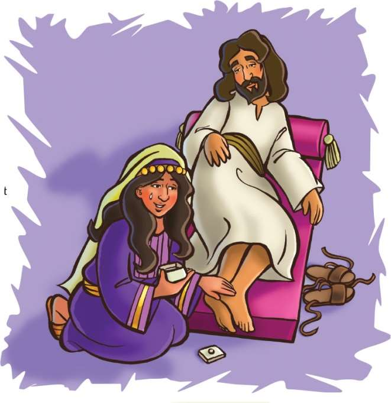
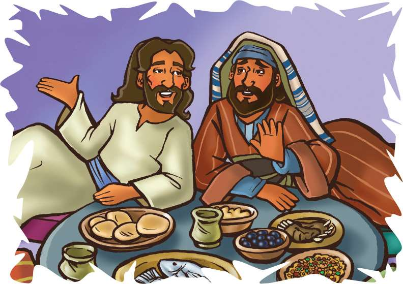

> 
Chângvawn

> “Mite hnênah zahna lantîr zêl rawh u.” (1 Petera 2:17).

### Chhiar tûrte

Luka 7:36–50; Johana 12:1–8; Chatuan Nghahfak (2nd Edition, 2014), pp. 618–632.

> 
Thuchah

> Pathianin endawng tuarte ngaihsak tûrin min duh.

_Raphael-a leh a chhûngte hmun thar lama an pêm tumin chinchâng hre lo leh bo deuh riau niin a inhria a. An sikul tharah pawh kawm tûr thian mumal a nei si lo._

_Chutah ni khat chu le, zirlâi pakhat hian rawn panin, a hnênah, “Chibai le! Kei hi Karin-a ka ni a, a hmain ka hmu nâ chein, mimal taka hriatna che erawh ka la nei lo va. Hawh, chhun chaw ei chhûng chu kan thiante zîngah hian lo thu ve rawh,” tiin a sâwm a. Chutiang thian kawm tûr nei lote ngaihsak a, kâwm nêl thîn pakhat a awm a, chu chu Isua kha a ni. Ani chu mi tinte tân thianah a tang zêl thîn a ni._

Simon-a ina zanriah kîlna kha hmun nuam tak mai a ni a. Simona chu Juda rorêltute zînga pakhat niin, phâr natna hrî a vei pawh Isua’n a tihdamsak a. Isua chunga a lâwmzia entîr nân, Simona chuan ruai ropui tak mai a theh a. Chuta lo kal apiangte chuan nuam an ti tlâng hle mai a ni.

Chutah chuan Mari pawh a tel ve a. Ani chanchin chu mite’n an sawi sep sep a. Ama hnêna thusawi duh erawh chu an ni hlawm sî lo. Ani chu mi sual a ni tih an hre huai a. A kawchhûng atangin Isua’n ramhuai a hnawhchhuahsak tih pawh mi tinin an hria a. Mari kha chu inneihna ruai kîl tûra sâwm pawh a ni ve lo maithei. Mahse, Isua kalna apianga zui zêl thîn a nih avângin, tu mahin an lo hnar lêm chuang lo va. Bengchheng lo va, sîr khata lo awm ve satliah mai tûrin an ngâi a ni.

Mari chuan amâ nihna a inhre chiang a. Mi changkângte zînga khawsa ve tûra pawm a ni lo tihte pawh a inhria a. Mahse, Isua chunga a lâwmzia chu ataka lantîr ngei a duh thung a. Ani chuan rimtui (alabasta) bur lian vak lo hi a nei a. Mi tu mahin a lam an thlîr lo tih a hriatin a rimtui bur chu a hawng a, Isua lu-ah leh ke-ah chuan a leih a. A hmangaihna mittui chu rimtui chungah chuan a luang a. Thâwm dîm taka thu hniamin, a sam bu tha tak chuan Isua ke chu a hrûksak a.

Rimtui rim kha lêng vêl lo se chuan, a thil tih kha tu mahin an hre kher lo vang. A thil rimtui rim kha a lêng ta chem chem a, chu lâi hmun chu a nam chhuak ta thuai a. Mite chuan an hnâr an lên vêl ruai a. “A man a to teh mai sin!” tiin an inhrilhru sap sap hlawm a. Thenkhat phei chuan, “Hetiang hi patling kum khat thawh chhuah man hu hial a ni ang. Hralh sela chuan a hausakpui lawih âwm si a! Mi retheite tanpui nân te pe zâwk se, ani lah chuan heti hian a khawhral vêl mai mai si a!” te an lo ti a.

Simon-a pawh chuan ngaih dân dang daih a nei a. Isua kha zâwlnei dik tak chu ni se, Amah tâwktu hmeichhe nihna dik tak hi a hre thei tûr. Hmeichhe sual râpthlâk tak a ni si a,” tiin a lo ngaihtuah a.

Mari thil tih chu an hre ta vek si a; a rilru a chî-âi buai ta hle mai a ni.

Isua’n Simona thil ngaihtuah mêk chu a lo hria a. Mari rilru manganzia pawh a hre tho bawk a. Chuta lo phun ru sep septe hnênah chuan, “Lo tibuai teh suh u. Mi retheite chu kumkhuain in hnênah an awm reng thîn a lâwm; mahse, Kei chu in hnênah ka awm ve reng dâwn lo a ni. Ani hian ka chungah thil duhawm tak chu a ti a ni,” tiin a hrilh a.

Chutah Isua’n Simona lam chu hawiin, “Mi pahnihin tangka pûktîrtu lei an ba a. Pakhat chuan denari 500 a ba a, pakhat zâwk chuan denari 50 a ba thung a. A pûktîrtu chuan an leiba chu an rûl thei lo ve ve a ni tih hriain, an leiba chu a ngaihdamsak ta tâwp mai a ni. Chu mite pahniha a tu zâwk chuan nge hmangaih zâwka i rin?” tiin a zâwt a.

Simona chuan, “A leiba hnem zâwka chu niin ka ring e,” a ti a.

Isua’n, “I ti dik e. In ina ka lo thlen khân, ka ke min silsak lo. Ka lu-ah pawh hriak min thih hek lo. Chibai bûka min fawh takngial pawh min tihsak lo. Mahse, he hmeichhia erawh hi chuan chûng zawng zawng leh a bâk pawh min tihsak thung a. A sual nasa tak kha ngaihdamsak a ni a; chuvâng chuan min hmangaih nasa ta a nih rêng hi!” a ti a.

Isua’n vântlâng zînga ngaihsak hlawh lo ber, Mari chungah zahna leh châwimâwina a lantîr a. A thil tih chu Simona thil tih zawng zawng âin a faksak ta zâwk bawk a. Vântlâng zînga hmuhsit hlawh ber chu entawn tlâk ber anga târ chhuah a ni ta. Chutianga châwimâwina a dawng chu Marin mak a ti êm êm a. Sawichhiat leh hnawl nih bâk beisei tûr a nei ngâi lo. Tûnah erawh chuan fak hlawh ber a ni ta si a ni.

Kan hriat theuh angin, mite’n an endawng leh hlamchhiah Mari chungah Isua’n ngilneihna a lantîr a. Zah phu leh ngaihsak nihna dinhmunah a hlâng a. Khatianga a chhûngzînga Mari a teltîr ang khân, Isua’n mi zawng zawng hi a chhûngzînga teltîr theuh a duh a. Mite a en thin dân anga mi dangte pawh en theuh tûrin min duh bawk a ni.

### Tih Tûrte

#### Sabbath

- Isua hun lâia mite thut dân anga thu tûrin in chhûngte sâwm ula. Pheikhawk hlîpin, pang vei lam rinchhan deuh chunga thu–mu tûrin. Ke erawh chu dawhkân hlat zâwng siin, mahni kîu rinchhan tûr a ni. Chutiang position-a awm chung chuan thil ei ho teh u. Chutah Bible thawnthu chhiar tlâng ula. Thawnthua mite kha in zînga tel ve angin ngaihruat ula. Eng nge in ngaihtuah chu sawi ho teh u.
- Chhûngte hnênah Chângvawn zirtîr ang che.

#### Sunday

- Chhûngkaw worship-naah dawhkân kîlin thu bial deuh taih ula. In chhûngte zînga a zahve hnênah sweet sem ula. Thil sem chang lo bîk nih chu nuam an ti em sawitîr ula. Chumi hnuah in sem ve leh vek tho dâwn nia. Jakoba 3:17 chhiar ho ula. He thu hian nangmahni tân eng awmzia nge a neih?
- Tawngtâi hmain chângvawn sawi ho ula.

#### Thawhtanni

- Chhûngkaw worship bultan nân “Musical chairs” tih hmangin hun hlimawm tlêm hmang ula. Thutna tûr hi inchangkim lo tûr hun tûr a ni. Chang lo bîk nih chu nuam an tih leh tih lo sawitîr theuh ang che.
- In chhûngte nên ring deuh lauhin Luka 7:36–50 chhiar ula. Engtin nge Isua’n endawng leh hlamchhiah tuar hmeichhia kha an zînga teltîr dân kawng a siamsak tâk? Engtin nge Isua tih dân anga mi dangte teltîr tûrin i tih ve ang? Isua tanpuina dîlin tawngtâi ang che u.
- En lovin, nâl takin chângvawn sawi ang che.

#### Thawhlehni

- Chhûngkaw worship-naah, Marka 14:5 chhiar ho ula. Mari thilthlâwnpêk chungchâng sawi ho ula. Denari khat kha Isua hunlâia patling ni khat hlawh ang hu vêl a ni. Mari rimtui kha denari 300 chuang man lâi a ni. Chumi awmzia chu Mari thilthlâwnpêk kha kum khat hlawh hu vêl lâi zu nia! Kha khân Isua chunga Mari rilru puthmang eng nge a târ lan?
- Puitling lamte nên tûnlâi huna patling kum khat hlawh zât âwm vêl chu chhût chhuak teh u. Chêng eng zah zêl nge ni awm?
- Isua hnênah thilthlâwnpêk pe dâwn ta ang la, eng nge i pêk ang? Chumi lem tûr chu han ziak teh. Sum eng zah nge i sên huam ang?
- Nâl takin chângvawn sawi la. In khua/vênga chênna mumal nei lote tân tawngtâisak ang che.

#### Nilaini

- Chhûngkaw worship-naah, (hnuchham leh tar enkawlna hmuna hlamchhiah tuar tu emaw tâna thu hlimawm tak ni tûra i ngaih chu ziak chhuak ang che. Jeremia 31;3 thu ang deuh Pathian thuchah ni âwma i ngaih chu ziak tel bawk la. Hmun hnâi deuha mi chu nangmah ngeiin pê la, hmun hla deuh a nih chuan dâkah i thawn dâwn nia. Chu mi tân chuan tûnah tawngtâisak nghâl ang che.
- Hla sak tûr: “We Are His Hands” (No. 42).
- In chângvawn hi mi pahnih/pathumte hnênah nâl takin sawi ang che.

#### Ningani

- In chhûngte nên Marka 14:1–9 chhiar tlâng ula. He thawnthua thil i hriat tharte chu engte nge ni?
- Tu ma ngaihsak hlawh loh nia i inhriat lâi hun kha ngaihtuah la. Chuta i rilru awm dân chu i chhûngte hnênah hrilh ang che. In sikulah mi tu emaw tu ma ngaihsak loh hmu ta lang, eng nge i tihsak ang le?
- In chângvawn thu awmzia nia i hriat chu sawi/ziak la. Chutah sikula tumâ ngaihsak hlawh loh tân chuan tawngtâisak ang che.

#### Zirtawpni

- In chhûngkaw worship-naah thil rimtui chi hrang hrang panga emaw tal rawn keng ang che. In chhûngte chu hnimtîr den den ula. A khawi chu nge rimtui bîk deuh a, a khawi chu nge rimtui ve vak lêm lo? A khawi rim chu nge i hriat than deuh ber? Rimtui avângin Pathian hnênah lâwmthu sawi ang che.
- Chhûngkuaa chhiar tlâng tûr: Matthaia 7:12, a awmzia pawh sawi ho ula. He châng hi eng nge an vuah thin?
- In chhûngte nêna thu kualin, Bible thawnthu hi mahni tawng kauchhehin hrilh ve ang che. Thawnthu chungchâng tlêm tal sawi tûrin i chhûngte chu sâwm theuh la. A tâwpah en lo, nâl takin in chângvawn hi sawi rual thap thap ang che u.