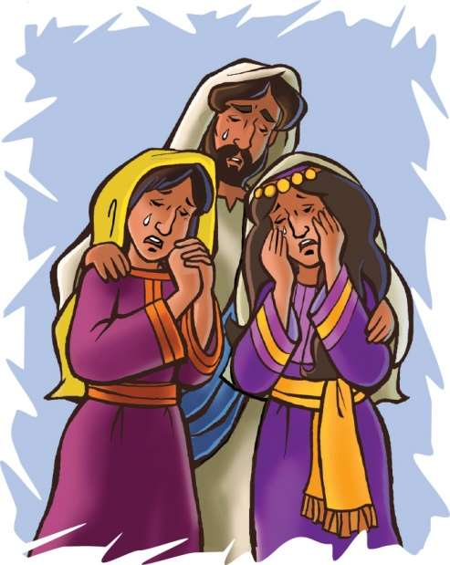

> 
Chângvawn

> “Phur rit inchhâwk tawn theuh rawh u,” (Galatia 6:2).

### Chhiar tûrte

Johana 11; Chatuan Nghahfak, (2nd Edition, 2014), pp. 584–598.

> 
Thuchah

> Pathianin mi dangte ngaihsak tûrin min duh.

_Hmangaih takte thihsan i tawng tawh ngâi em? I thian duh tak emaw, ran vulh duh tak emawin a thihsan tawh che em? Ni khat chu Isua’n ama chanchin mi dangte hnêna hrilh tûrin a thian thenkhat a tlawh a. Chutah chuan eng nge a tih in rin?_

Mari, Marthi, leh Lazara te chu Jerusalem khawpui atanga hla vak lo, Bethani khuaah an chêng a. He mite chhûngkua hi Isua thian tha takte an ni a. Bethani khuaa a lo kal tawh hi chuan an hnênah a thleng thîn a. Anni hian Isua thiltihtheihzia hriain, Lazara a dam loh tum pawhin, Mari leh Marthi chuan lo kal tûrin Isua chu an chah a.

Mahse, Isua chu Bethani kal tûrin a hmanhmawh lêm lo. A awmna hmunah chuan ni hnih dang a la châm zui a. Chumi hnu chuan Bethani lam panin a chhuak a. Chu hmun a thlen meuh chuan Lazara chu a lo thi hman tawh a, ni lî lâi thlânah an phûm tawh a ni.

Isua’n Lazara kha a thi dâwn tih chu hria a. Thihna atanga kaihthawh a ruahman a. Chu chuan Isua chu Pathian Fapa a nih ngei zia a finfiah dâwn a ni. Lazara farnute erawh chuan Isua thil tum leh ruahman chu eng mah an hre ve lo va. An hriat chin chu Lazara a dam lo va, a na hle tih a ni mai a. Chuvâng chuan Isua an chah a; mahse, ani chu a lo thleng ta mai si lo a nih kha.

Marthi-in Isua chuan an khaw kiang a rawn thleng tawh tih a hriatin, amah hmuak tûrin a kal nghâl a. A hnênah chuan, “Lalpa, heta awm ni la chu, ka nuta pa a thi lo tûr!” tiin lungchhe takin a hrilh a. Mahse, a hmêlah chuan beiseina zungzâm chhetê a la awm a. “Tûnah pawh hian i thil dîl apiang chu Pathianin a tihsak thei che tih ka hria a ni,” tiin a sawi zawm leh a.

Isua erawh chuan, “Kei hi thawhlehna leh nunna chu ka ni. Tu pawh keimah mi ring chu an thi ngâi lo vang. Hei hi nang i ring ve em?” tiin a zâwt a.

Marthi chuan, “Aw ring e. Krista, Pathian Fapa chu i ni tih ka ring,” tiin a chhâng a. A thinlung chhûngah chuan beiseina nei tharin, a tlân ta thuai a, a lâizâwnnu (Mari), chu a va ko va.

“Zirtîrtu hetah a awm. A ko va che,” tiin a hrilh a.

Mari chu a zuang tho thuai a, khaw pawna Isua hmu tûr chuan a kal ta nghâl a. Isua a va hmuh chuan, Marthi sawi ang bawk kha Isua hnênah a hrilh a; chu chu, “Lalpa, heta awm ni la chu ka nutapa a thi lo tûr,” tih a ni.

Isua’n a thian pahnihte chu thlîrin, a lung a chhia a, a tap chhuak ta hial a. A thinlung chu khawngaih leh lâinatnain a khat a; chuvâng chuan a tap chhuak ve hial a ni. Mari leh Marthi te lusûn lungngaih manganna chu hrethiamin, a tâwmpui a. A lungngaihna chu phurh puiin, a tanpui ta a ni.

Isua tih dân ang khân mi dangte kan en ve tûr a ni a, an rilru natnate kan tuarpui ve tûr a ni. An nutapa thihna an tuarna kha Isua’n a tawrhpui a, chutiang chuan mi dangte lungngaihna leh lâwmnate chu kan tâwmpui ve tûr a ni.

Mahse, Isua kha Mari leh Marthi te lungngaihna tawrhpuia tap ngawt pawh a ni lo. Lazara thihna vânga tap pawh a ni chiah lo, ani chuan a kâitho leh mai dâwn tih pawh a hre lâwk diam a. Mi thenkhat chuan Isua tap kha hmûin, “Lazara hi a lo va hmangaih êm!” tiin an sawi hlawm a. Mahse, a nihna takah chuan Isua kha khâng mipui hote vânga tap a ni zâwk si a.

An zînga tam takin amah chu chhandamtua pawm lovin, sual ngaihdamna chang lovin an thi ang a, chatuan nunna chu an chang dâwn si lo a ni! Amah rinchhan an thlang duh dâwn lo va, chu tak mai chuan Isua kha a tilungngâi zâwk a ni.

Isua ang khân mi dangte kan ngaihsak ve tûr a ni a. Chutiang tak chuan Isua’n a hmangaih a ni tihte kan hrilh ang a, an tân thil tha ber a duhsak thute kan hrilh tûr a ni. Mi thenkhat chuan Isua chu an la pawm dâwn a, thenkhat erawh chuan an pawm lo vang. Pathian kawngte thlang duh lo chunga la thi tûrte chu lâinatin, kan vei tûr a ni.

### Tih Tûrte

#### Sabbath

- In chhûngkuain thlânmual emaw, hmun fianrial dang emaw zawng ula. Chutah chuan thu khâwmin, in Bible zirlâi hi in chhiar dâwn nia. Lazara an phûmna thlân bula awm angin inngâi ula. In hmâi hma ngeia Isua’n Lazara thlân atanga ko chhuak tûr angin ngaihruat ang che u.
- In chhûngte nên chângvawn in zir tan dâwn nia.

#### Sunday

- Chhûngkaw worship-naah, Johana 11:1–44 chhiar ula, châng khat tê têin in inchhiar chhâwk tlâng theuh dâwn nia.
- In chhûngkua khân mi lungngâi in hriatte chu ngaihtuah ho ula. Tûn kâr chhûng hian ngaihsakna leh lâinatna in lantîr thei dân tûr chu ngaihtuah tlâng nghâl ula, in tawngtâisak nghâl bawk dâwn nia.
- Hla sak ho tûr: “Make Me a Servant” (No. 71).
- Chângvawn zir ho leh ang che u.

#### Thawhtanni

- (Tûn kâr tâwp lama zawh hman atân) thil endikna bultan nghâl ula. Hmun thim lamah thei hmin tuah tak dah ula, ni li chhûng chu dah vang vang ang che u. Zirtawpni-ah in en leh chauh dâwn nia.
- Engtia rei nge Lazara kha thlânah a awm hman? Hriat theih nân Johana 11:17 chhiar ula.
- Lehkha phêk hlâi deuh takah rîn bial chhûngah in Chângvawn ziak ula. Lazara thlân chhinna lung ang deuhah in chan dâwn nia. Puitling hriatah in chângvawn sawi lauh lauh ang che. Tûnhnâi deuha chhûngte sun in hriatte tân tawngtâisak ang che u.

#### Thawhlehni

- Chhûngkaw worship-naah, tap lâi hmêl lem emaw, mi lungngâi lem ziak ula. Johana 11:35 chhiar ula. He châng thu chungchângin in chhûngkuain sawi ho teh u. A lungngaih lâia Isua kha a tap ve thei a nih chuan, tûnlâi huna tahna chungchâng eng nge chu chuan min zirtîr? Puitling tawhte tân tah hi thil âwm a ni ve tho em? Nangmah avângin Isua hi tap ve tawhin i ring em?
- In chângvawn sawi rual ula, chutah Isua’n a ngaihsak che u avângin lâwmthu sawi ang che u.

#### Nilaini

- In chhûngte nên, in inngaihsak tlânzia chungchâng chu sawi ho ang che u. Sabbath ni lo thlen hmain ngaihsakna thil in tih ngei tûr chu eng nge emaw a lem emaw chu ziak ang che u. A huhovin Galatia 6:10 chhiar ula. He châng hi chhûngkaw tân pawh a tha ve tho ang em?
- Chângvawn a ‘tawn’ tihah khân in chhûngkaw hmingte hmang telin, han chhiar rual dâwn teh u. Vawiina mi dangte phur rit in chhâwk dân tûr chu sawi teh u.

#### Ningani

- Chhûngte nêna sawi ho tûr: Mi dangte phur rit inphurhpui leh inchhâwk tawn entîrna tûr Isua sawi chu eng nge ni? Chhiar tlân tûr: Matthaia 11:28; Sam 68:19. Mahni tawng kauchhehin, hêng châng thu awmziate hi sawi ang che.
- Khatih lâia lo awm ve ni ta lang, Mari leh Marthi–te phur rit i chhâwksak dân tûr kawng hrang hrangte han sawi teh.
- Mi tute emaw an phur rit chhâwksak i duh tûr hnênah chângvawn kha han sawi lauh lauh teh. Hla sak ho tûr: “Love Is in Your Hand” (No. 70). Chutah chu mi tân chuan tawngtâisak ang che.

#### Zirtawpni

- Chhûngkaw worship bultan nân, Thawhtannia thei hmin tuah in dah kha en teh. Eng ang hmêl nge a put? Tha taka siam leh theih a ni ang em? Chhiar ho tûr: Johana 11:25. Nun din thar leh theitu awm chhun chu tu nge ni?
- Tûnah Rom 15:5 chhiar ho ula. He thu hi lemchanah hmangin, hêng ang dinhmuna ding chu in fuih nân hmang ang che u: Thian tha tak hmun danga pêm; mahni ran chuam a thi; dam lo; sikul zirnaa che tha ve lo; exam-naa ti tha deuh riau; thian zînga mi thil thar eng emaw nei.
- Sunday ni chhûngkaw worship-naa inngaihsakna project report pêk tawh ni se. Chuta inhmang zawng zawngte tân tawngtâisak ni nghâl bawk se.