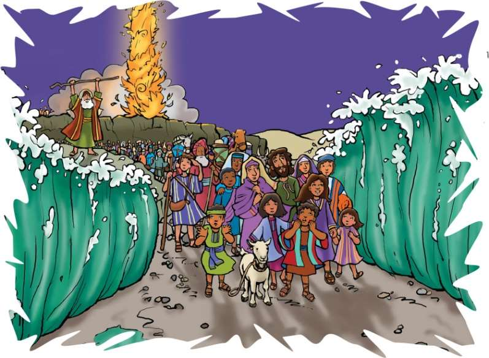
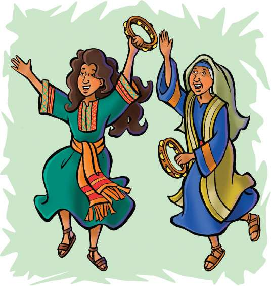

> 
Chângvawn

> “Ka thinlung zawng zawng hian ka zawng che a; Aw, i thupêkte ka kal bosan chu phal lul suh ang che,” (Sam 119:10).

### Chhiar tûrte

Exodus 13:21, 22; 14:19, 20; Thlahtubulte leh Zâwlneite, (2nd Edition, 2014), pp. 278–287.

> 
Thuchah

> A thu kan âwihin Pathian chibai kan bûk a ni.

_John-a chuan nipui camp neih chu nuam a ti hle mai a. Kut themthiamna thil hrang hrang a zir thar nual mai a. An counselor kawhhmuh ang zêlin thil a ti thîn a, thil thiam thar pawh a nei ta rêng a ni._

_Kan Bible thawnthu hian mipui tam tak, kawhmuhna ang zuia kal dul dul chungchâng min hrilh a. Kalna tûra Pathian kawhhmuhna an zui a, kawhhmuhna danglam tak, pawimawh bawk si a ni._

Israel fate chu Aigupta rama kum 400 bâwih an tân hnuin, Ram Tiam lam panin an chhuak ta nge nge a. Mahse, khawi kawng nge an zawh ang le? An kalna tûr kawng chu thlalêr ram ro, lum êm êm chu kal tlang a ngâi dâwn a ni.

Vâkvâi mai mai tûrin Pathianin a hlamchhiah lo va, thlalêr ram ro an kal tlang theih nân, a tûl dân ang zêlin amah ngei chuan a hruai thîn a ni. “Lalpa’n chhun lâiah chuan chhûm dingin an hma a hruai a; zânah chuan anmahni ên tûrin meialh dingin an hma a hruai a; chhun leh zân an kal theih zêlna tûrin” (Exodus 13:21). Chhûn lamah chuan chhûm chuan daihlim a siamsak a, zânah erawh chuan khawvâwt laka vên bâkah, chhun anga êngin meialh dingah a tang thung a. Chhûm chuan Israel fate chu thlalêrah, Tuipui Sen hrûlah chuan a hruai zêl a. Chutah chuan an châwl a.

Aigupta mite chuan Israel fate chuan chhuahsanin, an rawngbâwlsaktu bâwih an nei ta lo tih an hre ta thuai a. Kâr lohah Pharaoa leh a sipai rualte chuan thlalêr lamah chuan an um zui ve ta thung a. Anni hian Israel fate chu hruai kîr leh an duh a. Israel fate chuan an hnung lam hla taka vaivut khu pâr chhuang luih luih chu an hmu a. Tuipui kama an riah bûk atang chuan anmahni lam pana sakawr tawlâilîr lo tlân dum dum chu an hmu thei a. Engtin nge an tih tâk ang le? An sîr khatah chuan tlâng dung hian an kalna tûr kawng a dâl a. A sîr lehlamah chuan Tuipui Sen chuan a dâl bawk si a. Pharaoa sipai rualte lah chuan chak takin an rawn hnaih chilh zêl a. Dan chepa an awm tâk avâng chuan Israel fate chu an mangang ta hle mai a ni.

Mosia chuan, “Hlau suh u. Nghet takin ding ula, vawiin hian Lalpa chhanchhuahna chu in hmu ngei dâwn e,” tiin a lo fuih a.

Aigupta sipai rualte chuan an lo hnaih zêl a. Mahse, Pathian chhûm chuan thil mak danglam tak mai a tihsak dâwn ta a ni. Chhûm chu Israel mite chungah lo lêng pheiin, anmahni leh Aigupta mite inkârah chuan a rawn insawn ta thut mai a. Chu chuan Aigupta mite lam chu a tithim khup maia, Israel mite lam erawh chu a ti êng iar thung a.

Pathianin Mosia hnênah, “Israel fate chu kal zêl tûrin hrilh rawh, tuipui lamah kal rawh se,” a ti a. Tuipui thûk chauh lo chu kal ngaihna âwm rêng a awm lo, mahse, Israelte chuan thuawih takin tuipui lam chu an pan ta tho va.

Pathianin Mosia chu, “I tiang kha tuipui chungah phar chhuak rawh,” tiin thu a pe a. Thuawih takin Mosia chuan a tiang chu tuipui chungah chuan a phar chhuak a, thlipui na tak a lo thawk a; chu chuan tuipui chu chhêm then phawkin, kalna tûr lei châr a lo awm ta a. Zankhuain, mei-alh ding chuan êng tha tak a siam sak a. Israelte chuan Tuipui Sen chu lei chârah an kal kâi ta zung zung a. An ding leh veiah chuan tui chu bang ang maiin a ding zui mai a ni.

Aigupta sipaite chuan rawn ûm zêlin, Israelte chu tuipuiah an ûm zui zêl a. Israelte’n vaukam lehlam hmun him an thlen vêleh, Lalpan Mosia hnênah thu a sawi leh a. “Tuipui chungah i kut phar chhuak leh rawh le; tichuan, tuipui chu a luan dân ngâiin a luang leh dâwn nia,” a ti a. Chutiang chuan Mosia’n a ti a, tuipui chu a hmaa a luan dân ngâiin a luang leh ta a; Aigupta sipai rualte chu tuipuiah chuan an tla hlum zo ta a ni.

Tuipui Sen kam lehlamah chuan Israel fate chuan chhanchhuah an nihna chu hlim takin chumi tûk chuan an lâwm a. “Lalpa châwimâwiin hlâ ka sa ang, ropui takin a hneh tâk hi,” tiin Pathian an fak a. “Lalpa châwimâwiin hla ka sa ang; ani chu ka chhandamna a lo ni ta bawk a.” Pathian chibâk bûkna ropui tak a ni!

Chumi tûk chuan Israelte’n kawng danglam deuh takin Pathian chibai an bûk a. Pathian vênhimna avângin a hnêna lâwmthu sawi an duh a. Anni khân thu chu âwih lo ta se chuan, khatianga hnehna ropui lawm tûr a awm hauh lo vang le! Pathian thu kha lo âwih ta lo se eng thil nge thleng thei âwm chu ngaihruat chhin teh u. Khata an thuawihna kha Pathian chibai bûkna a ni a, chutiang tak chuan chumi tûk chuan namên lo taka lâwmna an nei a ni.

Pathian chibai bûk hi amah zahna leh châwimâwina a ni a. Pathian châwimâwi leh fak nân kan âwte hi kan hmang thei a. A mi ngenna anga kan tih hian, kan nunte pawh amah châwimâwi nân kan hmang thei a ni.

### Tih Tûrte

#### Sabbath

- A remchân chuan, in chhûngkuain lui kamah lêng ho ula. Hmun fianrial remchâng lâiah thuin, zirlâi hi in chhiar ho dâwn nia. Tuipui tui a lo inthen a, an kal tlang tâkah khân engtin nge an ngaih i rin? Hlauh kan neih chângin eng thil ti thîn tûrin nge Pathianin min duh le?
- I chhûngte hnênah chângvawn chhiar ang che.
- Hla sak tûr: “Trust and Obey” (Sing for Joy, no. 113).

#### Sunday

- Puitlingte tanpuinain chhang thlum insiampui ula. Siamna tûr châkkhâite sawi ula, thil chawhpâwlh dân tûr leh siam dân tûrte chhiar ula. Chi in telh tam lûtuk chuan, eng nge a an ang? Chu âia tam chi al ta ulang, a la tui tho ang em? Kawhhmuhna zui hi eng ang taka pawimawh nge ni thîn? Pathian min kawhhmuhna zui hi engang taka pawimawh nge ni? Thufingte 3:5–8 leh Deuteronomi 30:16 chhiar ho ang che u.
- In chhûngte hnênah chângvawn zirtîr ang che u.

#### Thawhtanni

- Chhûngkaw worship-naah, Exodus 13:21, 22; 14:19, 20 chhiar ula. A theih chuan, pâwnah chhuakin, chhûm thlîr vêl teh u. Chhuahvah pahin pakhat chu zui zêl tûr angin ngaihruat teh. Eng nge anga i rin chu i chhûngte hnênah hrilh ang che. Engtiang kawngtein nge Pathianin in chhûngkua a hruai thin che u? Amah chu in zui em?
- Hla sak tûr: “I Have Decided to Follow Jesus” (Sing for Joy, no. 119). Chumi thu chu tawngtâiin Isua hnênah hrilh ang che.
- Mahni tawng kauchhehin, in chângvawn thu awmzia hi in chhûngte hnênah hrilh ang che.

#### Thawhlehni

- Chhûngkaw worship-naah, tu thu nge i âwih dâwn a lem ziak ang che. Mi tute emaw thu i âwih tûr Pathianin eng nge a sawi? Chhiar ho tûr: Ephesi 6:1–3 and Rom 13:1. Sawi ho tûr: Engati nge hêng mite thu hi âwih tûr ka nih ang? An thu ka âwih chuan, anmahni chibai bûk ka ni em?
- Isua leh Bible lem ziakin, Johana 14:15 chhiar la. Milemah chuan: “Isua thu ka âwihin, amah chibai ka bûk a ni,” tih ziak la. I chhûngte hnênah entîr ang che.

#### Nilaini

- Vawiin worship nân, Genesis 6:22 leh Genesis 12:1, 4 chhiar ula. A hnuai rînah hian, Pathian thuawihtu mi pahnih hming ziak ang che. [_]()
- Bati chhi la. Eng ang taka êng thâ nge ni? Mei alh ding han hmuh chu eng ang nge a nih i rin?

#### Ningani

- Chhûngkaw worship nân, paper plate hmai tawn tawnah milem ziak ang che. Lehlamah chuan Isua entîr nân hmêl hlim lem i ziak ang a, a lehlamah chuan thinrim leh lungâwi lo hmêl lem ziak ang che. A khawi lam chu nge i thlan ang le? Isua kawng leh Setana kawng chanchin sawi tûrin i chhûngte sâwm la. Chutiang nêna inhmeh tûr i lem ziak chu i lantîr zêl dâwn nia.
- Johana 10:10, tâwp lam chhiar ho ang che u.
- In chângvawn sawi rual ula. Ama thu âwih zêl tûrin Pathian tanpuina dîl thîn ang che.

#### Zirtawpni

- In chhûngkaw worship-naah zirlâi thawnthu hi lemchanah hmang ang che u. Chutah Exodus 15:1–18 chhiar ho ang che u.
- Chhiar ho tûr: Sam 143:10. In chhûngkuain tawngtâi ho ula. Tawngtâi nân chângvawn thu hi hmang ang che u.