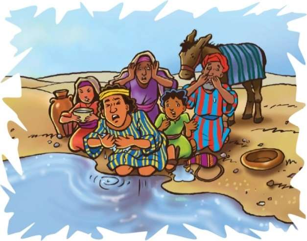
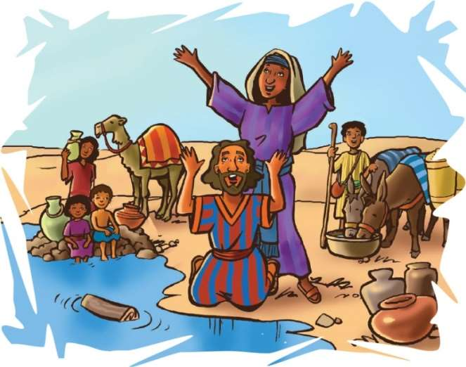

> 
Chângvawn

> “Lalpa, ka thinlung zawng zawngin ka fak ang che,” (Sam 138:1).

### Chhiar tûrte

Exodus 15:22–27; Thlahtubulte leh Zawlneite, (2nd Edition, 2014), pp. 289–293.

> 
Thuchah

> Hlim taka fakna nên Pathian chibai kan bûk thîn.

_Jones chhûngkua chu an la hriat than loh ngawpui chhûngah an vâk vêl a. Hun rei tak an kal a. Nakin deuh lawkah chuan an bo a ni tih an inhre chhuak ta thuai a. An tui pai an in zova, tûnah lah khua a lumin an tuihâl ta hle mai si a. Nuber chuan, “Hawh u, hetah hian châwl ila, Pathian tanpuina i dîl ang u,” tiin a rawt a._

_An tawngtâi zawh chuan an kal tan leh ta nghâl a. Rei lo têah chuan kêa kalna kawng an pawh ta thuai a. Tichuan, an riah bûk awmna lam chu an pan thei ta a ni._

_An riah bûk lamah chuan meipui chhepin, hlim taka Pathian fakin chibai an bûk a. Chutah chuan nu ber chuan Israelte’n harsatna an tawh ve thawnthu ngaihnawm tak a hrilh ta a ni._

Tuipui Sen kama hlim taka lâwmna hun an hman chu a zo va. Chhûm ding chu hmalam panin a kal leh ta a. Israelte pawhin zui tûra chhuah a hun leh ta a ni tih an hre nghâl mai a. Tichuan, chhûm chu zuiin, thlalêrah an kal zêl a. Ni thum chhûng chu tui in tûr nei lovin an kal ngat ngat a. An tui paite chu an in zo tawh a. Dam an duh a nih chuan tui in tûr an hmuh thuai a ngâi a ni.

Chhûm chuan Mara lam panin a hruai zêl a, chutah chuan tuihna hmuh an inbeisei a. Hêng lâi thlalêr hmunah hian Mosia’n kum 40 vêl lâi berâm rual a lo vêng tawh thîn a. Chung lâi hum chu a hre chiang viau a ni. Mara hmuna tui pawh chu a kha a, in tlâk a ni lo tih a hria a. Mahse, Pathianin chu hmun lam pan chuan a hruai si a ni.

Mosia lo hlauhthâwn lâwk ang ngeiin, Israelte’n tui an han hmuh chuan, “Tui, tui tui!” tiin chu lam pan chuan an tlân ta sung sung mai a. Mahse, a thleng hmasa berin a’n in chhin chuan an hlimna chu beidawnnaah a chang leh ta nghâl a.

Tuipui Sen kama Lalpa’n thilmak a tihsak kha ni thum hma lamah khân a ni tawh a. Khatah khân Aigupta sipai chak tak chu a tihboralsak a. Aigupta bâwiha an tânna an chhuahsanna chin pawh a rei leh ta fu mai. Amah Pathian, chhûm dinga inlâr ngei chuan he Mara lam pan hian a hruai a ni si a. Mahse, khâng an thil paltlang tâk zawng zawngte kha an theihnghilh zo vek tawh mai a. “Eng nge kan in dâwn?” tiin Mosia chungah an phunnâwi tan ta mai a ni.

Mosia erawh chuan Israel fate tih ang chu a ti ve lo thung a. Lalpa hnênah tanpuina a dîl a. Lalpa’n Mosia chu thing pakhat a kawhhmuh a, chu thing chu tuia paih lût tûrin a hrilh ta a ni.

Mosia’n chutiang chuan a ti a, tui chu a lo tui ta a ni. Mipuite khân tui in tûrin an rawn pan ruih ruih ngei ang. An lo kal hmasak kha chuan beidawng leh thinrim takin an lêtsan leh kha a ni a; tûnah erawh chuan Pathianin thilmak a tihsak leh tâk chungah chuan an lâwm leh ta hle a ni. Tuihâl an hlau tawh lo va. Chhanchhuah an ni leh ta a ni!

Chutah chuan Mosia hmangin Pathianin thutiam a siam a. “Lalpa thu hi ngun takin ngâithlâ ula, a mithmuhah thil dik chu ti zêl ang che u. Ti tûra a ngen che u chu in tih chuan, Aigupta-a hrilêng lakah khân a vênghim zêl dâwn che u a ni,” tiin a sawi a.

Pathian chuan Aigupta mite tibuaitu lak atang khân a vêng him zêl dâwn a ni. Anni hian an nun hmangin Pathian chu chibai an bûk ang em? Thuawihna hmangin amah chu an châwimâwi zêl ang em? Chutianga an tih phawt chuan, nun hlim takin a awmtîr zêl dâwn a ni.

Pathianin chhandam hlimna a pe che u a. Mara hmuna tui kha Israel-te in tûra a tihtuisak ang chiahin, Isua Krista khawngaihna zârah a chhandam che u a ni. Chu chu kan tân hlim leh lâwm êm êm chhan tûr chu a ni.

“Chhandamna tuikhur ata te chu hlim takin tui in la châwi ang” (Isaia 12:3). Israelte tâna tui a tihtuisak ang khân, chu thutiam chu tûna keini tân hian a la dik reng a ni. Khai le, hlim takin Pathian chu fak rawh u le!

### Tih Tûrte

#### Sabbath

- In chhûngte nên, khawi lam ram hnuaiah emaw vâk vêl ve teh u. Hmun remchâng lâiah châwlin, in Bible zirlâi thawnthu hi in chhiar dâwn nia. In mamawh tinrêng nêna Pathian pêk tui chu in khawlh khawlh ang che u. Hmun remchâng lâiah in chângvawn, Sam 138:1 hi chhiarin, sawi rual ula. Eng tiang kawng hrang hrangtein nge amah chu in fak ang le?

#### Sunday

- Chhûngkaw worship-naah, hêng Bible châng târlante hi phuah chawp thluk hmangin sa teh u. Châng tin hi mi hran zêlin in insak chhâwk dâwn nia. Bible chângte: Sam 59:16 or 17; 66:1, 2; 66:5; 67:1; 121:7, 8; 138:1 (chângvawn). Châng pum pui emaw, a then chauh emaw, in thiam dân ang angin in hmang dâwn nia.
- Thufingte 15:13 tîr lam chhiar la. Dârthlalang hmaah nuih dân zir vêl ang che. Chu chu i hlim phah deuh sawt em?

#### Thawhtanni

- Chhûngkaw worship nân Exodus 15:22–27 chhiar ula. Ni eng zah chhûng nge Israel fate khân tui in tûr an neih loh kha? (Exodus 15:22).
- In chhûngte phalna leh tanpuinain, thlalêr (desert) chungchâng lehkhabuah emaw, internet lamah emaw en ho teh u. Chuta tanga thlalêr chungchâng in hriat thar chu a lem in ziak dâwn nia.
- Chângvawn hla in phuah kha sa ang che u. Nâl takin chângvawn sawi ang che.

#### Thawhlehni

- In chhûngte nên, vaimim (puakzo) kang puak ula, chî tlêm al thet thet ang che u. Eng rim nge a nam? Eng ang hmêl nge a put? A tui em? A tituihâl sawt che u em? Pathianin Mara tui A tihtuisak chinah khân eng rilru nge in put in rin? Tui thâ in neih avângin Pathian hnênah lâwmthu sawi ang che u.
- Chhiar tûr: Exodus 15:25; Isaia 12:3.
- Chângvawn hi vawi eng emaw zât sawi nawn la, sawi ring deuh deuh ang che.

#### Nilaini

- Vawiin worship neih nân Exodus 15:24 chhiar ho ang che u.
- Phunchiar hmang ho hi engang hmêl pu nge, an lem ziak ang che. Phunnâwi lo va hlim taka Pathian in fak zâwk theih nân tawngtâi ang che u. In chunga thil duhawm lo a lo thlen châng pawhin, Pathian in fak thei tho ang em? Chumi chungchâng chu in chhûngte nên sawi ho teh u. ‘Hlimna’ lam hlâte sa ho ang che u.
- Khawi tuikhur/lui tui nge in tlan hriat tum la. Pathian hnênah lâwmthu sawi ang che.

#### Ningani

- Chhûngkaw worship-naah, Sam 77:14 chhiar ho ula. In chhûngkaw tâna Pathianin thil mak A tihsak che u chu ngaihtuah tlâng teh u. Chutah, chumi chungchâng chu mi dangte hnêna hrilh chhâwn in tum dâwn nia.
- A huhovin Exodus 15:26 chhiar ang che u.
- Pathian enkawlna chunga fakna lam hlâte sa ho ula. (Entîr nân, ‘God Is So Good’ No. te pawh kha.) Chutah chângvawn in sawi rual dâwn nia.

#### Zirtawpni

- Sabbath atâna inbuatsaih kawnga in chhûngte in tanpui pahin chângvawn sawi ang che u.
- Chhûngkaw worship-naah, in zirlâi Bible thawnthu kha mahni tawngkauchhehin in chhûngte hrilh ula, lemchanah in hmang ho nghâl dâwn nia.
- Hla inhlanchhâwn hmangin Pathian fak ho ang che u. Pakhatin châng khat sain, châng dang chu mi dangin in sa zêl dâwn nia. Tlar khat tê tê pawhin in insak chhunzawmsak thei bawk ang chu.
- Tûn kâr chhûnga Pathian enkawlna in dawn chungah lâwmthu sawi ang che u.