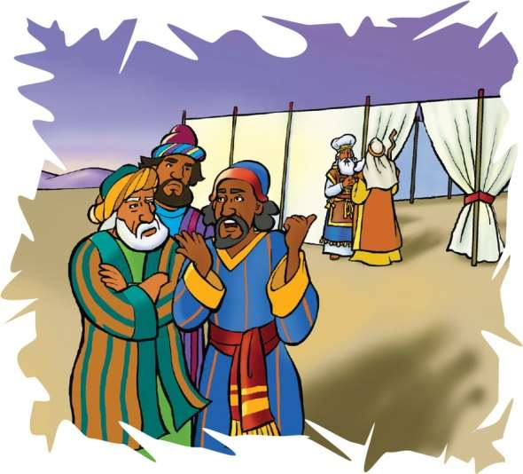
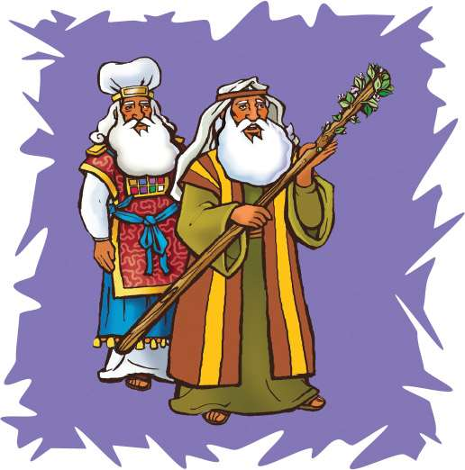

> 
Chângvawn

> “Vân te, lei te, tuifinriatte leh tuihnate Siamtu chu chibai bûk rawh u,” (Thupuan 14:7).

### Chhiar tûrte

Nambar 16; 17; Thlahtubulte leh Zawlneite (2nd Edition, 2014), pp. 416, 417.

> 
Thuchah

> A thuneihna zahna kan lantîr hian Pathian chibai kan bûk a ni.

_Lin-a leh Jacoba te chuan thu mal hmanga infiamna an nei a. Kâr lohah dâr lo ri-in, an chawlhlâwk chu a zo ta thuai a. Zirtîrtu chuan, “Naupangte u, lo kal rawh u le. Tûnah chuan chhiarkawp zir a hun ta e,” riin a rawn au va._

_Lin-a chu a’n meng deuh âk a. Jacob-a erawh chuan, “Kan chawlhlâwk chhûng chu a va rei lo êm êm,” tiin a phun deuh bal bal a._

_Hmânlâi hunah khân puitling thenkhat chu an hruaitu thu lo angin an awm tlat mai a. A chungah chuan an hel ta a ni. Mahni ngaih dân dânin thil an tî a. Mahse, an kawng zawh chu Pathian kawng pawh a ni si lo!_

Israelte riah bûkah chuan buaina a chhuak a. Kora, Dathana, leh Abirama te chu an phili deuh chung mai a. Anni ngaih dân chuan Mosia leh Aarona te chauh chu hruaitu an ni bîk tûr a ni lo.

Kora pawh chuan Aarona te chhûng chauh puithiama an tang bîk chu dik lo niin a ngâi ve bawk a. Kora leh Levia chi mi thenkhatin biak bûkah rawng an bâwl ve a, mahse, Aarona te chhûng chauh chu puithiam nih phalsak an ni si a. Ani chuan, “Kei pawh Aarona ang thova Levia chi ka ni ve a. Engati nge keini chhûng pawh puithiam kan nih theih loh bîk ang ni?” tiin a ngaihtuah nauh nauh a. A ngaihtuah nasat poh leh dik lovin a hre nasa zual zêl a.

Mahse, Kora, Dathana leh Abirama te khân thil pawimawh tak theihnghilh an nei a. Mosia khân Israelte hruaitu nih hna kha ama duh rêng vânga chelh a ni lo. Pathianin a thlang zâwk a ni.

Kora, Dathana, leh Abiram te chuan kâr lohah thurualpui an nei ta thuai a. Aarona leh Mosia te an phiar ruknaah chuan lamtang mi 250 lâi an nei thei ta mai a ni. Anni chu a huhovin Mosia hnênah kalin, “Engati nge Lalpa mite chungah mahni in indahsân bîk?” tiin an va chhuahchhâl a.

Mosia’n an thusawi chu a lo ngâithla a. Chutah hetiang hian vaulâwkna thu an hnênah a sawi a: “Nangni leh in pâwlte hi Lalpa dodâlin in tangrual a nih hi,” a ti a. Mahse, a thusawi chu an ngâithla duh lo va. Khâng mite khân Pathian mi thlan hruaitute chu an pawm duh lo va. Kaihhruaina thu Pathianin A pêkte pawh an zui ve duh lo va. Pathian chuan Mosia kha an hruaitu atâna A thlan a ni tih mi tinin hre theuh se a duh a. Pathian chuan tûn hma lama thil la thleng ngâi lo chu khâng Kora, Dathana, leh Abirama te bâkah, mi 250-te chungah thlentîrin, anni chu a tiboral ta vek a. Mahse, chu chuan Israelte riahbûka phunnâwina leh lungâwi lohna chhuak chu a hmet mit thei mai chuang lo.

Pathianin Mosia hnênah chuan, “Israel hnam 12 hruaitute tiang theuh la khâwm ang che. Chutah chuan an hnam hruaitute hming pawh i ziak theuh dâwn nia,” tiin a hrilh a.

Levia chi-te âiawhin Aarona hming a ziak a. Pathianin Mosia hnênah chûng tiang zawng zawngte chu biak bûk chhûnga zankhuaa dah tûrin a hrilh a.

Pathian chuan, “Ka mi thlana tiang chu a lo chawr ang. Hêng mi, i chunga phunnâwi hmang hote hi ka tiboral vek dâwn a ni,” a ti a.

Zîngah chuan Mosia chu biak bûk chhûngah a lût a. Mipuite chuan tu tiang ber nge chawr tih hriat hlân nghâkhlel takin an thlîr hlawm a. Mosia’n tiang a rawn lâk chhuah chuan, Aarona tiang lo chawr an hmuh chuan mak an ti tlâng hle mai a. A chawr chauh ni lovin, pâr tûrin vâiumkhal a lo kuhmûm a. Tiang khawro tawh si khân nunna a lo nei bîk a nih chu!

Mosia’n Israelte hnêna tiang chu a’n entîr chuan, Pathianin Aarona chu a lo thlang ngei a ni tih an hre chiang ta a ni. Mosia leh Aarona te khân Pathian thuneihna hnuaiah rawng an bâwl thîn a. Mipuite pawhin an thu an zâwm ta a ni.

Pathian thuneihna an zahin an zâwm zêl tûr a ni tih hriat theih nân, Mosia’n Aarona tiang chawr chu biak bûk chhûnga (Pathian) bâwmah a dah tha a. He Bible thawnthu hian kan chunga thunei tûra Pathian ruatte hi kan zah tûr a ni tih min hriat nawntîr a ni.

### Tih Tûrte

#### Sabbath

- A remchân chuan, in chhûngte nên ramhnuai thing hmunah lêng ho ula. Tiang hawl atâna remchâng chu lâin, in hawl dâwn nia. Chawlhna hmun remchângah châwlin, Bible thawnthu hi chhiar ho ang che u. In chângvawn, Thupuan 14:7 thu chhiarin, zir tan ang che u. Bible thawnthu in hriat reng theih nân, in tiang chu in hâwn dâwn nia.

#### Sunday

- Worship nân in chhûngte nên, Nambar 16 leh 17 chhiar ula. Tiang engzât nge la khâwm tûra Pathianin Mosia kha a hrilh le? (Nambar 17:2)
- Pathianin in chunga thunei tûra a ruat mi pathum hming târ langin, tawngtâisak ang che.
- Tiang in rawn hunah khân vâiumkhal tâwn bet ang che. Pangpâr dang leh hnahte pawh i tâwn bet tel dâwn nia. Kâr tluanin vawng thâ ang che.
- Chângvawn hi in chhûngte hnênah zirtîr ang che.

#### Thawhtanni

- Worship lâiin in chhûngte nên Sam 96 chhiar ho ula. Châng hrang hrangte kha in inchhiar sem dâwn nia. “Engati nge Pathian hmangaiha i zah?” tiin in inzâwt theuh dâwn nia.
- Chângvawn en nawn leh la. Chutah Pathian thilsiam chi hrang zînga pali lem chu ziak ang che. Tawngtai lâiin chung thil pali-te chu ngaihtuahin, lâwmthu i sawi nghâl dâwn nia.
- “Thinlung Hlimin Kan Fak A Che” (Sing for Joy, no. 1) tih hla kha sa, saktîr, ngâithla emaw, hmûi chîp chunga sak emaw i tum dâwn nia.

#### Thawhlehni

- Kora, Dathana, leh Abirama te’n buaina an chawk chhuak a. Chumi chungchâng chu i chhûngte hnênah hrilh ve ang che. Nambar 16:11 chhiar ho teh u. Khâng mite kha tu chunga phunnâwi nge an nih zâwk? Eng emaw chângin thuneitute chungah i phunnâwi ve ngâi em?
- Phunnâwi leh thil sawisêl chîng lo tûrin Pathian tanpuina dîl ang che.
- I tiangah khân in chângvawn thu ziak la, a nih loh leh ziah sâ bel mai ang che. I chhiar fo theihna tûr hmunah i dah dâwn nia.

#### Nilaini

- Chhûngkaw worship neihnaah in zirlâi thawnthu hi hrilhin, sawifiah ang che. Aarona tiang chawr khân tu nge Pathian thlan puithiam tih harsatna kha a chinfelsak ta em? Chhiar tûr: Nambar 17:5, 8–11.
- Chhiar tûr: 1 Timothea 6:6. He châng hi hrilhfiahsak tûr chein puitling sâwm ang che. Phunnâwi lo va thil pawm hmiah chungchâng hi in chhûngkuain sawi ho teh u. Engtin nge hei hi infiamnaah ataka in hman ang? Thuneitute hnuaiah leh hun dangahte pawh?
- In chângvawn hi puitling hriatah nâl takin sawi ang che.

#### Ningani

- In chhûngte nên, Philipi 2:14, 15 chhiar ula. Arsi lem lian tâwk ziakin, chep thlâ la, chutah chuan phunnâwi loh chhan tûr pathum ziak ang che. Chhiar fona theihna tûr hmun remchângah i târ dâwn nia.
- In chângvawn hi i chhûngte hriatah nâl takin sawi ang che..
- Hla sak tûr: “Smile, Smile, Smile” (Sing for Joy, no. 107), chutah tawngtâi zuiin, hlim thei tûra Pathian tanpuina dîl ang che.
- Zirtawpni
- Mipuite hnêna thusawi tûra president emaw lalber emaw a lo kal chângin, rimâwi tumtute’n rimâwi an tum deuh châwk. Hei hian zah tih a entîr. Lalber Isua hnêna hmangaihna leh zahna lantîr nân rimâwi/hlâ phuah teh.
- Hla sak tûr: “Clap Your Hands” (Sing for Joy, no. 4). In sak lâiin in kutte bêng ula, rimâwi tum tûr in neih loh leh chhepchher remchâng apiang in hmang mai dâwn nia.
- Worship-naah he Bible thawnthu hi lemchanah in hmang dâwn nia. A nih loh leh a thawnthu i chhûngte hnênah hrilh la. Thim hnuah i arsi lem kha en tûrin sâwm la. Chhiar ho tûr: Philipi 2:14, 15. Sabbath hun chhûnga Pathian thuneihna zahna lantîr kawnga tanpui tûr chein Pathian ngên la. Chutiang tih dân kawng hrang hrangte sawi tlâng teh u.