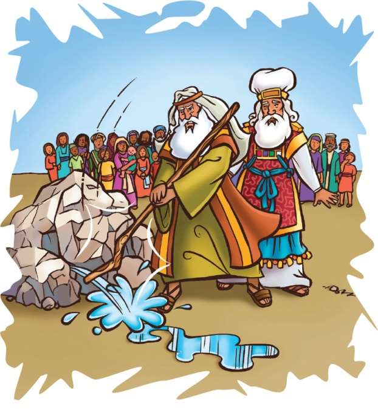
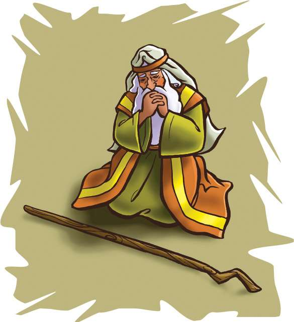

> 
Chângvawn

> “Lalpa chu kumkhuain rinchhan rawh u, Lalpa chu kumkhaw lungpui a ni si a,” (Isaia 26:4).

### Chhiar tûrte

Nambar 20:1–13; Thlahtubulte leh Zawlneite (2nd Edition, 2014), pp. 426–436.

> 
Thuchah

> Amah kan rinchhan hian Pathian chibai kan bûk a ni.

_Tui tlachhamin in awm ve tawh ngâi em? In tuihâl dân tûr chu han suangtuah chhin teh u! In tâlbuaiin, tihngaihna tak pawh in hre lo a ni maithei e. Hmânlâi khân Pathianin Mosia chu Aigupta ram atanga Israelte hruai chhuak tûrin a hrilh a. Mosia chuan a hruai chhuak ta ngei a. Chutiang thil thlen dân chu hetiang hi a ni._

Israelte’n tui an tlachham leh ta a. Tichuan, Mosia chungah an phunnâwi leh ta a ni. “Engati nge he thlalêr hmuna thi tlâw mai mai tûra Aigupta ram atanga min hruai chhuah rêng rêng ni?” tiin an phunnâwi a. “Ei tûr lah chu eng mah a awm si lo. Tui in tûr pawh a awm bawk si lo!” an ti a. He thil hi tum khat lek tî pawh an ni lo. Chutiang chuan vawi tam tak an phunnâwi nawn a, an âw pawh a ring deuh deuh bawk a.

Vawi eng zât nge chutiang an sawi chu Mosia’n a hriat ang le? Dik tak chuan, tui in tûr neih loh vângin kum 40 kal taah pawh khân an lo phunnâwi tawh a. Khatih lâi khân Mosia’n lungpui chu a tiangin a vua a, tui chu a lo luang chhuak ta huau huau mai a nih kha. Chu lâi hmuna mipui an châm chhûng zawng chuan tui chu a put huau huau reng mai a ni.

Tûnah chuan tui tlachhamin an awm leh ta a. An mamawh phuhruk tûrin Pathian enkawlna rinchhan ta mai lo chuan, phunnâwiin an chiar hiar leh ta viau mai a. Pathian Mosia chu a tiang kenga, Aarona nêna kal tûrin a hrilh a. Tichuan, Israel mipuite chu ko khâwm tûrin a ti bawk a.

“An mit hmuhah chuan lungpui hnênah chuan thu sawi la, tui luan chhuahtîr tûrin hrilh ang che,” a ti a (En tûr, Nambar 20:6–8.)

Mosia hi chhel leh dawhthei tak mai a lo ni reng tawh thîn a. Mahse, kum 40 chhûng zet Israelte phun leh chiarna thu a lo ngaihthlâk châmchi tâkah chuan, a ning ve ta deuh a ni. A thin a rim a. Phun leh chiar khum nih reng chu a ning tawh a ni. Pathian an rinchhan duh lohzia thu chu a hre nawn leh ta. Mosia thin chu a rim ve hle a, Pathianin thilmak thlentîr dân tûr a kawhhmuh dânte pawh chu a theihnghilh ve ta hial a.

Kum 40 kal ta khân Pathianin lungpui atangin tui a luan chhuahtîr a. Tûna tui luan chhuahtîr theitu tûr chu Pathian chauh a ni. Mahse, chu tak mai chu Mosia’n a theihnghilh a. Amah chu lungpui atanga tui luan chhuahtîr theitu tûr emaw chu a inti ta mai a ni.

Mosia chuan mipuite hnênah chuan, “Nangni helhmangte u, lo ngâithla teh u, lungpui atang hian tui ka’n lâk chhuahsak dâwn che u em ni?” tiin a au vak a. Mahse, Pathian thupêk anga lungpui hnêna thu sawi ta lo chuan, a ban chu pharin, a tiang chuan lungpui chu tum hnih a’n hlap a. Pathianin lungpui atang chuan tui chu a luan chhuahtîr a.

Mosia pawh mahni tâwk têin a rilru chu a nuam sang sang pawh a ni maithei e. Mipuite chunga thinrim hrîkthlâk nâna ân phiar phiar a duh pawh a ni thei a, lungpui a han hlap zawt zawt pawh chuan a rilru a tinuam sawt maithei e. Mahse, Mosia chêt dân khân amah leh Aarona te thiltihtheihna zâra luang chhuak angin a lantîr a. Chuvâng chuan Pathian kha a châwimâwi a ni lo tlat a ni. Mosia khân thu kha lo âwih chu ni se chuan, mipuite khân Mosia kha an hruaitu a ni tih hriain, kaihhruainate chu Pathian hnên atanga a dawn ngei a ni tih an hre thei tûr.

Tichuan, Pathian chuan aw dam diai hian, “Mosi, min rinchhan ta lo a nih kha. Israel mite mit hmuhah a nih tûr angin min châwimâwi lo a ni. Kha vâng khân, hêng mipuite hi an hnêna ka pêk tûr ramah chuan in hruai lût lo vang,” tiin a hrilh a.

Chu veleh Mosia’n a thil tih pawizia chu a hrethiam nghâl a. Ani meuh pawhin Pathian a rinchhan ta sî lo va. Khatih lâi khân Israelte hruaitu chu tu nge ni tih kha a lo theihnghilh hmin dêr mai a ni.

Kum 40 chhûng zet chu Mosia leh Aarona te chu thlalêrah an tâp ve reng a. Kum 40 chhûng chu Pathian mite hruaitu an ni. Mahse, anni pahnih hian Ram Tiam chu an lût ve thei dâwn ta si lo. Israelte khân, an hruaitu chu tu pawh ni se, Pathian chu rinchhan zêlin, a zirtîrna zawng zawngte chu an âwih zêl tûr a ni tih an zir chhuah a ngâi a ni.

Pathianin amah châwimâwi leh chibai bûk thîn tûrin min duh a. Amah rinchhan tûrin min duh bawk. Ni tinin min awmpui zêl dâwn tih hre tûrin min duh a. Min ngen anga kan tih hian amah chu chibai kan bûk a. A mi kaihhruaina kan rinchhan hian amah chu chibai kan bûk a ni.

### Tih Tûrte

#### Sabbath

- Lungpui atanga tui luang chhuak hmang khân Pathianin tuikhawhthla a siam a. A theih chuan tuikhawhthla kianga thuin, Bible zirlâi hi chhiar ang che u. Isaia 26:4 keuvin chhiar ho ang che u.
- Beidawnna in tawh lâi chungchâng sawitîr theuh ula. Tanpuitu atân Pathian an rinchhan hlawm em? Eng nge thleng? Amah rinchhan zêl tûra tanpuina chu Pathian hnênah dîl ang che u.

#### Sunday

- Nambar 20:1–13 chhiar ho ang che u. In chhûngte tanpuinain, lehkhabu-ah emaw, Internet lamah emaw thil pawimawh tak zawng tûrin sâwm ang che u. In taksain tui a hman tangkâi dân kawng ngâ tal ziak chhuak ang che u. Tui in tûr khawp kham nei lote lem leh tui khawp kham neite lem ziak ang che u.
- Card hmangin emaw, lehkha chhah hmangin emaw lungpui lem chep thlâ ang che u. Chutah chuan chângvawn thu ziak ang che u. Lungpui lem chu dik tak remin, chângvawn chu in chhiar dâwn nia.

#### Thawhtanni

- Chhûngkaw worship-naah hêng zawhnate hi chhâng ang che u: Eng ang boruak hnuaiah nge in phunnâwi thin? Thil eng emaw in duh loh chângin, eng nge in tih ang? Hêng Bible chângte hi chhiar teh u: Jakoba 5:9; Sam 142:1, 2; Sam 37:7; Matthaia 18:15; Thufingte 24:6.
- Lungpui lema chângvawn in ziah kha dik takin rem ang che. Ring takin vawi nga emaw tal i chhiar lauh lauh dâwn nia.

#### Thawhlehni

- Vawiin worship neihnaah, i thinrim hnuhnung ber chungchâng kha ngaihtuah nawn leh la, chumi chungchâng chu sawi theuh tûrin sâwm ang che. Hei hi ngaihtuah tlâng teh u: A thinrim vânga Mosia’n thil lian tham tak a chân chhan kha eng nge ni? (Chhiar ho tûr: Nambar 20:12.)
- Lungpui lema chângvawn in ziah kha dik takin rem leh ula, chutah thiam takin in sawi rual dâwn nia.

#### Nilaini

- Chhûngkaw worship-naah, mi tute emaw innghah nâna i rinchhan thinte hming ziak chhuak ang che. A tu chu nge i rinchhan ber thin? Rinchhanna avângin in inhnaih phah sawt em? Thufingte 16:20 chhiarin, sawi ho ang che u.
- In chhûngte nên in chângvawn sawi rual ang che u.

#### Ningani

- Worship lâiin, Bible map-ah Kadesh hmun zawng chhuak ula. Kanaan ram hlat zâwng chhut teh u. In in atanga khawpui hnâi ber chu engtia hlâ nge ni?
- Mahni tawng kauchhehin chhûngte hnênah Bible thawnthu hi hrilh la. He thawnthu atangin eng zirlâi nge i zir chhuah?
- Chhiar tûr: Thufingte 3:5. Chutah “Trust in the Lord” (Sing for Joy, no. 111) tih hlâ sa ho ang che u.
- Lungpui lema chângvawn kha entîr la. En lovin, nâl takin sawi ang che.

#### Zirtawpni

- Chhûngkaw worship-naah ‘Mitdel hruai (leading the blind)’ tih kha chang ula. Worship tan hmain in chhûngah emaw, pawnah emaw kal dâlnate in siam dâwn nia. Worship tan hnuah, chhûngkaw zahve chu an mit tuamsak ula. Mi dangte chu tanpuituah in tantîr zêl ang a, kal dâlna siam zîngah chuan in kalpui dâwn nia. Zawh tûr, “Nangmahni tanpui kha in rinchhan ngam em? Tanpuitu tu nge in rinchhan ngam ber? Chhiar ho tûr: Sam 118:6, 7. Hêng châng thute hi in chhûngte in sawitîr dâwn nia.
- Kâr kal ta Sabbath Sikula chângvawn ziahna lungpui lem in siam kha entîr la. Lungpui lem chu kentîr theuh la. Chutah, Pathian an rinchhan theih dân kawng khat tal sawi tûrin sâwm theuh ang che u.