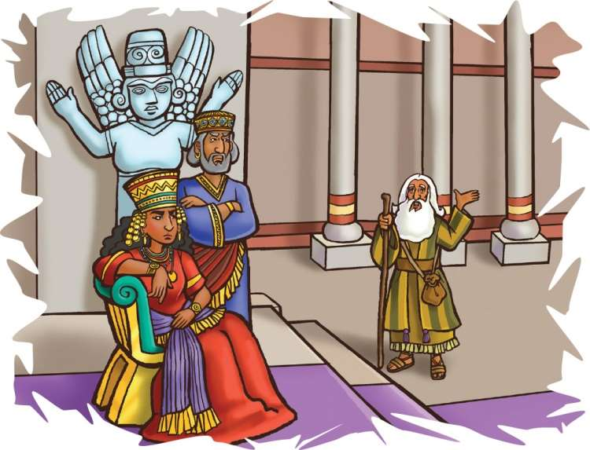
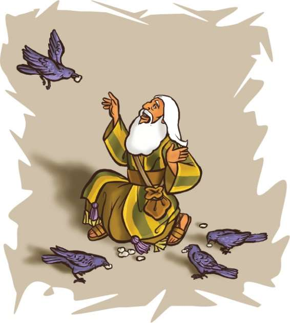

> 
Chângvawn

> “Kei in Pathian ka ni si a; ka tichak ang che u a; a ni, ka tanpui ang che u,” (Isaia 41:10).

### Chhiar tûrte

1 Lalte 17:1–6; Zâwlneite leh Lalte (2nd Edition, 2014), pp. 105–112.

> 
Thuchah

> Pathianin ka mamawhte a hria a, ani chuan min ngaihsak reng thîn.

_Sava thil chuk lâi in thlîr tawh ngâi em? Eng nge an chuk? Pathianin chu savâ chu nangma ei tûr pe tûrin rawn tîr ta se, eng nge in beisei ang le? Thlâi chî nge ni ang, pangang zâwk? Nge, Thei rah zâwk chu? Hmânlâi khân Pathianin mi pakhat châwm tûrin savâ a tîr tlat mai a ni. Elija sava chanchin atangin Pathian rinchhan dân kan zir dâwn a ni._

Hmânlâi hunah khân Lal Ahaba’n Israel ramah ro a rêl a. Ahaba khân lal dangte zawng zawng âiin Lalpa mit hmuhah thil sual a ti nasa bîk a (1 Lalte 16:30).

Lal Ahaba leh lalnu, Jezebeli–te hian milim chibai an bûk thîn a. Israel zawng zawngte pawhin milem chibai an bûk ve bawk a. Mipuite pawh chu Lalpa thupêk zâwm lo tûrin an fuih thîn a. Jezebeli leh Baala puithiamte’n Lalpa zâwlneite chu an that vek a.

Pathianin zâwlnei a nei a, a hming chu Elija a ni. Ani hi Jordan Lui râl, Gilead biala Tishbe khaw chhuak a ni. Elija chuan Pathian rawngbâwlin, mi dangte pawh chu Pathian chibai bûk tûrin a zirtîr thîn a. Pathianin Israel rama milem chibai bûkna lo hluar ta viau chu

A hmuhin pawi a ti êm êm a. Chu chuan Israel ramah suahsualna a ti pâwngpawrh tih a hria a ni.

Baala puithiamte chuan mipuite hnênah ruah leh dâi tlâktîrtu chu Baala a ni tiin an zirtîr thîn a. Baala chu luipui leh lui tê-te thununtu a nih an ring bawk a. Elija erawh chuan Pathian chu chutiang thilsiam zawng zawngte chunga thuneitu a ni tih a hria a. Pathianin Elija chu Ahaba hnêna thuchah thlen tûrin a tîr a.

Elija erawh chuan Ahaba’n Lalpa hnên atanga thuchah chu a lâwm dâwn lo tih an hria a. Chu bâkah, lal in vêngtute chuan ani chu Pathian zâwlnei a ni tih an lo hre dâwn tih a hre lâwk diam bawk a. Anni chuan ani chu man an lo tum mai dâwn a ni. Anni chuan lo manin, lalnu sual Jezebeli leh a puithiamte kutah an hlân dâwn pawh a ni maithei e. Mahse, chutiang hlauhawm kârah pawh chuan, Elija chuan tîmna pawh a nei chuang lo. Ani chu Samaria-ah kalin, lal in vêngtute lo tih din hman hauh lovin, lal in chu a pan dîng nghâl a. Lalber hnênah lût tlangin, Pathian thuchah chu a hrilh ta hmiah mai a ni.

“A rawng ka bâwl Lalpa, Israelte Pathian chu a nung ngei angin, ka thu lo chuan kum eng emawti chhûng chu dâi leh ruah rêng a sûr lo vang,” tiin Elija chuan a puang a. Chutah rang taka inherin, a chhuak leh ta nghâl a.

Ahaba hmu tûra a kal lâi khân Elija kha mahni chauha kal a ni bîk lo. Pathian vênhimna tel lo se chuan, vêngtu sipaite khân lo tidingin, an tihlum nghâl ngei ang. Mahse, a lo luh lâi khân Pathian chuan a awmpui a. A chhuahsan leh lâi pawhin a la awmpui zêl tho a ni.

Pathianin Elija hnênah, “He lâi hmun hi chhuahsan nghâl la. Chhak lam pan la, Kerit Lui kamah biru rawh. Chutah chuan tui in tûr i hmu ang. Nangmah châwm tûrin choâkte thu ka pe tawh e,” tiin a hrilh a.

Chutiang chiah chu a ni ta rêng a. Elija chuan bihrukna tûr hmun him, lui te kam tlâng pangah chuan a hmu a. Tûk tin leh tlâi tinin savâte chuan Elija tân ei tûr an rawn pe thîn a. Thla eng emawti chhûng chu Elijan chu lui te tui chu a tlân a. Lui tui a awm chhûng chu tui in tûr a tlachham lo.

Elija chuan Pathian enkawlnaah him tâwk hlein a inhria a. Choâkte’n chaw pe tûra an rawn bir apiang hian châw an rawn pe a, Elija chuan a nunna a tân thilthlâwn pêk Pathianin a pe thîn tih a hria a. Ama nunna chu Pathian ngaihin a hlu hle a ni tih pawh a hria a ni.

### Tih Tûrte
- Sabbath
- A remchân chuan, in chhûngkuain lui kam hmun fianrial remchângah kalin thu tlâng ula, in Bible zirlâi hi in chhiar ho dâwn nia. Inzawh tûr: Choâk hi engang hmêlpu nge ni? In kiang vêla sava awmte tân chaw chah in la dâwn nia. Savâte avângin Pathian hnênah lâwmthu sawi ang che.
- Chângvawn Isaia 41:10 chhiar ang che u.
- Hla sak tûr: “God Is So Good” (No. 1).

#### Sunday

- In chhûngte nêna chhiar ho tûr: 1 Lalte 17:1–6. In chhûngkaw tâna hun duhawm lo chungchâng leh chuta Pathian enkawlna in dawn thu sawi ang che u.
- A huhovin chângvawn chhiar ula. Chângvawnah hian Pathian thil sawi eng thil pahnih nge i tih ang? Hetah hian ziak ang che:

1. [_]()

2. [_]()

#### Thawhtanni

- Chhûngkaw worship neihnaa sawi ho tûr: Lal Ahaba kha engang mi nge ni? Chhiar tûr: 1 Lalte 16:33. Lal hnêna Pathian thuchah a hrilh hnu khân engati nge Elija kha a bihruk zui a ngaih?
- In chhûngkua khân inbihruksiak teh u. Pakhat chu Ahaba emaw Jezebeli emaw angah chantîr ang che u. Ahaba emaw Jezebeli laka Elija bihruk dân sawi ang che. Engati nge Elija kha an zawn hmuh theih loh?
- Chângvawn thu kha chep thlâin, indawt dik takin chanchinbu emaw, magazine buah emaw i bel dâwn nia. Chângvawn chu ring takin chhiar lauh lauh ang che.

#### Thawhlehni

- Chhûngkaw worship-naa chhûngte hnêna zawh tûr: Dinhmun hlauhawma din châng i nei tawh ngâi em? Engtin nge i rilru chu a awm? Elija khân engtin nge a ngaih i rin? Jeremia 1:19 chhiar ho ang che u.
- Mi hlauhawm tu emaw i hriat hming chu hetah hian ziak ang che: [_]().
- I chhûngte nên chu mi tân chuan tawngtâisak ang che u. I chhûngte hriatah chângvawn kha ring takin sawi lauh lauh ang che.
- Hla sak tûr: “You Are My Hiding Place” (He Is Our Song, no. 96). Chutah Pathianin in chhûngkua a vênhim che u avângin lâwmthu sawi ang che.

#### Nilaini

- Chhûngkaw worship-naah, Bible map enin, Samaria khua leh Kerit Lui (Cherith Brook) zawng chhuak teh u. Kerit Lui thlen nân engtia rei nge Elija kha a thang ngâi ang? Khatih lâi khân eng rilru nge Elija khân a put i rin? Kerit Lui leh Elija lem ziak ang che.
- Chhiar tûr: 1 Lalte 17:6. Elijan lui tui a in tûr leh choâk hnên atanga eitûr a dawng tûr chu suangtuah ang che. Pathianin in chhûngkua A enkawl dân che u chungchâng sawi ula.
- Thiam nâl takin in chângvawn sawi ang che u.

#### Ningani

- Chhûngkaw worship-naah thu kual ula. Mahni taksa kun chuang lo leh kîu thlêp lo va mahni pheikhawk lâktîr tum teh u. Minit khat chhûng tihtîr ula. Chutah inkawpa pheikhawk inphelhpui tûrin ti leh thung ula. Danglamna eng nge hetah hian awm le? Engati nge Pathian tanpuina kan mamawh? Chhiar ho tûr: Sam 46:1. Vawiin hian mi tu emaw tanpui tûrin engtin nge ruahmanna siam ang che u.
- Ring deuh lauhin chângvawn sawi la, tawngkam khat zêlah hmalamah pên zêl ang che. Engtia hlâ nge in kal hman?

#### Zirtawpni

- Elija chanchin sawi tûrin in chhûngzînga mi tu emaw sâwm ang che u (1 Lalte 17:1–6) lemchanah in hmang zui dâwn nia.
- In chhûngkuain chângvawn sawi rual ang che u.
- Pathianin a hmangaihna che chungchâng hlâin sâ ang che u.
- In chhûngte chu tûn kâr chhûnga Pathian enkawlna an dawn chungchâng sawitîr theuh ang che. Chutah, Pathian enkawlna chungah lâwmthu sawi ang che u.