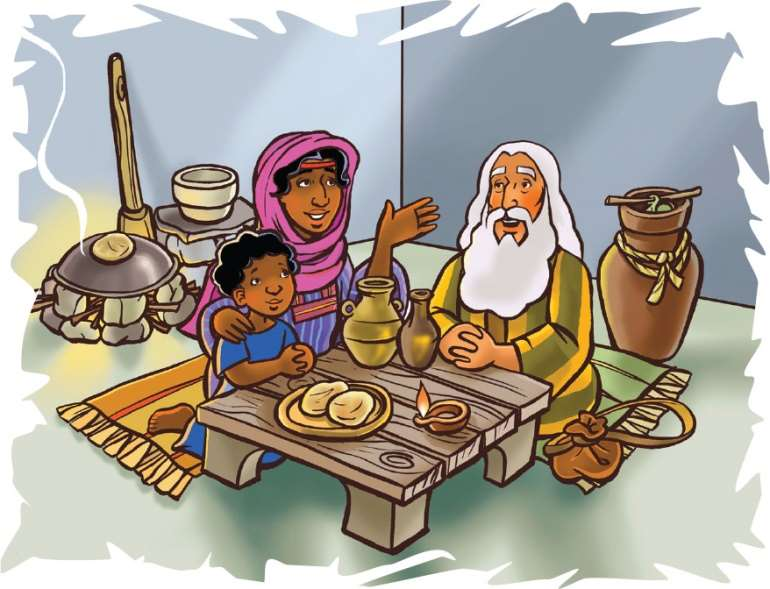
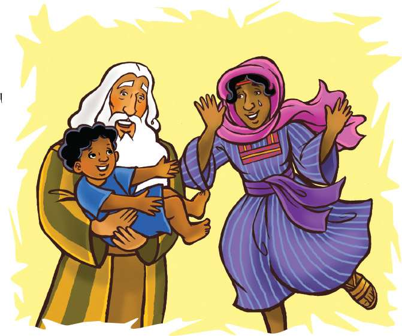

> 
Chângvawn

> “Khawngaihna Pathian chuan . . . a siam thâin a tichak ang che u,” (1 Petera 5:10).

### Chhiar tûrte

1 Lalte 17:7–24; Zâwlneite leh Lalte (2nd Edition, 2014), pp. 113–115.

> 
Thuchah

> Thil tha lote lo thleng mah se, Pathianin min hre reng tih ka hria a ni.

_Kera chu a riltâm a. A chhûngte pawh an riltâm bawk a. Ni thum chhûng chu ei tûr eng mah nei lovin an awm tawh a. An pa chu ei tûr zawngin a chhuak a. Mahse, eng mah hawn nei lovin a lo hâwng leh a. “Pawi ka ti hle mai. Kan khuaah ei tûr rêng ka hmu zo tawh lo. Thla tam tak chhûng chu khua a khêng tawh si a. Ruah a sûr loh chuan eng mah a thang tha thei lo a ni. Hun rei tak chhûng chu ei tûr rêng nei lovin kan awm maithei a ni.”_

_Thi mai tawh tûra an inngaih tawh lâiin, Pathianin tanpuina a rawn thlentîr a. Motor pakhat, ADRA tih chhinchhiahna chuang chu an khuaah a lo thleng hlauh mai a. A khalhtu chuan, “Buhfâi, buhfai!” tiin a au lauh lauh a. “Chhûngkaw tinin buhfâi ip khat theuh in chang thei ang!” a ti a._

_Kâr lohah chuan chhûngkaw tin chuan hun eng emaw ti chhûng chu ei tûr an nei thei dâwn ta a ni. Khawkhêng a reh a, ruah a lo sûr leh hma chuan motor dangte pawh lo kal ta zêl a. Hmânlâi hunah khân Pathianin Elija chu a bîk deuh takin a lo enkawl tawh a ni._

Thla eng emawti chhûng chu Israel ramah khua a khêng (ruah sûr lo) tawh a. Thlawhhmate pawh a khawroin, thlâi rêng a awm lo. Thingkungte pawh khaw lumah chuan hnah pawh nei lovin, an ding filh thulh mai a. Lui lian leh lui tête pawh an kang chat vek tawh a. A tâwpah chuan Ahaba laka Elija bihrûkna, Kerith Lui pawh a kang ve tawh a. Mahse, Pathianin Elija chu a enkawl zui zêl a.

Pathianin Elija hnênah, “Zarephat khuaah kal la. Chutah chuan nangmah enkawl tûrin hmeithâi pakhat ka ruat tawh e,” a ti a. Tichuan, Elija chuan Israel ram chhuahsanin, mêl zahnih chuang maha hlâ, ram dang chu a pan ta a. Chuta Zarephat khaw kulh kawngka chu a thleng a, hmeithâi pakhat thing tang lo fawm mêk chu a hmu a.

Elija chuan a hnênah, “Khawngaihin tui in tûr tlêm mi han lâk teh âw! Chhang tlêm pawh min rawn lâk nghâl bawk dâwn nia,” tiin a au zui a.

Tui lâksak tûr chuan hmeichhia chu a kal nghâl a. Mahse, Elija’n “Chhang tlêm min han ken nghâl ang che,” tia a chah leh tâkah khân ani chu a ding chawih a. “Chhang chu ka nei lo. Ka neih zawng chu chhangphut vei khat lek leh hriak tlêm tê a ni. Chumi siam nân chuan thingtang tlêm ka’n kuai a ni a. Ka siam zawh hunah kan nu–fain kan ei ang a, a bâk chu kan thi tawh mai ang,” tiin a hrilh a.

Elija chuan, “Hlau suh. Va haw la, chhang chu min han siam phawt la. Chumi zawhah chuan in nu-fa ei tûr chu i la siam leh dâwn nia. Pathianin ramah hian ruah a sûr leh hma loh chuan hriak leh chhangphut chu hman zawh a ni lo vang’ a ti a ni a ti a,” (En tûr, 1 Lalte 17:14.)

He nu hi Israel mi a ni ve lo va. Mahse, Pathian ringtu a ni a, Pathian chungah a rinna a nghat a ni. An mamawh chu Pathianin a ngaihsak ang tiin a rinchhan hmiah mai a ni.

Elija sawi ang chiah chu a ni ta rêng a. A rual chuan an in chuan a pan a. Chu ni a chin chu a chhangphut leh hriak chu a zo thei ta rêng rêng lo mai a ni. Elija chhanhim tûra Pathian hna thawh zârah, hmeithâi leh a fapa chu chhanhim an ni ve ta a ni.

Chuta tanga eng emaw hnu chuan hmeichhe fapa chu a damlo va, a thi ta mai a. A ngaih dân chuan Pathian hremna tuar niin a inngâi a. “Ka chungah eng nge i tih tâk ni? Ka fapa tihlum tûra ka sualna min hriattîr tûrin em ni ka hnênah i lo kal?” a ti hial a.

Chu mipa naupang chu Pathian tihhlum chu a ni lo rêng a. Pathian thilthlâwnpêk chu nunna a ni a. An pathum khân tâm tla lakah Pathianin a vênghim tawh rêng a ni.

Elija chu hmeithâinu in chhâwng chungah a chêng a. Hmeithâi nu fapa ruang chu, chu pindanah chuan a pawm chho va, Pathian hnênah chuan, “Aw Lalpa, ka Pathian a nunna hi han pe leh ang che!” tiin a ngên a. Pathianin Elija dîlna chu chhângin, chu mipa naupang chu a lo nung leh ta a ni.

Pathian chuan nangma nuna harsatna pawh chinfelsak che a duh a. Eng emaw chângte chuan thil tha lote chu lo thleng thîn mah se, Pathian chuan min la hmangaih reng tho va. Ani chuan amah rinchhan tûrin min duh a. Ani chuan Elija leh Zarephat hmeithai mamawh a phuhrûksak ang khân, nangni pawh in mamawhte a ngaihtuahsak zêl dâwn che u a ni.

### Tih Tûrte

#### Sabbath

- Bûrah chhangphut tlêm leh bur dangah hriak tlêm dah la. Chûng chu chaw–ei dawhkânah dah ang che. Mi tin tân plate leh cup pawh chhawp tel la. Plate-ah chhang, burah tui i chhawp bawk ang a. In Bible châng in chhiar pahin, hmeithâi ina thilmak thleng zâra hriat leh chhangphut hmanga eitûr chhangthâwp chu in ngaihtuah dâwn nia.
- A hu hovin 1 Petera 5:10 chhiar ula.
- Hla sak tûr: “God Is So Good” (No. 1), chutah ei tûr in neih avângin Pathian hnênah lâwmthu sawi ang che u.

#### Sunday

- Chhûngkaw worship neihnaah 1 Lalte 17:7–16 chhiar ula. Chutah Sabbath Sikula bul in lo tan tawh chhangphut no chanve leh chi-al hmet lek leh hriak fiante hnih hmangin chhang hmet la. Tichuan, i nuai phêk dâwn nia. Kan–bêlah hmin thapin i chhuang hmin dâwn nia.
- Hriak um chu lehkha cheh mâwi takin chei ang che. Chutah chuan in chângvawn ziak la, ni tina in hmuh theihna tûr hmunah i târ dâwn nia.
- Ei tûr tha tak in neih avângin Pathian hnênah lâwmthu sawi ang che u.

#### Thawhtanni

- Vawiin worship neihnaah, 1 Lalte 17:17–24 chhiar ho ang che u. A fapa a thih lâia hmeithâi nu hmêl lan dân tûr ang lem ziak la. A lo nun leh tâk hnua a hmêl lan dân tûr ang lem chu ziak bawk ang che.
- Tûnah chhang lêp khat lek nei angin inngaihruat la. Ni thum chhûnga eng mah dang nei tawh lo tûrin inngaihruat bawk la. Mi dangte hnêna sem tûra tih ni ta lang, eng nge i sawi ang le?
- In vhângvawn kha mahni tawngkauchhehin sawi ang che. ‘Khawngaihna’ tih hi eng nge a awmzia? Mi dangte chunga Pathian khawngaihna lantîr tûrin a tanpuina dîl ang che.

#### Thawhlehni

- Worship-naah 1 Lalte 17:15 chhiar ula. Hmeithâinuin a thil neih chhun mi dangte hnêna sem a phal vânga thil tha thleng ta kha eng nge ni? Mi dangte hnêna thil i sem ve vânga malsâwmna i dawn tâk ngaihtuah nân hun tlêm hmang ang che. Chumi chanchin chu i chhûngte i hrilh dâwn nia.
- Hetianga zaizir dân hi i chhûngte hnênah zirtîr nân chângvawn kha sawi ang che: Pathian—chunglam kâwk la; khawngaihna—thinlung zâwn kâwk la; siam tha—kut kha chunglam atanga taksa thlengin vai la; chak—ban tisek la.
- Hrisêlna leh chakna i neih vângin Pathian chungah lâwmthu sawi ang che. Lehkha phêkah “Nangma tân thil eng emaw ti tûrin min ngên rawh,” tiin ziak la, chutah chuan i hming sign bawk ang che.

#### Nilaini

- Hmeithâinu fapa damlo chungchâng (1 Lalte 17:17–24) kha i chhûngte hnênah hrilh ang che. Sawi ho tûr: Hêng thil tha lo, natna leh thihna hi khawi atanga lo chhuak nge ni? (He zawhna chhân nân, Matthaia 13-a Isua thusawi pakhat khân min chhânsak âwm e. Châng 24, 25, 38, leh 39 en la.) Hêng hi hrilh fiah tûrin i chhûngte sâwm ang che.
- Chângvawn (1 Petera 5:10) chhiar la; mahse, ‘nangmah’ tih âiah i hming ziak ang che.
- Damlo i hriat tân tawngtâisak ang che.

#### Ningani

- Worship-naah 1 Lalte 17:22, 23 chhiar la. Mipa naupang lo dam leh ta angah khân inchan la. Pathian hnêna i thil sawi hmasak ber tûr chu eng nge ni ang? I nu hnênah eng nge i sawi ang?
- Khawngaihna leh nunna a pêk che avângin Pathian hnênah lâwmthu sawi ang che.
- Ring takin in chângvawn sawi la, thumal tinah kut lo bêng zêl ang che.
- Tawngtâi hmaa hla sak tûr: “Than You.”

#### Zirtawpni

- Vawiin worship neih nân, i chhûngte hnêna zawh tûr: Eng tiang kawngtein nge Pathian khawngaihnâin min tihchak thin? Chutah 2 Korinth 9:8 chhiar ho ang che u.
- Lehkha phêk chunglam kilah hei hi ziak la: “Pathianin min hmangaih ka hria,” chumi hnuaiah chuan “Pathian khawngaihnâin min tihsak . . . .” tih ziak bawk ang che. Pathian khawngaihna zâra thil eng emaw i dawnte lem chu ziak zêl la. Lehkha phêk mawng lamah chuan “Pathianin nang leh kei min ngaihsak” tih ziak ang che.
- Pathianin in chhûngkaw chunga malsâwmna tam tak a vûr che u avângin lâwmthu sawi ang che.